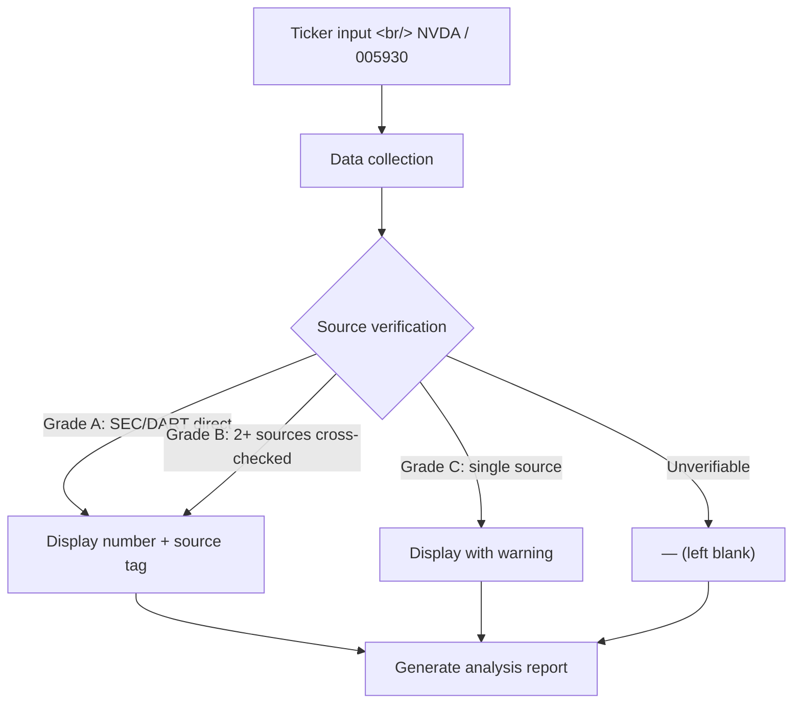
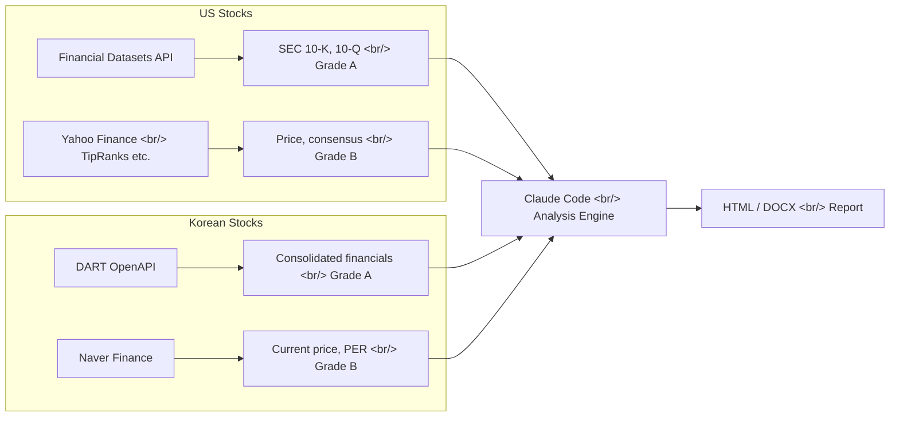

## Overview

Say "analyze NVDA" and get back scenario analysis (Bull/Base/Bear), probability-weighted R/R Score, eight quarters of financials, and an interactive HTML dashboard. [stock-analysis-agent](https://github.com/kipeum86/stock-analysis-agent) is an institutional-grade stock research automation tool built on top of Claude Code. For US stocks it pulls data directly from SEC filings; for Korean stocks, from the FSS DART OpenAPI.

<!--more-->

## Core Principle: Blank Beats Wrong



The agent's core philosophy is **"show a blank rather than an unverifiable number."** This directly addresses AI hallucination — the tendency to produce plausible-looking but fabricated figures. Every number carries a source tag like `[Filing]`, `[Portal]`, or `[Calc]`, and a four-tier confidence system runs from Grade A (original filing) down to Grade D (unverifiable → blank).

## Four Output Modes

| Mode | Name | Format | Purpose |
|------|------|--------|---------|
| **A** | At-a-glance | HTML | Decision card + 180-day event timeline — for screening |
| **B** | Benchmark | HTML | Side-by-side comparison matrix for 2–5 stocks |
| **C** | Chart (default) | HTML | Interactive dashboard — scenarios, KPIs, charts |
| **D** | Document | DOCX | 3,000+ word investment memo — Goldman Sachs research note style |

The Mode C dashboard includes scenario cards (Bull/Base/Bear), an R/R Score badge, KPI tiles (P/E, EV/EBITDA, FCF Yield, etc.), Variant View (where the market is wrong), Precision Risk (causal chain analysis), Chart.js charts, and eight quarters of income statement data.

## Dual Data Pipeline



**US stocks**: When the Financial Datasets API MCP is connected, Grade A data is extracted directly from SEC filings. Without MCP, the agent falls back to web scraping from Yahoo Finance, SEC EDGAR, and TipRanks — but maxes out at Grade B.

**Korean stocks**: The DART OpenAPI (Korea's FSS disclosure system) is connected directly. The `fnlttSinglAcntAll` endpoint fetches consolidated financial statements (IS/BS/CF), while Naver Finance supplies current price, PER, and foreign ownership ratio. The DART API key is free.

## R/R Score — Risk/Reward in a Single Number

```
R/R Score = (Bull_return% × Bull_prob + Base_return% × Base_prob)
            ─────────────────────────────────────────────────────
                       |Bear_return% × Bear_prob|
```

A probability-weighted average of scenario targets produces a single score. Above 2.0 = Attractive; 1.0–2.0 = Neutral; below 1.0 = Unfavorable.

## Variant View — "Where the Market Is Wrong"

This is the most interesting section. Where typical AI analysis stops at listing pros and cons, stock-analysis-agent identifies **the specific points where market consensus is mistaken**, backed by company-specific evidence. It extracts three points in Q1–Q3 format, each explaining "why the market is missing this."

## Usage

```bash
# Single stock analysis
Analyze NVDA
Deep analysis on 005930

# Peer comparison
Compare Samsung vs SK Hynix
NVDA vs AMD vs INTC

# Portfolio / watchlist
Scan my watchlist
Show catalyst calendar
```

Commands are given conversationally inside Claude Code. The commit history includes `Co-Authored-By: Claude Opus 4.6`, confirming this agent was itself built with Claude Code.

## Insight

The most important pattern stock-analysis-agent demonstrates is **solving AI hallucination through system design**. Forcing a source tag on every number and leaving blanks when verification fails is a simple rule — but it's a powerful one. The dual pipeline covering both US (SEC) and Korean (DART) markets with direct API integration is also a particularly practical reference for Korean developers. That said, with only 3 stars it's an early-stage project; treat it as a learning resource for architecture and prompt design rather than a production tool.
