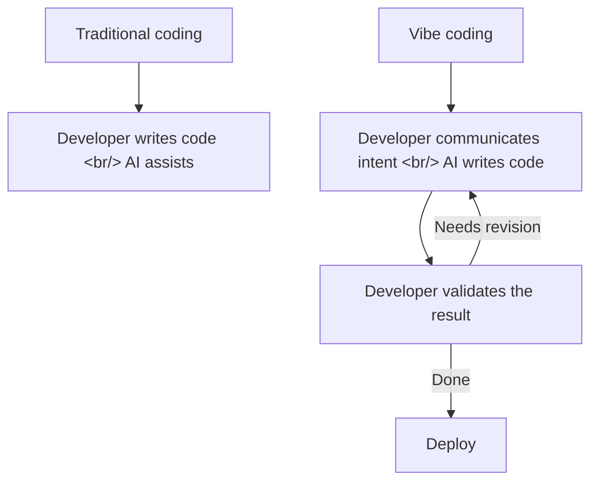
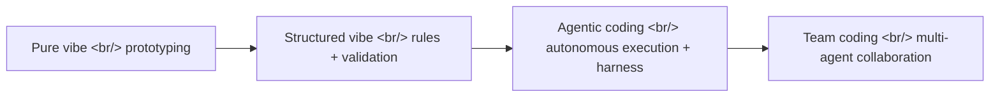

## Overview

The term "vibe coding" started with a tweet from Andrej Karpathy and has since established itself as a development paradigm. [Vibe Coding Fundamentals In 33 minutes](https://www.youtube.com/watch?v=iLCDSY2XX7E) on YouTube is a systematic breakdown of the fundamentals behind this paradigm — the practice of building software by giving AI natural language instructions without writing a single line of code directly.

<!--more-->

## What Is Vibe Coding?

Karpathy's original framing was simple: "I see the code, but I don't read it. When there's an error, I paste the error message straight into the AI. It works most of the time." That's the essence of vibe coding.

But this pure form works well for prototyping and falls apart for production code. Vibe Coding Fundamentals presents a structured approach that bridges that gap.

## Core Principles

### 1. Deliver Clear Context

The starting point is giving AI structured documentation — not "build me a chat app," but tech stack, directory structure, coding conventions, and business requirements. Files like Claude Code's CLAUDE.md and Cursor's .cursorrules serve exactly this role.

### 2. Iterate in Small Units

Rather than asking for an entire feature at once, break it into small chunks and cycle through: request → validate → next request. One change per prompt is the key discipline.

### 3. Verifiable Outputs

"Seems to work" isn't verification. Use test code or actual run results. This is where TDD and vibe coding converge — write the tests first and have the AI produce code that passes them.

### 4. Build the Generator, Not Just the Output

Rather than one-off code generation, build a reproducible workflow. Version-control your prompts and capture successful patterns as skill files or rule files.

## The Vibe Coding Spectrum

Vibe coding isn't a single method — it's a spectrum:

| Level | Characteristics | Best for |
|-------|----------------|----------|
| Pure vibe | Natural language only, minimal validation | Prototyping, one-off scripts |
| Structured vibe | CLAUDE.md-style rules + TDD | Side projects, MVPs |
| Agentic coding | Harness + autonomous execution loop | Production feature development |
| Team coding | Multi-agent + code review | Large-scale projects |

## Quick Links

- [Vibe Coding Fundamentals In 33 minutes](https://www.youtube.com/watch?v=iLCDSY2XX7E) — Original YouTube video

## Insight

Despite the casual-sounding name, vibe coding done well requires significant engineering discipline. Clear context delivery, small-unit iteration, verifiable outputs — these are the fundamentals of traditional software engineering. What changed is *who writes the code*, not *how good software is made*. The principles are the same. This maps exactly to the advice from AI Frontier EP 86: "build the generator, not just the output" — you're designing the system that produces software, not just producing software once.
