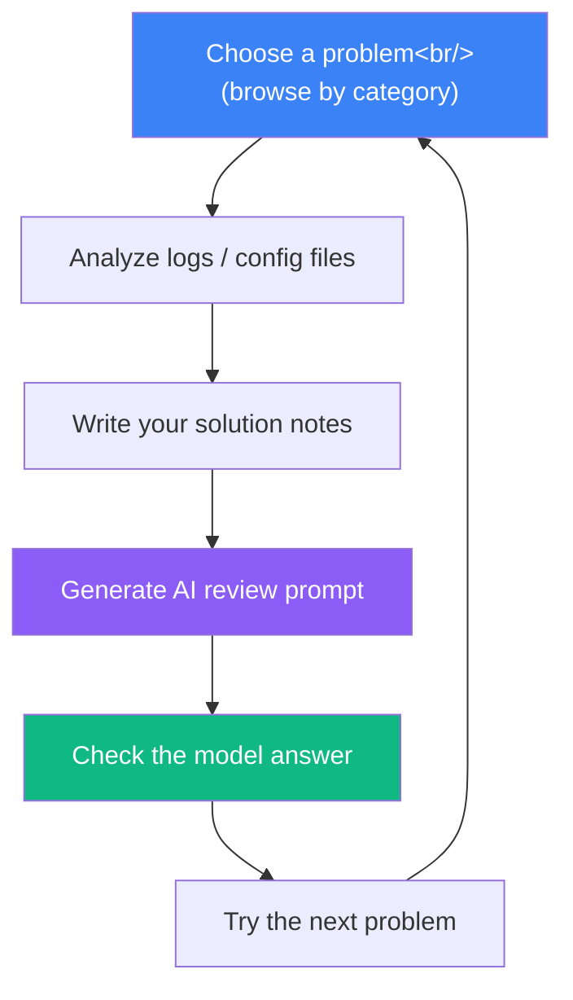
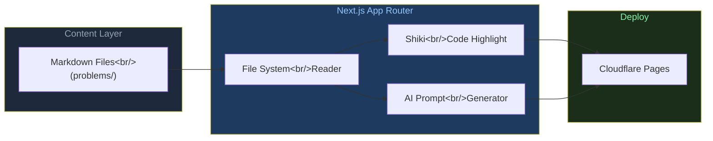

## Overview

You can't develop troubleshooting instincts from books alone. It takes repeated practice: reading real logs, pinpointing exactly which line in a config file is wrong. [Infratice](https://infratice.co.kr) delivers that experience directly in the browser. It's a problem-based learning platform covering Kubernetes, Linux, Network, CI/CD, and Monitoring — presenting real-world incident scenarios as static logs and config files. You analyze the root cause, write up your findings, and get an AI-review prompt generated automatically.

<!--more-->

The GitHub repo [kiku99/Infratice](https://github.com/kiku99/Infratice) is written in TypeScript and has 25 stars. The architecture is noteworthy: a static-content foundation on Next.js App Router, with all problem data managed as Markdown files — making contributions straightforward. Deployment is on Cloudflare Pages for fast global access.

---

## The Problem-Solving Flow

Infratice's learning flow is simple yet closely mirrors real incident response. Pick a problem, read through the provided logs and config files, reason through the root cause, and write your analysis. When you're done, an AI-review prompt is generated so you can get feedback from ChatGPT or Claude. Finally, check the model answer and compare it with your own.

The **AI review prompt generation** step is the key innovation. Instead of just showing the correct answer, Infratice composes a prompt based on your own write-up so an AI can give you targeted feedback. This makes the learning active — you discover what you got wrong before seeing the solution. The model answer comes after, which keeps the focus on your reasoning process.

---

## Categories and Example Problems

The platform currently covers five categories: **Linux**, **Kubernetes**, **Network**, **CI/CD**, and **Monitoring**. Each problem is stored as a Markdown file at `content/problems/{category}/{NNN}-{description}.md`, so anyone can add new scenarios via a PR.

Two representative examples:

- **Kubernetes — ImagePullBackOff**: Read Pod event logs and `kubectl describe` output to determine whether the failure is a typo in the image tag or a registry authentication issue. One of the most common incident types in real operations.
- **CI/CD — GitHub Actions build failure**: Analyze `workflow.yml` config and Actions logs to identify the cause — missing environment variable, cache conflict, runner version mismatch, and more.

Both reproduce patterns that appear in real production environments. If you've been in ops for any length of time, you'll recognize them immediately.

---

## Tech Stack and Architecture

Infratice runs on Next.js App Router with problem content managed as Markdown files. Code highlighting uses Shiki for readable rendering of logs and config files. Styling is Tailwind CSS v4, deployed on Cloudflare Pages.

The decision to separate content into Markdown is the right call. The Next.js app reads Markdown files at build time to generate static pages, so everything is served from Cloudflare's edge network with no server. Adding a new problem means writing one Markdown file and opening a PR — no database, no API.

Shiki tokenizes on the server side, so accurate syntax highlighting is available without any client-side JavaScript. It's well-suited for rendering structured text like log files and YAML configs legibly.

---

## Other Projects Worth Noting

A few other repos that caught my eye:

- **[youngwoocho02/unity-cli](https://github.com/youngwoocho02/unity-cli)** (57 stars, C#/Go) — A single Go binary for controlling the Unity Editor via CLI. Works standalone without MCP, ready to plug into build automation or CI pipelines.
- **[softaworks/agent-toolkit](https://github.com/softaworks/agent-toolkit)** — A curated collection of skills for AI coding agents. A structured repository of reusable skills for tools like Claude Code and Cursor.
- **[alibaba/page-agent](https://github.com/alibaba/page-agent)** — An in-page GUI agent that controls web interfaces via natural language. Runs directly inside the browser, handling complex UI automation with plain language commands.

---

## Closing Thoughts

Infratice is a rare platform that lets you directly train the skill of reading logs. The effort to close the gap between theory and hands-on practice is technically clean. The Markdown-based content model keeps contributions open, so if you've dealt with a memorable production incident, consider writing it up as a problem and contributing it.

If you want to get sharper at infrastructure troubleshooting, try working through problems at [infratice.co.kr](https://infratice.co.kr).
