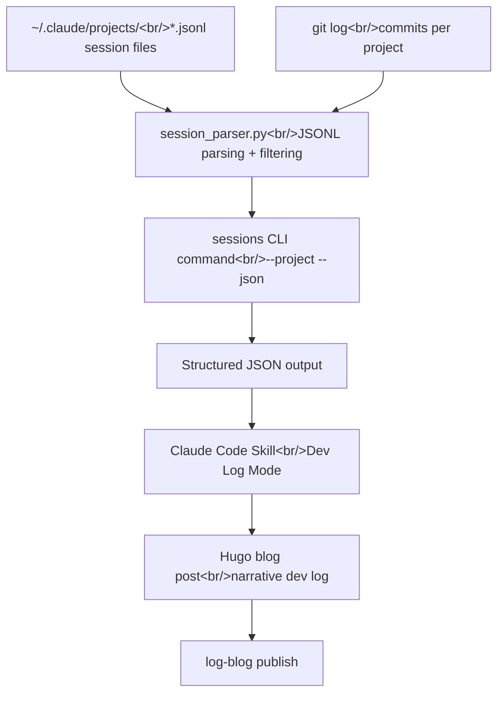

## Overview

log-blog is a Python CLI tool that converts Chrome browsing history into Hugo blog posts. Today's work split across two major threads. First, I improved AI chat URL classification and added Gemini share link extraction. Second, I built a new `sessions` command that parses Claude Code CLI session data to auto-generate development log posts. Across four sessions and roughly five hours, 13 commits landed.

<!--more-->

---

## AI Chat Extraction Improvements — AI_LANDING Noise Filter

### Background

When extracting AI service URLs from Chrome history, actual conversation pages and landing/login pages were mixed together. Across two Chrome profiles, 96 out of 3,575 URLs were AI service URLs — and most were noise: `claude.ai/oauth/*`, `chatgpt.com/` (landing page), `gemini.google.com/app` (no conversation ID).

Diagnosis:
- **Claude**: Most URLs were `claude.ai/code/*` (Claude Code sessions); `claude.ai/chat/{uuid}` conversation patterns: 0
- **ChatGPT**: 1 conversation URL, the rest landing pages
- **Gemini**: `gemini.google.com/app/{id}` conversations matched, but `gemini.google.com/share/{id}` (share links) were missing
- **Perplexity**: No URLs in history at all

### Implementation

I added `AI_LANDING` to the `UrlType` enum and restructured the classifier to run the noise filter **before** conversation pattern matching.

```python
class UrlType(str, Enum):
    # ... existing types ...
    AI_LANDING = "ai_landing"  # Noise: landing/OAuth/settings pages
```

Sample noise patterns:

```python
_AI_NOISE_PATTERNS = [
    re.compile(r"claude\.ai/(?:oauth|chrome|code(?:/(?:onboarding|family))?)?(?:[?#]|$)"),
    re.compile(r"chatgpt\.com/?(?:[?#]|$)"),
    re.compile(r"gemini\.google\.com/(?:app)?(?:/download)?(?:[?#]|$)"),
    # ...
]
```

In `content_fetcher.py`, `AI_LANDING` URLs now get an early-return skip with no fetch attempt — no wasting Playwright slots on login walls.

I also added `url_type` to the `extract --json` output, so the skill's Step 2 classification uses the same regex engine instead of having Claude guess the type.

**Result**: 34 AI chat conversations correctly classified, 32 noise URLs filtered out.

### Gemini Share Link Support

Added the `gemini.google.com/share/{id}` pattern to the Gemini classification regex, and implemented a dedicated `_extract_gemini_share()` extractor in `ai_chat_fetcher.py`. Share links are publicly accessible, so they're handled with standard Playwright — no CDP connection needed.

---

## YouTube Fetcher Fix — Adapting to a Breaking API Change

### Background

While writing a blog post, YouTube transcript fetching failed:

```
AttributeError: type object 'YouTubeTranscriptApi' has no attribute 'list_transcripts'
```

The `youtube-transcript-api` library shipped a v1.x update that changed **class methods** to **instance methods**.

| v0.x (old) | v1.x (new) |
|-----------|-----------|
| `YouTubeTranscriptApi.list_transcripts(video_id)` | `YouTubeTranscriptApi().list(video_id)` |
| `YouTubeTranscriptApi.get_transcript(video_id)` | `YouTubeTranscriptApi().fetch(video_id)` |

### Implementation

I rewrote `youtube_fetcher.py`:

```python
def _get_transcript(video_id: str):
    from youtube_transcript_api import YouTubeTranscriptApi
    api = YouTubeTranscriptApi()
    try:
        return api.fetch(video_id, languages=["ko", "en"])
    except Exception:
        pass
    try:
        transcript_list = api.list(video_id)
        for transcript in transcript_list:
            try:
                return transcript.fetch()
            except Exception:
                continue
    except Exception:
        pass
    return None
```

I also added the **YouTube oEmbed API** as a fallback to fetch video metadata (title, channel name, thumbnail) even when no transcript is available. Zero dependencies — just `urllib.request`:

```python
_OEMBED_URL = "https://www.youtube.com/oembed?url=https://www.youtube.com/watch?v={video_id}&format=json"
```

Three-tier fallback:
1. Transcript + oEmbed metadata (best)
2. oEmbed metadata only (when transcript unavailable)
3. Playwright scraping (when everything else fails)

---

## Sessions Command — Extracting Dev Logs from Claude Code Sessions

### Background

I run 20–40 Claude Code CLI sessions per day across multiple projects (GitHub + Bitbucket). Those sessions contain rich development narrative — debugging processes, architecture decisions, code changes — but there was no way to turn them into blog posts. The Chrome history pipeline tells me "what I looked at" but not "what I built."

### Data Flow



### Automatic Project Discovery

Claude Code stores session files under `~/.claude/projects/` in directories named with the project path encoded as a string:

```
-Users-lsr-Documents-github-trading-agent/
  ├── f08f2420-0442-475f-a1f8-3691da54eb9d.jsonl
  ├── 30de43c5-8bc2-48d0-86df-c1a6a3f7f6ee.jsonl
  └── ...
```

The problem: directory names can contain hyphens. For a repo named `hybrid-image-search-demo`, it's impossible to tell from the directory name alone which hyphens are path separators and which are part of directory names.

I solved this with a **greedy filesystem matching** algorithm:

```python
def _reverse_map_path(dirname: str) -> Path | None:
    # Strip worktree suffix if present
    if _WORKTREE_SEPARATOR in dirname:
        dirname = dirname.split(_WORKTREE_SEPARATOR)[0]

    raw = "/" + dirname[1:]  # leading '-' → '/'
    segments = raw.split("-")

    result_parts: list[str] = []
    i = 0
    while i < len(segments):
        matched = False
        for j in range(len(segments), i, -1):
            candidate = "-".join(segments[i:j])
            test_path = "/".join(result_parts + [candidate])
            if os.path.exists(test_path):
                result_parts.append(candidate)
                i = j
                matched = True
                break
        if not matched:
            result_parts.append(segments[i])
            i += 1

    path = Path("/".join(result_parts))
    return path if path.exists() else None
```

By trying the longest possible match first, directories with hyphens like `/Users/lsr/Documents/bitbucket/hybrid-image-search-demo` are resolved correctly.

### JSONL Parsing — Smart Filtering

Claude Code's JSONL files contain many message types: `user`, `assistant`, `system`, `progress`, and more. Including everything produces too much noise; I need to extract what matters.

| Message type | Include? | What to extract |
|---|---|---|
| User text | Yes | Full text (narrative backbone) |
| Assistant text | Yes | Up to 1,500 chars (decisions/explanations) |
| Edit/Write tool calls | Yes | File path + diff content |
| Bash errors | Yes | Command + stderr |
| Bash success | Summary only | Command only |
| WebFetch/WebSearch | Summary only | URL/query only |
| Agent subtasks | Summary only | Delegation description + result summary |
| Read/Grep/Glob | No | Exploration noise |
| thinking blocks | No | Internal reasoning, noise |

Default exclusions: sessions under 2 minutes or with fewer than 3 messages (override with `--include-short`). Max 100 items per session.

### CLI Usage

```bash
# List available projects
uv run log-blog sessions --list

# Detailed session data for a specific project (JSON)
uv run log-blog sessions --project log-blog --all --json

# All data including short sessions
uv run log-blog sessions --all --include-short --json
```

The output JSON contains three key datasets — `sessions`, `git_commits`, and `files_changed` — which the Claude Code skill's "Dev Log Mode" reads to write a narrative development log post.

---

## Skill Update — Adding Dev Log Mode

I added a "Dev Log Mode" section to `SKILL.md`. When a user says "summarize what I did today" or "write a dev log," the skill now branches to the session-data flow instead of the Chrome history flow.

Comparing the two modes:

| Item | Chrome History Mode | Dev Log Mode |
|---|---|---|
| Data source | Chrome SQLite DB | Claude Code JSONL + git log |
| Content nature | "What I looked at" | "What I built" |
| Post style | Topic-based technical analysis | Problem → solution narrative |
| Fetching needed | Yes (Playwright/API per URL) | No (included in session data) |

---

## Commit Log

| Message | Changed files |
|---------|---------------|
| docs: add design spec for AI chat extraction improvement | specs |
| docs: fix stale references in AI chat extraction spec | specs |
| docs: add implementation plan for AI chat extraction improvement | plans |
| chore: add pytest dev dependency | pyproject.toml, uv.lock |
| feat: add AI_LANDING noise filter and Gemini share link support | url_classifier.py, tests |
| feat: add url_type to extract --json and filter AI_LANDING noise | cli.py, tests |
| feat: skip AI_LANDING URLs in content fetcher | content_fetcher.py |
| feat: add Gemini share link content extraction | ai_chat_fetcher.py |
| docs: update skill to use url_type from extract output | SKILL.md |
| docs: add session-to-devlog feature design spec | specs |
| docs: update session-devlog spec with review fixes | specs |
| docs: add session-devlog implementation plan | plans |
| feat: add sessions command for Claude Code dev log extraction | cli.py, config.py, session_parser.py |

---

## Insights

Two separate threads converged on the same goal today. Improving AI chat URL classification captures "what I looked at externally" more accurately; the sessions command captures "what I built internally." Together they move log-blog from a "browsing log tool" to a foundation for recording the full scope of development activity.

The greedy filesystem matching algorithm is simple but effective. Reverse-mapping hyphenated directory names can't be solved with regex alone — checking the actual filesystem is the most reliable approach. The key insight is accepting that Claude Code's project directory encoding is lossy and validating at runtime instead.

The `youtube-transcript-api` v1.x breaking change was a reminder of why dependency management matters. Adding oEmbed as a fallback reflects graceful degradation — "if we can't get the transcript, at least get the metadata." The result is a three-tier fallback (transcript + oEmbed, oEmbed only, Playwright), each level maximizing the information retrieved.

The spec → design → plan → implement workflow (brainstorm → writing-plans → subagent-driven-development) continues to prove its worth. The AI chat improvement handled 7 tasks in parallel via subagents, and three spec review loops removed unnecessary types like `AI_CHAT_CLAUDE_CODE`, meaningfully improving the design before any code was written.
