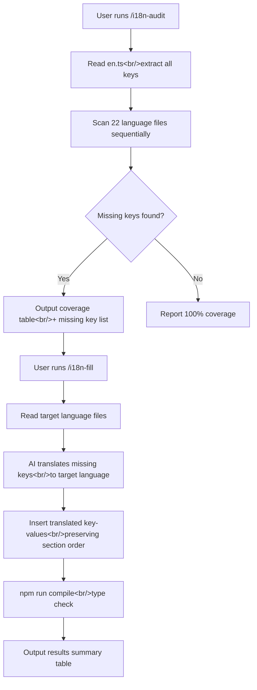

MEGA Code is a VS Code extension that turns Claude Code sessions into learning materials. It supports 23 languages, but translation coverage was uneven — Korean at around 90%, most others at 20–30%. Manually hunting down missing keys and translating them on every cycle became unsustainable. Automation was overdue.

This dev session covers designing and implementing two Claude Code commands (`/i18n-audit`, `/i18n-fill`) to automate the i18n workflow, plus fixes for a Node.js overlay race condition and a ChatService PATH mismatch found along the way.

<!--more-->

## i18n Automation Command Design

### The Problem

Three friction points were showing up in every i18n session:

1. Claude making assumptions about file contents without reading them first
2. Incomplete audits that missed missing keys
3. Repeated file edit failures

To eliminate this friction, I adopted a Two-Phase approach: audit first (understand current state), then fill (insert translations). Clean separation.

### `/i18n-audit` — Read-Only Translation Audit

This command, written in `.claude/commands/i18n-audit.md`, scans 22 language files against `en.ts` as the reference and reports missing keys. The core rule is simple: **always read the file before analyzing it**.

Output format is a markdown table:

```
| Language | File    | Total | Present | Missing | Coverage |
|----------|---------|-------|---------|---------|----------|
| Korean   | ko.ts   |   N   |    ...  |    ...  |    ...%  |
| Japanese | ja.ts   |   N   |    ...  |    ...  |    ...%  |
```

Key count is dynamically calculated from `en.ts` at runtime — hardcoding "282" would break every time a feature was added.

### `/i18n-fill` — AI-Powered Translation Gap Filling

This command inserts translations based on the audit results. Target languages can be specified:

```bash
/i18n-fill              # all 22 languages
/i18n-fill ko ja        # Korean and Japanese only
```

Translation guardrails are clearly defined in the prompt:

- Preserve `{param}` interpolation placeholders
- Keep HTML tag attributes (href, class, etc.) untouched; only translate visible text
- Match the tone and formality level of existing translations
- Preserve special export names like `id_` in `id.ts` (to avoid JavaScript reserved word conflicts)



### Key Design Decisions

Spec review surfaced five important issues:

1. **Indonesian export name** — `id.ts` exports as `id_`, not `id`, to avoid a JavaScript reserved word conflict.
2. **Hardcoded key count** — Changed "282" to a runtime count from `en.ts`.
3. **Key insertion position** — Insert into the correct section matching `en.ts` structure, not appended to the end of the file.
4. **HTML tag preservation** — Only translate text inside tags, not attributes.
5. **Extra keys** — Never delete keys that exist in a language file but not in `en.ts`.

## Bug Fix: Node.js Overlay Race Condition

### Symptom

The "Node.js missing" warning banner wasn't appearing, even on machines without Node.js installed. From the user's perspective, everything looked fine.

### Root Cause

Tracing the overlay state delivery chain revealed **four gaps in a push-only design**:

1. **Gap 1: Initial load race condition** — The `node-overlay` HTML starts with `class="hidden"`, and `updateNodeUI()` only runs when a `node:statusUpdate` message arrives. If the message arrives before the listener is registered, the overlay stays hidden forever.

2. **Gap 2: `onDidChangeVisibility` ignores node state** — When a panel is hidden and reopened, `sendAuthStatus()` is re-sent but there's no recovery path for node state.

3. **Gap 3: `sendNodeStatus` doesn't check visibility** — Messages sent while the panel is hidden are silently lost.

### Fix

I applied the **Push + Pull + Pending** triple-safety pattern that the auth system already used — extended it to node state as well:

```typescript
// dashboard-provider.ts — new fields
private pendingNodeUpdate = false;
private lastNodeAvailable: boolean | null = null;

// sendNodeStatus — with visibility check
public sendNodeStatus(available: boolean): void {
  this.lastNodeAvailable = available;
  if (!this.view) return;
  if (!this.view.visible) {
    this.pendingNodeUpdate = true;
    return;
  }
  this.view.webview.postMessage({
    type: 'node:statusUpdate',
    data: { available },
  });
}
```

On the webview side, `node:requestStatus` is now sent on `DOMContentLoaded` and on agent zone transitions:

```typescript
// card-scripts-init.ts — added to DOMContentLoaded
vscode.postMessage({ type: 'node:requestStatus' });
vscode.postMessage({ type: 'auth:requestStatus' });

// card-scripts-tabs.ts — added on zone switch
if (zone === 'agent') {
  vscode.postMessage({ type: 'node:requestStatus' });
  vscode.postMessage({ type: 'auth:requestStatus' });
}
```

Three files changed: `dashboard-provider.ts`, `card-scripts-init.ts`, `card-scripts-tabs.ts`.

## Bug Fix: ChatService PATH Mismatch

### Symptom

"Error: Claude CLI not found" appearing in the Q&A panel despite Claude CLI working fine in the terminal.

### Root Cause

`ClaudeCliChecker.isAvailable()` and `ChatService.runClaude()` were using different PATH values:

```typescript
// ClaudeCliChecker — uses extended PATH (correct)
const env = { ...process.env, PATH: buildExtendedPath() };
execFile('claude', ['--version'], { timeout: 5000, env }, ...);

// ChatService — uses default PATH (bug)
const proc = spawn('claude', args, {
  timeout: DEFAULT_CHAT_TIMEOUT_MS,
  stdio: ['pipe', 'pipe', 'pipe'],
  // no env! uses VS Code's default PATH only
});
```

`ClaudeCliChecker` finds `claude` using an extended PATH that includes `/opt/homebrew/bin` and reports it as available, but `ChatService` spawns without that path and gets `ENOENT`.

### Fix

Extracted `buildExtendedPath()` as a shared utility and unified its use in three places:

```typescript
// src/dependency/extended-path.ts (new file)
export function buildExtendedPath(): string {
  const home = os.homedir();
  const extra: string[] = [];
  if (process.platform !== 'win32') {
    extra.push(
      '/usr/local/bin',
      '/opt/homebrew/bin',
      path.join(home, '.local/bin'),
      path.join(home, '.claude/bin'),
      path.join(home, '.nvm/versions/node'),
      path.join(home, '.local/share/fnm'),
      path.join(home, '.volta/bin'),
      path.join(home, '.nodenv/shims'),
      '/usr/bin',
    );
  }
  const current = process.env.PATH || '';
  return [...extra, current].join(path.delimiter);
}
```

Previously, `node-checker.ts` and `claude-cli-checker.ts` each had their own `buildExtendedPath()` and had already drifted: node-checker had 7 paths, cli-checker had 4. Consolidation fixed the latent drift bug as well.

Four files changed: `extended-path.ts` (new), `claude-cli-checker.ts`, `node-checker.ts`, `chat-service.ts`.

## Other Work

- **`/explain-code` skill design** — A code tour skill for vibe coders (users unfamiliar with code structure). Provides a "Bird's Eye → Room by Room → Glossary" three-step walkthrough to understand code before running `/mend-logic` or `/mend-ui`.
- **Docs restructuring** — Developer README moved to `docs/`, walkthrough documents removed.
- **Version 0.1.1 release** — "Reliability Improvements" section added to README.

## Commit Log

| Message | Changed files |
|---------|---------------|
| fix(webview): add pull-based recovery for Node.js overlay status | dashboard-provider.ts, card-scripts-init.ts, card-scripts-tabs.ts |
| fix(chat): unify PATH resolution so ChatService finds Claude CLI | chat-service.ts, claude-cli-checker.ts, extended-path.ts, node-checker.ts |
| docs: restructure -- move developer README to docs/ | README-for-developers.md and others |
| chore: bump version to 0.1.1 | package.json, package-lock.json |
| docs: add bug reports, specs, and implementation plans | 6 doc files |
| docs: add i18n commands design spec | i18n-commands-design.md |
| docs: address spec review feedback for i18n commands | i18n-commands-design.md |
| docs: add i18n commands implementation plan | i18n-commands-plan.md |
| feat: add /i18n-audit command for translation key auditing | i18n-audit.md |
| feat: add /i18n-fill command for AI-powered translation gap filling | i18n-fill.md |
| chore: allow .claude/commands/ to be tracked in git | .gitignore |

## Insights

### Push-only messaging will always break

Message passing between a VS Code webview and the extension host is asynchronous. Push-only delivery can lose messages based on timing. The auth system already had the Pull + Pending pattern, but node state was missing it in the same codebase. **A pattern that solves a problem in one system needs to be applied to every other system with the same constraints.**

### PATH mismatch creates "check passes, execution fails"

When dependency checking and actual usage run in different environments (different PATH), the check result becomes meaningless. VS Code extension host PATH can differ significantly from the system shell — always factor this in. Extracting `buildExtendedPath()` as a shared utility isn't just DRY; it's **ensuring consistency**.

### The most important i18n automation rule: "always read before analyzing"

Claude assuming file contents without reading them was the biggest friction in i18n sessions. Both `/i18n-audit` and `/i18n-fill` list "ALWAYS read a file before editing it" as rule number one. **Making the most common failure mode the first explicit rule in an AI prompt is an effective design pattern.**
