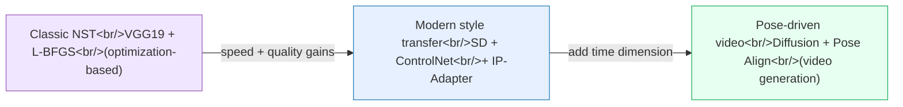
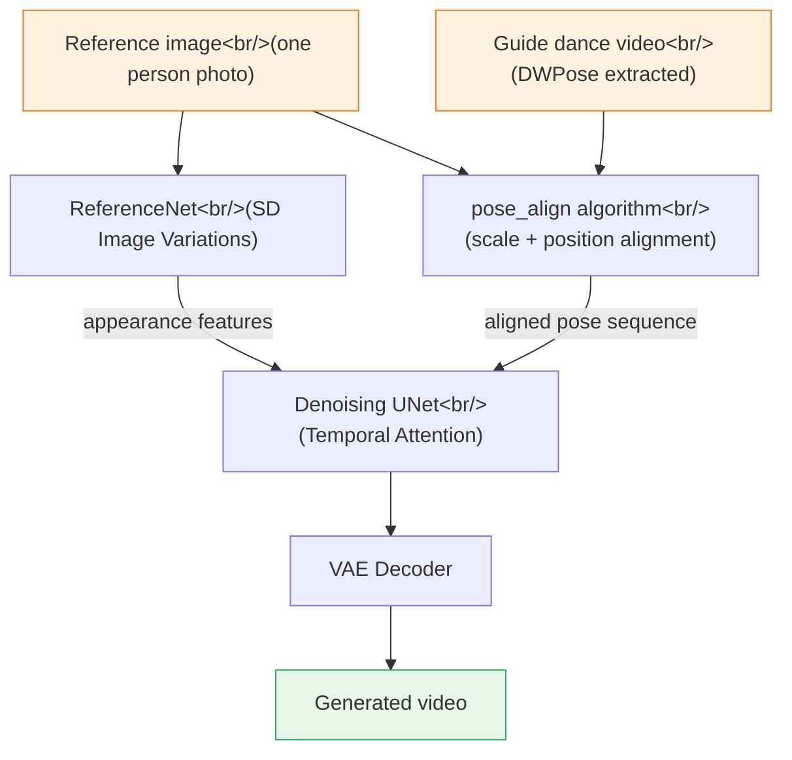

## Overview

The technology for transferring one image's style onto another has evolved at remarkable speed since Gatys et al.'s 2015 paper. What started as a slow, VGG19-based optimization loop has grown into real-time Stable Diffusion style transfer and, now, pose-driven virtual human video generation. This post surveys three open-source projects representing each era and traces the direction the technology has taken.

<!--more-->

The three projects take completely different approaches. `nazianafis/Neural-Style-Transfer` is the classic optimization-based method — great for understanding the fundamentals. `philz1337x/style-transfer` leverages the Stable Diffusion ecosystem for dramatically faster and higher-quality results. And Tencent Music's `TMElyralab/MusePose` extends the concept of style transfer into pose and motion, turning a still image into a dancing video.

---

## The Spectrum of Three Approaches

The diagram below shows how the three techniques differ along key axes.



- **Classic NST**: An optimization process that runs hundreds of backpropagation steps on a single pair of images. The principles are transparent and the implementation is simple, but it's slow.
- **Modern style transfer**: Uses Stable Diffusion's latent space to separate structure preservation (ControlNet Canny) from style injection (IP-Adapter). Speed and quality improve dramatically.
- **Pose-driven video generation**: Extends the concept of "style" into pose and motion. The visual appearance of a reference image is preserved while the movement from a target dance video is applied.

---

## 1. nazianafis/Neural-Style-Transfer — The Right Starting Point for Understanding the Principles

### A Classic Gatys Implementation

`nazianafis/Neural-Style-Transfer` (59 stars) is an educational PyTorch + VGG19 implementation of Gatys et al.'s 2015 paper "A Neural Algorithm of Artistic Style." The code is concise, and the role of each loss function is visible directly in the code — making it an ideal reference for anyone learning Neural Style Transfer from first principles.

The core idea: take one content image and one style image, and directly optimize the output image to minimize three loss functions. Neural network weights are frozen — the pixel values themselves are what's being updated.

### Loss Function Structure

Three losses combine to guide the optimization.

- **Content Loss**: L2 distance between feature maps at the `conv4_2` layer. Preserves structure and layout.
- **Style Loss**: Gram matrix differences across five layers (`conv1_1` through `conv5_1`). The Gram matrix captures correlations between feature map channels, encoding texture and style.
- **Total Variation Loss**: Sum of differences between adjacent pixels. Suppresses noise and smooths the result.

```python
# Gram matrix calculation
def gram_matrix(feature_map):
    b, c, h, w = feature_map.size()
    features = feature_map.view(b * c, h * w)
    gram = torch.mm(features, features.t())
    return gram.div(b * c * h * w)

# Total loss
total_loss = alpha * content_loss + beta * style_loss + gamma * tv_loss
```

The optimizer is L-BFGS, a quasi-Newton method using second-order derivative approximations that converges faster than Adam. The downside: memory usage grows sharply with resolution, and each image pair requires hundreds of forward/backward passes. Better as an experiment for understanding how Gram matrices encode style and how VGG layer depth affects the information captured, rather than for practical use.

---

## 2. philz1337x/style-transfer — Practical Style Transfer with Stable Diffusion

### ControlNet + IP-Adapter Combination

`philz1337x/style-transfer` (55 stars) solves the speed problem of classic NST by moving to the Stable Diffusion ecosystem. The approach combines two components: **ControlNet Canny** preserves edge structure from the content image, while **IP-Adapter** injects the visual characteristics of the style image into the diffusion process.

- **ControlNet Canny**: Extracts a Canny edge map from the content image and uses it as a guide signal during denoising. This preserves the outlines and structure of the original image in the output.
- **IP-Adapter (Image Prompt Adapter)**: Encodes the style image with a CLIP image encoder, then injects it into the UNet via cross-attention. The image itself serves as the style guide — no text prompt needed.

Using both together provides a clean separation: "structure from the content image, color and texture from the style image." The manual weight-tuning that classic NST required becomes much more intuitive.

### Deployment

Two ways to run it:

**Cog (Replicate) method**: Uses `cog`, a Docker-based packaging tool, to deploy to Replicate or run locally in a container.

```bash
# Local run
cog predict -i image=@content.jpg -i style_image=@style.jpg

# Replicate API
curl -X POST https://api.replicate.com/v1/predictions \
  -H "Authorization: Token $REPLICATE_API_TOKEN" \
  -d '{"version": "...", "input": {"image": "...", "style_image": "..."}}'
```

**A1111 WebUI method**: Install the ControlNet extension and IP-Adapter in AUTOMATIC1111's Stable Diffusion Web UI for a GUI-based pipeline. The developer also runs a paid version at ClarityAI.cc with additional features like upscaling.

Compared to classic NST, quality is higher and speed is much faster. The difference is especially pronounced for artistic styles (watercolor, oil painting, etc.) over photorealistic ones. The base model's pre-training on vast image-text pairs gives it far richer texture and color representation than VGG19-based Gram matrices.

---

## 3. TMElyralab/MusePose — Pose-Driven Virtual Human Video Generation

### A Practical Implementation of AnimateAnyone

`TMElyralab/MusePose` (2,659 stars) is a pose-driven image-to-video framework developed by Tencent Music Entertainment's Lyra Lab. It's an optimized version of Moore-AnimateAnyone — itself a practical implementation of Alibaba's AnimateAnyone paper — and handles pose animation in the Muse series (MuseV, MuseTalk, MusePose).

The goal is simple: take a single reference image of a person and a dance video, and generate a video of that person performing the dance. The reference image provides the appearance (clothing, face); the guide video provides the motion and pose.

### MusePose Pipeline



### pose_align — The Core Contribution

MusePose's most important technical contribution is the `pose_align` algorithm. The person in the reference image and the person in the guide video will typically differ in height, build, and camera distance. Without alignment, the pose transfer looks awkward.

`pose_align` automatically aligns scale, position, and proportions based on DWPose keypoints from both figures. This preprocessing step is essential for output quality.

```python
# pose_align example
python pose_align.py \
    --imgfn_refer reference_person.jpg \
    --vidfn_guide dance_video.mp4 \
    --outfn_align aligned_pose.mp4
```

### Model Architecture

- **ReferenceNet**: Based on Stable Diffusion Image Variations. Encodes appearance features (clothing, face) from the reference image and feeds them to the UNet.
- **Denoising UNet**: A UNet with added Temporal Attention layers for maintaining consistency across frames over time.
- **DWPose**: A pose estimation model that extracts human body keypoints from each frame. More accurate than OpenPose.
- **VAE**: Decodes from latent space back to pixel space.

Training code was released in March 2025, enabling fine-tuning on custom datasets. ComfyUI workflows are also supported. The project is actively used in entertainment applications like virtual fashion fitting and K-pop dance generation.

---

## Comparing the Three Projects

| Item | Neural-Style-Transfer | style-transfer | MusePose |
|---|---|---|---|
| Foundation | VGG19 + L-BFGS | SD + ControlNet + IP-Adapter | Diffusion + DWPose |
| Output | Image | Image | Video |
| Speed | Slow (minutes) | Fast (seconds) | Slow (scales with video length) |
| Training needed | No | No (pretrained) | No (pretrained) |
| Best for | Learning / experiments | Practical style application | Virtual humans, dance videos |
| GPU requirements | Low | Medium | High |

Classic NST can run on CPU without a GPU and is great for visualizing intermediate steps while learning the theory. For actual use, style-transfer has the best quality-to-barrier-of-entry ratio. MusePose produces the most impressive results but has correspondingly demanding infrastructure requirements.

---

## Closing Thoughts

Looking at the three projects together, the evolution path of AI image generation technology comes into focus. What started as "transfer one image's style onto another" has expanded into the time dimension — free control over a person's motion and pose. The common thread is that all three exploit visual representations already learned by deep learning models. Classic NST uses feature representations from a classification model (VGG19); the modern approaches use the latent space of a generative model (Stable Diffusion).

With projects like MusePose open-sourced and training code available, the barrier to virtual human technology keeps dropping. Beyond simple dance generation, real-time avatar control and personalized virtual influencer creation are the logical next applications.
