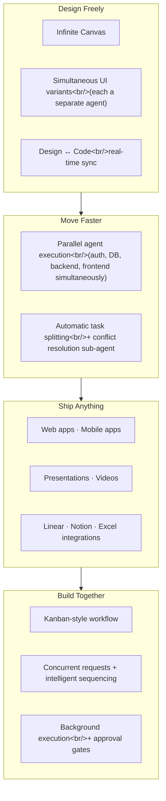

## Overview

Shortly after Replit closed a $400M Series D at a $9 billion valuation, they shipped **Agent 4**. The progression from Agent 2 (February 2025) → Agent 3 (September 2025) → Agent 4 marks a significant shift in philosophy: from "coding agent" to **"creative collaboration platform."** Web apps, mobile apps, landing pages, presentations, data visualizations, animated videos — the scope now extends beyond code to knowledge work broadly.

<!--more-->

---

## What Changed from Agent 3

Agent 3 focused on **long-running autonomous operation** — self-testing, bug-fixing, running independently for hours. Agent 4 pivots. Instead of pure autonomy, it emphasizes **"creative control."** The agent handles orchestration and repetitive work; creative judgment stays with the human.

This pivot aligns with the dominant trend of 2026 — "coding agent → knowledge work agent." Replit joins OpenAI's Cowork and Notion's Custom Agents in moving beyond pure code generation.

---

## Four Core Pillars

### 1. Design Freely — Infinite Canvas

A design canvas is now integrated directly into the build environment. On the infinite canvas you can freely explore designs and **generate multiple UI variants simultaneously**, with each variant handled by its own agent. The most striking part: design and code sync in real time — no separate design-to-development handoff.

### 2. Move Faster — Parallel Agents

The technical centerpiece of Agent 4. **Multiple agents process project components — auth, database, backend, frontend — concurrently.** Tasks are automatically split into smaller units, and a dedicated sub-agent resolves conflicts. This shift from sequential to parallel processing is the basis for Replit's claim of building "production-quality software 10x faster."

Note: parallel agents are currently **Pro/Enterprise tier only**, available temporarily to Core users.

### 3. Ship Anything — Beyond Code

A single integrated project can now produce web apps, mobile apps, landing pages, presentations, data visualizations, and animated videos. External service integrations with Linear, Notion, Excel, and Stripe are also supported.

Replit CEO Amjad Masad said Agent 4 can "not just build an application, but build and maintain an entire company" — pitch decks, animated logos, and payment integrations all in one platform.

### 4. Build Together — Kanban Workflow

The sequential chat thread is replaced with a **task-based kanban workflow**. Multiple team members can submit requests simultaneously, and agents process them with intelligent sequencing. Everything runs in the background with approval gates before merging.

---

## Agent 3 vs. Agent 4

| Item | Agent 3 (Sept 2025) | Agent 4 (Mar 2026) |
|------|---------------------|---------------------|
| Core philosophy | Long-running autonomous operation | Creative collaboration |
| Design | Requires separate tools | Infinite canvas built-in |
| Agent execution | Sequential (single) | Parallel (multiple) |
| Scope | Code-centric | Apps + slides + video |
| Team workflow | Chat threads | Kanban + approval gates |
| External integrations | Limited | Linear, Notion, Stripe, etc. |
| Pricing | Paid plans | Core and above (parallel: Pro+) |

---

## Quick Links

- [Replit Official Blog — Introducing Agent 4](https://blog.replit.com/introducing-agent-4-built-for-creativity) — Official launch announcement
- [Agent 4 Product Page](https://replit.com/agent4) — Feature overview and getting started
- [AINews — Replit Agent 4: The Knowledge Work Agent](https://www.latent.space/p/ainews-replit-agent-4-the-knowledge) — Latent Space analysis

---

## Insight

The most significant shift in Agent 4 is **the retreat from autonomy**. Agent 3 pushed "the agent figures everything out for you." Agent 4 pulls back to "the agent handles the repetitive work; creative decisions stay with you." This is the pattern emerging across the entire AI coding tools market in 2026 — rather than full autonomy, **where to place the human-AI collaboration boundary** has become the central design question.

The parallel agent architecture is also interesting. Auth, DB, backend, and frontend processed concurrently with a sub-agent resolving conflicts — this design shares the same core hypothesis as TradingAgents' multi-agent debate structure: "collaboration between multiple agents outperforms a single agent." Whether it's actually 10x faster remains to be validated in practice; the question is how expensive conflict resolution between parallel agents turns out to be relative to sequential processing.
