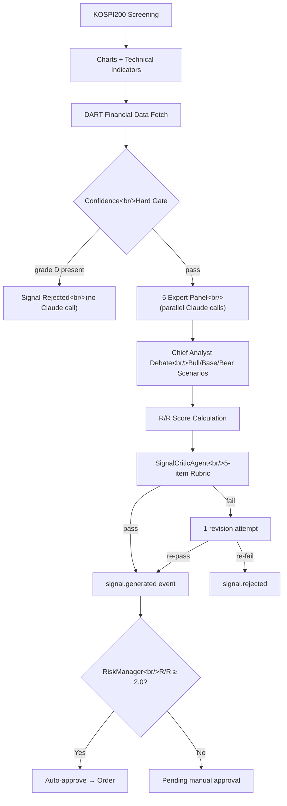
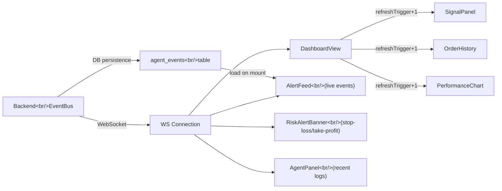

## Overview

In [the previous post (#3 — TradingAgents Analysis)](/posts/2026-03-17-trading-agents/), I analyzed the open-source TradingAgents repo and immediately spotted gaps in our own agent: fundamental analysis from financial statements, investment signal quality validation, scenario-based R/R (Risk/Reward) scoring, and rich report output. This post documents how I closed all four gaps.

Three sessions, over 20 hours of work. 37 commits, 25 new files, 65 changed files. One full cycle from design → spec review → implementation plan → subagent-driven TDD → merge → frontend debugging → dashboard reactivity improvements.

<!--more-->

## 1. Gap Analysis — What We Were Missing

A feature comparison against `kipeum86/stock-analysis-agent`:

| Feature | stock-analysis-agent | Our trading-agent |
|---|---|---|
| Fundamental data (DART API) | PER, EPS, Revenue, etc. | Technical analysis only |
| Data confidence grading | A/B/C/D validation | None |
| Scenario framework | Bull/Base/Bear + probabilities | None |
| R/R score formula | Quantitative calculation | None |
| Critic agent | 7-item quality rubric | None |
| Rich HTML report | KPI tiles, charts | Plain text |

Our strengths, on the other hand: real-time order execution, risk management (stop-loss/take-profit), event-driven multi-agent orchestration, WebSocket push. The fundamental difference is read-only research tool vs. an executable trading system.

The goal was clear: **A) DART fundamental integration → B) signal quality validation (critic + R/R) → C) rich dashboard**. I chose a Vertical Slice approach — make one stock flow through the entire pipeline before anything else.

## 2. DART Financial Data Integration

### DartClient Design

I built a `DartClient` service wrapping the FSS (Financial Supervisory Service) DART OpenAPI. Key design decisions:

- **`DART_API_KEY` is optional** — if absent, `enabled=False` and all fields get grade D. This causes immediate rejection at the confidence hard gate, blocking signal generation without wasting Claude API calls.
- **Corp code caching** — DART uses 8-digit unique codes rather than ticker symbols. The full mapping is fetched from the `corpCode.xml` endpoint and cached in a SQLite `dart_corp_codes` table, refreshed once daily.
- **Daily financial cache** — a `dart_cache` table prevents duplicate API calls for the same ticker within a day.

```python
class DartClient:
    def __init__(self):
        self.enabled = bool(settings.dart_api_key)
        self.base_url = "https://opendart.fss.or.kr/api"

    async def fetch(self, stock_code: str) -> dict:
        if not self.enabled:
            return {"financials": None, "confidence_grades": {
                "dart_revenue": "D", "dart_operating_profit": "D",
                "dart_per": "D", "dart_eps": "D",
            }}
        corp_code = await self._resolve_corp_code(stock_code)
        # fnlttSinglAcntAll endpoint for last 4 quarters
        ...
```

### Confidence Grading

Every data source gets a confidence grade:

```python
class DataConfidence(Enum):
    A = "A"  # Official disclosure, arithmetically verified
    B = "B"  # 2+ sources, within 5% variance
    C = "C"  # Single source, unverified
    D = "D"  # No data — triggers hard gate
```

**Hard gate**: if any of `current_price`, `volume`, `dart_revenue`, `dart_operating_profit`, or `dart_per` is grade D, signal generation halts entirely. The principle: "if we don't know, we don't guess."

## 3. Signal Pipeline — 5 Experts → Critic → R/R Gate

I added a **Fundamentals Analyst** as the fifth expert alongside the existing four (Technical, Macro, Sentiment, Risk). It takes DART data as its primary input and analyzes revenue growth trends, operating margin, PER/PBR valuation, and debt ratio.



### R/R Scoring

I replaced the old `confidence: float` field with a scenario-based structure:

```python
class Scenario(BaseModel):
    label: str          # "Bull" / "Base" / "Bear"
    price_target: float
    upside_pct: float   # % vs. current price
    probability: float  # 0.0–1.0, three sum to 1.0

class SignalAnalysis(BaseModel):
    bull: Scenario
    base: Scenario
    bear: Scenario
    rr_score: float     # (bull.upside × bull.prob + base.upside × base.prob)
                        #  / |bear.upside × bear.prob|
    variant_view: str   # What the market consensus is missing

def compute_rr_score(bull, base, bear) -> float:
    upside = bull.upside_pct * bull.probability + base.upside_pct * base.probability
    downside = abs(bear.upside_pct * bear.probability)
    return upside / downside if downside > 0 else 0.0
```

The `RiskManager` auto-approval gate now requires both `min_rr_score` (≥ 2.0) and `critic_result == "pass"`.

### SignalCriticAgent

Immediately after signal generation, before the event is published, the critic checks five items:

| # | Check | Pass Condition |
|---|---|---|
| 1 | Scenario completeness | 3 scenarios present, probabilities sum to 1.0 ±0.01 |
| 2 | Data confidence | No grade D on key fields |
| 3 | R/R arithmetic | Computed R/R and declared R/R within 5% |
| 4 | Expert dissent represented | At least one non-consensus view in the debate |
| 5 | Variant view specificity | References a concrete data point, not a generic risk statement |

Checks 1–3 are purely programmatic (no Claude call). Only checks 4–5 invoke the LLM rubric. On failure, the Chief gets the feedback injected and gets one revision attempt. A second failure drops the signal as `signal.rejected`.

### Chief Debate Update

The consensus threshold was updated for the 5-expert setup:
- `bullish_count >= 4` → `"dominant"` (≥80%)
- `bullish_count == 3` → `"majority"` (60%)
- `bullish_count <= 2` → `"split"`

## 4. Database Schema Extension

Seven columns were added to the `signals` table, and a new `agent_events` table was created:

```sql
-- ALTER TABLE migration (ignores column-already-exists errors)
ALTER TABLE signals ADD COLUMN scenarios_json TEXT;
ALTER TABLE signals ADD COLUMN variant_view TEXT;
ALTER TABLE signals ADD COLUMN rr_score REAL;
ALTER TABLE signals ADD COLUMN expert_stances_json TEXT;
ALTER TABLE signals ADD COLUMN dart_fundamentals_json TEXT;
ALTER TABLE signals ADD COLUMN confidence_grades_json TEXT;
ALTER TABLE signals ADD COLUMN critic_result TEXT;

-- Agent event persistence
CREATE TABLE IF NOT EXISTS agent_events (
    id INTEGER PRIMARY KEY AUTOINCREMENT,
    event_type TEXT NOT NULL,
    agent_name TEXT,
    data_json TEXT,
    timestamp DATETIME DEFAULT (datetime('now'))
);
```

The `risk_config` table was seeded with `min_rr_score` (default 2.0) and `require_critic_pass` (default true).

## 5. Dashboard Reactivity and ReportViewer

### WebSocket-Based Live Updates

The old dashboard fetched data once on mount and never reacted to WebSocket events. Fixed:



**Key change**: `DashboardView` increments a `refreshTrigger` state on each WS message, and each panel component re-fetches when that prop changes. `RiskAlertBanner` watches for `signal.stop_loss` and `signal.take_profit` events and displays a warning banner at the top.

### Agent Event Persistence

Previously, agent events lived only in memory and disappeared on server restart. Now `event_bus.py` fire-and-forgets each event to the DB. On `AlertFeed` mount, recent events are loaded from the DB and merged with live WS events.

### ReportViewer

A new component fully replacing the old `ReportList`:

- **KPI tile row**: total return, win rate, average R/R, total trade count
- **Trade table**: buy/sell details and return per ticker
- **Signal grid**: scenario cards and expert stances
- **Narrative section**: markdown report body

On the backend, `report_generator.py` produces structured `summary_json`, and `_enrich_report()` in the `reports.py` router parses the JSON columns and delivers them to the frontend.

## 6. Debug Notes

### Missing `import type` Blanks the React Page

After the merge, the dashboard went completely white. With no error boundary, there were no clues. Only after checking the browser console via Playwright did I find the cause:

```
Uncaught SyntaxError: The requested module does not provide an export named 'Scenario'
```

TypeScript `interface` declarations are erased at compile time. But three components were doing runtime imports of `Scenario`. The fix was straightforward:

```typescript
// Before — runtime import of a type-only construct
import { Scenario } from '../../types';

// After — properly erased at compile time
import type { Scenario } from '../../types';
```

All three files (`SignalCard.tsx`, `ScenarioChart.tsx`, `FundamentalsKPI.tsx`) had the same pattern. Without an error boundary, one component crashing takes the whole page down — the same pattern as a single broken Mermaid diagram hiding all diagrams.

### "9 hours ago" — UTC Timestamp Parsing Bug

Every timestamp in the dashboard showed "9 hours ago." SQLite's `datetime('now')` stores UTC strings without a `Z` suffix — `"2026-03-17 01:55:01"`. JavaScript's `new Date()` treats these as local time, causing a 9-hour offset in a KST (UTC+9) environment.

```typescript
// frontend/src/utils/time.ts — shared UTC parser
export function parseUTC(timestamp: string): Date {
  const ts = timestamp.endsWith('Z') || timestamp.includes('+')
    ? timestamp
    : timestamp + 'Z';
  return new Date(ts);
}
```

Replaced `new Date(timestamp)` with `parseUTC(timestamp)` across all six components: `AgentPanel`, `AlertFeed`, `OrderHistory`, `PerformanceChart`, `ReportViewer`, `RiskAlertBanner`.

## 7. Commit Log

Summary of 37 commits across 3 sessions:

| Phase | Commits | Content |
|---|---|---|
| Design | 3 | Spec docs, review feedback, implementation plan |
| Phase A: DART | 4 | `DataConfidence` enum, `Scenario`/`SignalAnalysis` models, DB schema, `DartClient` |
| Phase B: Quality | 4 | Chief debate update, `SignalCriticAgent`, DART + hard gate wiring, critic loop |
| Phase C: UI | 4 | R/R gate, signals API extension, 3 React components, `import type` fix |
| Merge | 1 | feature branch → main (1,493 insertions, 25 files) |
| Dashboard | 7 | Design spec, implementation plan, WS refresh, `RiskAlertBanner`, event persistence, `AgentPanel` logs |
| Report | 6 | `ReportSummary` type, `getReport` API, `summary_json` calculation, `ReportViewer`, CSS, `ReportList` removal |
| Fixes | 4 | `confidence_grades_json` parsing, Reports tab navigation, AgentPanel layout, UTC parsing |
| Misc | 4 | `.gitignore`, plan docs, etc. |

## 8. Insights

### Vertical Slice Surfaces Integration Issues Early

Pushing one stock through the full DART → Expert → Chief → Critic → R/R Gate → UI pipeline immediately exposed integration issues like the `import type` bug and missing `confidence_grades_json` right after the merge. Building layer by layer would have deferred all of this to a far more expensive debugging session later.

### Programmatic Critic Checks Cut LLM Costs

Three of the five rubric items (scenario completeness, data confidence, R/R arithmetic) are verified with pure code — no Claude call needed. Only the remaining two require LLM judgment. The principle: let code handle arithmetic, let the LLM handle judgment.

### Timestamps Are Always a Trap

SQLite's `datetime('now')` storing UTC without a `Z` is documented behavior, but `new Date()` in JavaScript interpreting it as local time is a pitfall I fall into every time. The right answer was to build a `parseUTC()` utility once and use it consistently across every component.

### What's Next

- Add error boundaries — one component crash should not take down the entire page
- DART API rate limiting — the current daily cache works for single stocks, but concurrent multi-ticker scanning needs proper throttling
- Run the live market scanner and measure critic rejection rates — if the rubric is too strict, it may be blocking useful signals
