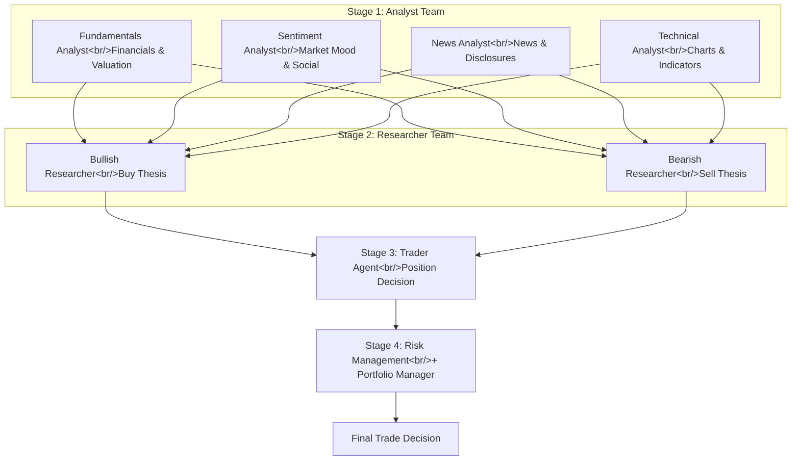

## Overview

> Previous post: [Stock Trading Agent Dev Log #2 — Expert Agent Team and KOSPI200 Data Adventures](/posts/2026-03-05-trading-agent-expert-team/)

Building the Expert Agent Team architecture in [#2](/posts/2026-03-05-trading-agent-expert-team/) taught me something important: a multi-agent debate structure produces far richer analysis than a single LLM. It turns out someone had already taken that idea and built a serious framework around it. [TradingAgents](https://github.com/TauricResearch/TradingAgents) is a multi-agent trading framework with 32,395 GitHub stars (as of March 2026) that models the decision-making structure of an actual trading firm using LLM agents.

<!--more-->

---

## TradingAgents Architecture

### The Four-Stage Pipeline

TradingAgents mirrors the decision flow of a real securities research team. It has academic grounding in arXiv paper [2412.20138](https://arxiv.org/abs/2412.20138), with a separate Trading-R1 technical report also available.



The **Analyst Team** consists of four specialists. The Fundamentals Analyst covers financial statements and valuation. The Sentiment Analyst handles market mood and social data. The News Analyst covers news and regulatory filings. The Technical Analyst focuses on chart patterns and indicators. Each agent writes its report independently.

The **Researcher Team** is where TradingAgents' real differentiator lives. Two researchers — Bullish and Bearish — take the analyst reports and **debate** each other rather than simply aggregating information. Opposing views are deliberately put in collision. Compared to the Expert Team I built in [#2](/posts/2026-03-05-trading-agent-expert-team/), TradingAgents adds multiple debate rounds that iterate toward consensus.

The **Trader Agent** synthesizes the analyst and researcher reports to make the actual position decision. **Risk Management** and the **Portfolio Manager** handle the final approval stage.

### Comparison with Our System

The Expert Agent Team from [#2](/posts/2026-03-05-trading-agent-expert-team/) used 4 experts + a Chief Analyst. Against TradingAgents:

| Item | Our System (#2) | TradingAgents |
|------|-----------------|---------------|
| Analysis agents | 4 (same) | 4 (same) |
| Debate structure | Chief Analyst synthesis | Bullish vs. Bearish debate |
| Risk management | None | Risk Management + Portfolio Manager |
| Data sources | KIS API + NAVER Finance | Alpha Vantage + News API |
| LLM | Claude API | GPT-5.4, Gemini 3.1, Claude 4.6, etc. |
| Korean market | KOSPI200 native | Not supported |

The key differences are the **Bullish vs. Bearish debate structure** and the **risk management layer**. Our system has a Chief Analyst synthesizing opinions; TradingAgents explicitly collides opposing positions before the Trader decides. This structure can produce richer analysis, but API call costs scale accordingly.

---

## Quick Start

```bash
git clone https://github.com/TauricResearch/TradingAgents.git
cd TradingAgents
pip install -r requirements.txt
```

```python
from tradingagents.graph.trading_graph import TradingAgentsGraph
from tradingagents.default_config import DEFAULT_CONFIG

ta = TradingAgentsGraph(debug=True, config=DEFAULT_CONFIG)
_, decision = ta.propagate("NVDA", "2024-05-10")
print(decision)
```

A single `propagate()` call runs the entire pipeline. Pass a ticker symbol and a date, and the full Analyst Team writes reports in parallel, the Researcher Team debates, and the Trader's final decision is returned.

### Switching LLM Providers

v0.2.1 supports GPT-5.4, Gemini 3.1, Claude 4.6, Grok 4.x, and Ollama. Switching is just a config change:

```python
config = DEFAULT_CONFIG.copy()
config["llm_provider"] = "anthropic"
config["deep_think_llm"] = "claude-sonnet-4-6"
config["quick_think_llm"] = "claude-haiku-4-6"
```

Not being locked into a single model is a meaningful practical advantage. Our system is tied to the Claude API, so TradingAgents' provider abstraction layer is worth studying.

---

## Considerations Before Production Deployment

The backtest results in the paper and technical report are impressive. But there are practical considerations before going live.

**API costs**: The more debate rounds between agents, the faster costs multiply. A single analysis run can generate dozens of LLM calls.

**Hallucination risk**: LLMs hallucinate — especially with specific numbers and dates. Without a fact-verification layer, bad information can feed directly into investment decisions. The ["Blank beats wrong" principle from stock-analysis-agent](/posts/2026-03-16-stock-analysis-agent/) is a good reference here.

**No order execution**: As an open-source framework, the actual order execution layer needs to be built separately. KIS API integration, as in our system, would be required.

**No Korean market support**: Handling KOSPI200 or DART disclosures requires additional development — which is where our system has an advantage.

---

## Next Steps

The Bullish vs. Bearish debate structure and the risk management layer from TradingAgents are worth incorporating. Specifically:

1. **Chief Analyst → debate structure**: Replace simple synthesis with explicit collision of opposing positions
2. **Add a risk management layer**: Portfolio-level risk checks that consider the full context
3. **LLM provider abstraction**: Build in the ability to experiment with models beyond Claude

Another option is to fork TradingAgents directly and add KIS API and DART data support. The core architecture is already validated; you'd only need to add the Korean market specialization layer on top.

---

## Quick Links

- [TauricResearch/TradingAgents](https://github.com/TauricResearch/TradingAgents) — Multi-agent trading framework (32K stars)
- [arXiv paper 2412.20138](https://arxiv.org/abs/2412.20138) — Academic foundation
- [stock-analysis-agent post](/posts/2026-03-16-stock-analysis-agent/) — Claude Code-powered practical analysis tool
- [#2 Expert Agent Team](/posts/2026-03-05-trading-agent-expert-team/) — Previous post in the series

## Insights

What stands out most about TradingAgents is that the core value of a multi-agent debate structure isn't "more information" — it's **the structuring of opposing views**. When Bullish and Bearish researchers interpret the same data in opposite directions, the investor sees both arguments before making a judgment call. This is a structural solution to the confirmation bias inherent in single-LLM analysis.

32,000 stars is the community voting on that idea. LLM-based financial analysis has already moved past "is this possible?" to "how do we make it trustworthy?" — and that's a more interesting problem.
