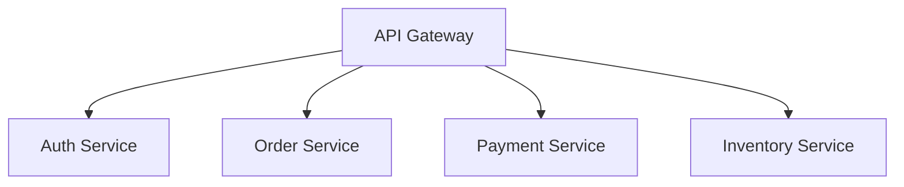
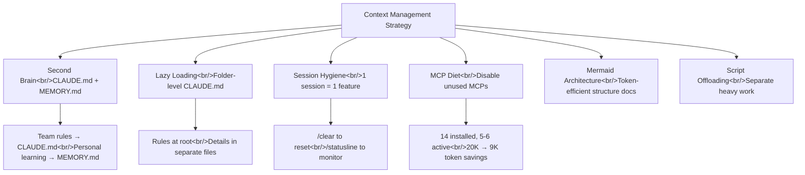
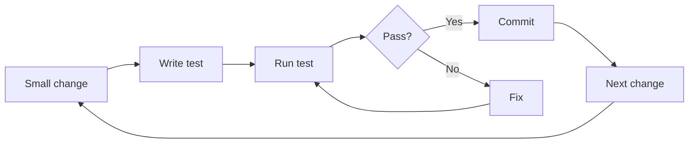
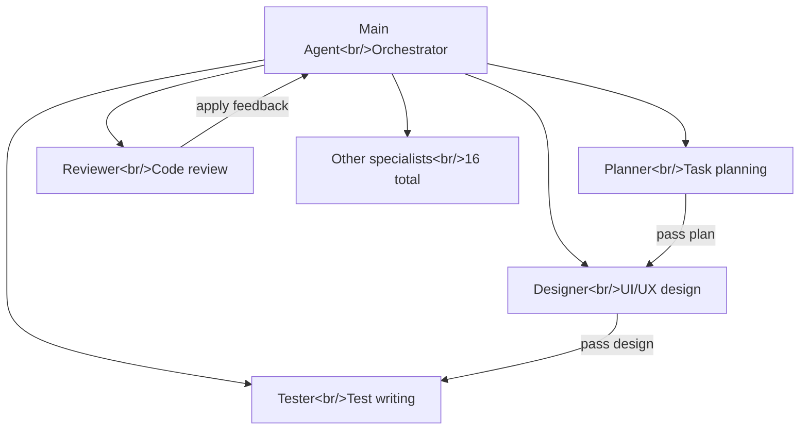

## Overview

Even after installing Claude Code and learning the basics, a common frustration surfaces: "Why am I not getting the results everyone else seems to get?" Conversations grow long and Claude seems to get dumber, repeating the same mistakes and breaking things in other places when fixing one. Most of these problems come down to **context management and workflow**.

This post synthesizes two videos into immediately actionable strategies. The first is a Meta engineer's [20-minute deep dive on context management and practical workflows](https://www.youtube.com/watch?v=DCsv0rKKrN4), covering everything from Second Brain setup to the WAT framework. The second is Anthropic hackathon winner Afan Mustafa's [10 Claude Code tips](https://www.youtube.com/watch?v=QhZJyg47JW0), distilling 10 months of experience that earned him 70,000+ GitHub stars, broken down into beginner, intermediate, and advanced levels.

Both videos converge on the same message: **Claude Code's output quality depends entirely on the quality of context you provide, and building a system to manage that context systematically is what productivity actually looks like.**

<!--more-->

## Core Principles of Context Management

### Second Brain — Structure Your Knowledge

The strategy is to record patterns, solutions, and decision rationale discovered while working with Claude Code in local markdown files. The Meta engineer maintains a project decision log organized by topic, capturing patterns encountered during development, solutions, and reasoning. When you need to do something similar later, you just feed Claude that file.

This used to be manual, but the `/memory` command now automates it. Claude automatically saves what it learns during a session — build commands, debugging insights, code patterns — to `MEMORY.md`, which is auto-loaded at the start of each session. Say "remember this" and it's saved. Check and edit with `/memory`.

| File | Role | Scope | Managed by |
|------|------|------|-----------|
| `CLAUDE.md` | Team-shared rules, coding conventions, architecture decisions | Whole project | Manual |
| `MEMORY.md` | Personal preferences, recurring mistake patterns, learned content | Personal | Auto (`/memory`) |
| `TODO.md` | Session-to-session work continuity | Per session | Manual + AI collaboration |

The key principle: **don't put everything in CLAUDE.md.** Keep personal memory in `MEMORY.md` and team-shared knowledge in `CLAUDE.md`.

### Lazy Loading — Load Only What You Need

A common mistake is cramming API specs, DB schemas, coding conventions, and architecture docs all into one CLAUDE.md. The problem is that CLAUDE.md is auto-loaded every session. If it contains 50 API endpoints and 30 DB table schemas, you're burning thousands of tokens every time — for content that's less than 5% relevant to the current task.

**Bad** — all 50 API endpoints in CLAUDE.md:

```markdown
# CLAUDE.md
## API Endpoints
POST /api/users ...
GET /api/users/:id ...
(all 50 endpoints listed)
```

**Good** — CLAUDE.md holds references; details live in separate files:

```markdown
# CLAUDE.md
## Reference Docs
- API spec: docs/api-spec.md
- DB schema: docs/db-schema.md
- Architecture: docs/architecture.md
```

This is **Lazy Loading**. When you say "update the DB schema," Claude reads `docs/db-schema.md` from the pointer in CLAUDE.md and does the work — without loading the API spec or frontend architecture docs. Afan Mustafa calls this **Progressive Disclosure**: better to hand a new employee a table of contents and say "look things up when you need them" than to dump the entire manual on them at once.

If the root CLAUDE.md is growing too large, create **folder-level CLAUDE.md files**:

```
project/
├── CLAUDE.md              # Global rules (keep it lean)
├── apps/api/
│   └── CLAUDE.md          # API server-specific rules
├── web/
│   └── CLAUDE.md          # Frontend-specific rules
├── supabase/
│   └── CLAUDE.md          # DB-related rules
└── docs/
    └── architecture.md    # Mermaid diagrams
```

The relevant CLAUDE.md is auto-loaded when working in that folder, preventing both root CLAUDE.md bloat and context contamination.

### Document Architecture as Mermaid Diagrams

Instead of explaining system structure in prose every time, a **Mermaid diagram** communicates architecture to Claude far more efficiently:



Store diagrams by feature in a separate file like `docs/architecture.md` and reference it from CLAUDE.md. Combined with Lazy Loading, Claude reads only the architecture relevant to the feature at hand. Token efficiency is dramatically better than prose descriptions.

### Session Hygiene — One Session, One Feature

The context window is 200K tokens. That sounds large, but it fills faster than expected. Afan Mustafa calls this **"Context is milk"** — it goes stale over time. The longer a conversation runs, the fuzzier the earlier parts become.

Core principles:

- **One session = one feature.** Instead of "build the entire payment system," scope it down to "implement the Stripe webhook handler." When a feature is done, use `/clear` or start a fresh session before moving on.
- **Run `/compact` at the right time.** Relying on auto-compression alone can lose critical context. Trigger it manually after completing a major feature or when the direction changes.
- **Monitor token usage with `/statusline`** continuously. You can't manage what you can't see — it's like driving without a fuel gauge.

**The core principle: "Fresh context beats bloated context."** Don't cling to previous conversation history. Starting each task with a clean session produces better results.

### MCP Diet — Turn Off Tools You're Not Using

Multiple connected MCPs consume significant tokens just from their tool descriptions. Looking at Afan Mustafa's actual setup: **14 MCPs installed, but only 5–6 active at any time.** The rest are turned on only as needed.

The system prompt can consume up to about **20,000 tokens**. Disabling unused MCPs can cut that to **9,000 tokens** — more than half. Too many active MCPs can shrink your effective context from 200K down to **70,000 tokens**.

Both videos give the same advice:

1. Use `/mcp` to check currently active MCPs
2. Disable any not needed for the current task
3. MCPs like **Notion and Linear have especially large tool descriptions** that consume a lot of tokens
4. Build **custom MCPs** wrapping only the endpoints you actually use. This saves tokens and improves response quality.



### Offload Heavy Work to Scripts

Running heavy data processing inside a conversation contaminates context. Take a DB migration that needs to parse a 100K-row CSV: Claude has to read all 100K rows, load them into context, and process them. Context gets polluted and quality drops.

Instead:

1. Ask Claude to **write a migration script** that parses the CSV
2. Have Claude **run** that script
3. Claude only receives the **results** (JSON, etc.) and continues from there

Claude never needs to read the CSV directly — just the summary output. Heavy data goes through scripts; Claude only receives the result. Context stays clean.

## Practical Workflow Patterns

### Plan Mode — Design First, Implement Second

Both videos emphasize **running Plan mode first**. Afan's analogy: "You wouldn't start laying bricks without a blueprint." Jumping straight to execution can send Claude on a destructive mass-edit in the wrong direction, wasting both context and usage credits.

The concrete workflow:

1. **In Plan mode**, describe the task to Claude
2. Claude presents a plan — which files to modify, what approach to take
3. **Review the plan** and give feedback. Correct the direction if it's wrong; ask for alternatives if you want them.
4. Once satisfied with the plan, **switch to Accept mode** and execute
5. After completion, `/clear` and move to the next step

**The key: separate the planning session from the implementation session.**

### Always Read the Thinking Process

Never ignore Claude's thinking process. There are moments when Claude makes an assumption like "this function seems to do X, so I'll do Y" — **and that assumption can be wrong.** Catch it immediately with `Escape` and correct the assumption. Code built on a wrong assumption is entirely worthless. **Catching it early is everything.**

### Cross-AI Critique

A useful tip from the Meta engineer: take Claude's plan and **show it to ChatGPT or Gemini for critique**.

> "Analyze this conversation and point out what Claude might be missing or getting wrong."

Each AI model approaches problem definition and solutions from genuinely different angles. Taken a step further, this whole process can be **automated as a custom skill** — a `with-multiple-ai` skill, for example, could pass one AI's plan to another, collect feedback, and surface a summary automatically.

### TDD-Based Smart Coding

Since it's difficult to closely review every line of AI-generated code, **tight TDD loops are essential.**



- Keep change units small
- Write and run tests **after every change**
- **Commit immediately** on pass. If something breaks, rolling back to the last commit makes debugging trivial.
- When errors occur, **paste the raw log — don't interpret it.** Human interpretation introduces omissions and inaccuracies. Claude is excellent at analyzing stack traces; give it the original.

### TODO.md for Session Continuity

AI doesn't know your task list the way you do. **Maintaining a TODO.md** from project start to finish and sharing it with AI is key to continuity.

Practical workflow:

1. Decide what to do today — implement payment, polish landing page, subscription system, fix bugs 1 and 2
2. Write it as a checklist in `TODO.md`
3. Tell Claude: "Start from TODO.md"
4. Use **Agent Teams** to parallelize multiple tasks
5. At session end, say "update TODO.md" and progress is automatically reflected

This maintains **continuity across multiple sessions**.

### The WAT Framework

NetworkChuck's **WAT (Workflow-Agent-Tools)** framework provides structure for managing Claude Code projects. The Meta engineer tried it and found it solid.

- **W (Workflow)** — define the task steps clearly in plain English before writing any code. Write out what stages this task should go through.
- **A (Agent)** — assign agents to each stage. Self-healing is key — when an error occurs, the agent reads its own logs, identifies the cause, fixes the code, and re-runs. Splitting roles across agents for parallel processing can cut a 10-minute task to 3–4 minutes.
- **T (Tools)** — **many small scripts beat one large script.** Break `deploy-all.sh` into single-responsibility units. When Claude fails mid-execution, debugging a small script is far more efficient.

**Concrete example — adding a comment system to a blog:**

```
W (Workflow):
  1. Design and migrate the comments table schema
  2. Implement API endpoints
  3. Build frontend UI
  4. Write and pass tests at each stage

A (Agent):
  - Claude as coordinator, distributing tasks to subagents
  - One subagent designs tests while another implements the API
  - Automatic self-healing recovery on errors

T (Tools):
  - scripts/migrate.sh → run DB migration
  - MCP GitHub → auto-create PR
  - Hooks → auto-run tests on every commit
```

The framework's core idea is **separating AI reasoning from code execution**. Have Claude think; let separate tools or scripts handle execution. Complex workflows become reliably manageable.

### Model Selection Strategy

Not every task needs Opus. Afan Mustafa uses a restaurant analogy — you don't order a tasting menu for a quick lunch.

| Model | Suitable tasks | Analogy |
|------|------------|------|
| **Haiku** | File lookup, minor edits, format changes | Quick lunch |
| **Sonnet** | Multi-file edits, general coding, bug fixes | Regular meal |
| **Opus** | Full architecture design, complex bugs, multi-file refactoring | Tasting menu |

**Providing reference code matters too.** Show Claude similar open-source code when asking it to build something, and the quality of the output noticeably improves. There's a difference between asking someone to draw on a blank canvas versus giving them a reference to work from.

## Advanced: Subagents and Automation

### Subagents — 16 Specialized Agents

Afan Mustafa's system has **16 specialized subagents**. Like an orchestra conductor who doesn't personally play every instrument, the approach is to give each agent exactly one job and pass the output to the next.



Using subagents keeps each role's context independent, so the main agent only handles orchestration — making complex projects manageable at scale.

### Git Worktrees — The Foundation of Parallel Work

Normally you finish one task before starting the next. With `git worktree`, you can have **multiple working directories simultaneously** in the same project — like going from one desk to five desks running in parallel.

```bash
# Create worktrees
git worktree add ../project-feature-a feature-a
git worktree add ../project-feature-b feature-b

# Run independent Claude Code sessions in each
cd ../project-feature-a && claude
cd ../project-feature-b && claude
```

Run Claude separately in each directory and five agents develop different features simultaneously. Non-conflicting features develop in parallel and merge to main when complete.

### Hooks — Automated Learning System

Claude Code's Hook feature works like **an alarm clock** — commands that run automatically at specific trigger points.

| Hook | Trigger | Use cases |
|------|--------|----------|
| `session_start` | On new conversation | Auto-load past records, load TODO.md |
| `pre_compact` | Before context compression | Save important content to MEMORY.md first |
| `stop` | On conversation end | Auto-record what was learned this session |

Combining these three creates **a system where Claude remembers what it learns even after conversations end**. It eliminates the manual effort of configuring context every time and lets Claude gradually "know" more about the project.

### Security Notes

Warnings from Afan Mustafa not to skip:

1. **Don't activate too many MCPs** — context space shrinks significantly
2. **Don't rely solely on auto-compression** — critical context can disappear
3. **Take security seriously** — when Claude reads external data, malicious instructions can be hidden inside. This is **Prompt Injection**, and Afan's guide includes security tools that automatically detect it.

## Quick Links

- [Meta engineer's complete Claude Code guide — practical edition](https://www.youtube.com/watch?v=DCsv0rKKrN4) — Context management, TDD workflow, WAT framework, Cross-AI critique
- [10 Claude Code tips — Anthropic hackathon winner](https://www.youtube.com/watch?v=QhZJyg47JW0) — Progressive Disclosure, system prompt diet, subagents, Git Worktrees, Hooks

## Insights

The throughline of both videos is: **"Claude Code is not a tool — it's a system."** Beyond writing good prompts, you need to build a **development system** that encompasses knowledge management (CLAUDE.md, MEMORY.md), session design (Plan-Implement separation, `/clear`), tool optimization (MCP Diet), and automation (Hooks, subagents).

What's particularly striking is that both videos start from different places yet arrive at the same conclusions. The Meta engineer is coming from a large team environment; Afan Mustafa from solo hackathon projects — yet both rank **context efficiency** and **task unit separation** as their top priorities. This is a natural convergence driven by the physical constraint of Claude Code's context window.

If I had to prioritize: first, **clean up CLAUDE.md and split it by folder**. Then, **make Plan mode a habit**. Next, **use TODO.md to maintain continuity across sessions**. Finally, **extend automation with subagents and Hooks**. Don't try to apply everything at once — weave each step into your workflow one at a time.
