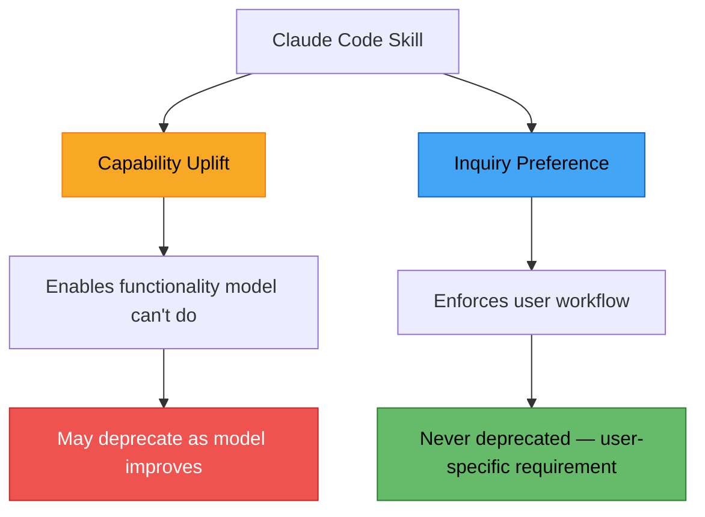
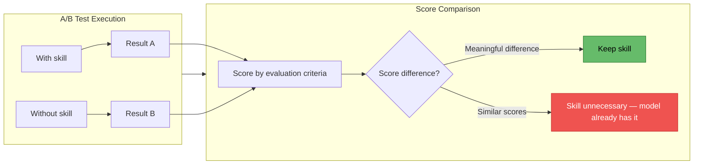
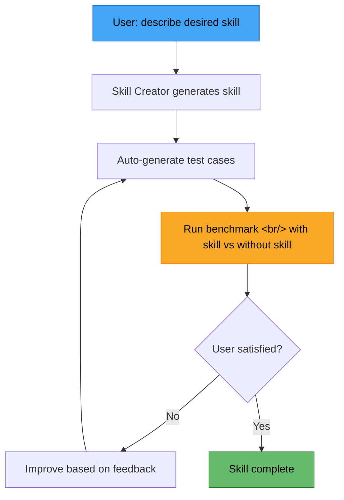

## Overview

Anthropic has announced a major update to Claude Code Skills. The most prominent change is the introduction of a **built-in benchmarking system**. You can now quantify whether a skill actually improves output quality through A/B testing, and Skill Creator V2 automates the entire lifecycle from test case generation through iterative improvement. New frontmatter options also provide fine-grained control over how skills execute.

<!--more-->

## Two Skill Categories: Capability Uplift vs. Inquiry Preference

Anthropic has formally divided skills into two categories.

### Capability Uplift Skills

Skills that enable the model to do something it fundamentally cannot do on its own. Specific API call patterns and external tool integrations fall here. This type of skill **may become unnecessary as the model improves** — once the model absorbs the capability itself, the skill is redundant.

### Inquiry Preference Skills

Skills that enforce a user's specific workflow or preferences. Examples: "always respond in Korean," "follow the security checklist on every PR review." This type **will never be deprecated**, because it captures requirements that are inherently user-specific, regardless of how powerful the model becomes.

This classification matters because of the **benchmarking system** described next. Capability Uplift skills can be retired based on benchmark results when the model has absorbed the underlying capability.

## Benchmarking System: Proving a Skill's Value with Data

This is V2's flagship feature — a built-in evaluation system that **quantitatively measures** whether a skill actually improves output quality.

### How It Works

**Multi-agent support** allows A/B tests to run simultaneously. One agent with the skill and one without perform the same task, and results are compared against evaluation criteria.

### Example Auto-Generated Evaluation Criteria

Seven criteria Skill Creator automatically generated for a social media post generation skill:

| # | Criteria | Description |
|---|----------|------|
| 1 | Platform coverage | Was a post generated for every specified platform? |
| 2 | Language match | Was it written in the requested language? |
| 3 | X character limit | Does the X (Twitter) post respect the character limit? |
| 4 | Hashtags | Were appropriate hashtags included? |
| 5 | Factual content | Is the content factually consistent with the source material? |
| 6 | Tone differentiation | Is the tone appropriately differentiated per platform? |
| 7 | Tone compliance | Does it follow the specified tone guidelines? |

If scores differ **meaningfully** with and without the skill, the skill has value. If scores are **similar**, the model already has the capability and the skill is unnecessary.

## Skill Creator V2: Automate the Full Lifecycle

With Skill Creator upgraded to V2, it goes beyond simple generation to **automate the entire skill lifecycle**.

### Installation and Usage

1. Run `/plugin`
2. Search for "skill creator skill" and install
3. Describe the desired skill in natural language
4. Automatic: skill generation → test case generation → benchmark execution → result review

### The Automated Loop

Improving existing skills is also supported. Hand an existing skill to Skill Creator and it benchmarks current performance, identifies areas for improvement, and optimizes iteratively.

**Built-in progressive disclosure guidance** walks users through skill creation step by step, making it accessible even for those without prior skill-writing experience.

### Improved Implicit Triggering

Previous versions had reliability issues with implicit triggers (auto-execution without a slash command). V2 has the Skill Creator perform **description optimization** alongside skill generation, significantly improving implicit triggering accuracy. The skill's description is automatically refined to communicate more clearly to the model when to invoke it.

## New Frontmatter Options

New frontmatter options in V2 enable fine-grained control over skill behavior.

| Option | Description |
|------|------|
| `user_invocable: false` | Only the model can trigger it; users cannot invoke it directly |
| `user_enable: false` | Users cannot invoke it via slash command |
| `allow_tools` | Restrict which tools the skill can use |
| `model` | Specify the model to run the skill with |
| `context: fork` | Run the skill in a sub-agent |
| `agents` | Define sub-agents (requires `context: fork`) |
| `hooks` | Define per-skill hooks in YAML format |

The `context: fork` + `agents` combination is particularly interesting. It delegates skill execution to a separate sub-agent, so the skill works independently without contaminating the main context. The benchmarking system's multi-agent A/B test also runs on this foundation.

`user_invocable: false` is useful for creating "background skills" that aren't exposed to users and are invoked internally by the model based on its own judgment.

## Quick Links

- [Claude Skills V2 update video](https://www.youtube.com/watch?v=t81f188Tvec)
- [Claude Code official docs](https://docs.anthropic.com/en/docs/claude-code)
- [Anthropic official site](https://www.anthropic.com)

## Insights

The core of this V2 update is that **the effectiveness of a skill can now be measured objectively**.

Until now, skills operated on the assumption that "adding a skill will make things better." With built-in benchmarking, you can finally determine with data whether a skill actually improves output quality, or whether you're adding unnecessary prompt overhead on top of something the model already handles well.

The **Capability Uplift vs. Inquiry Preference** classification is equally practical. Instead of treating all skills identically, it provides a framework for distinguishing skills that should naturally be retired as the model advances from skills that should be maintained permanently.

Skill Creator V2 automating the generation-evaluation-improvement loop dramatically lowers the barrier to entry. Skill writing used to be squarely in the domain of prompt engineering. Now you just describe what you want, and an optimized, benchmark-validated skill comes out the other end. The skill ecosystem is set to grow rapidly in both quantity and quality.
