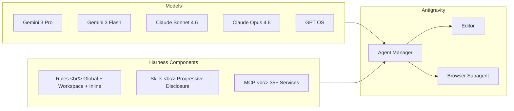
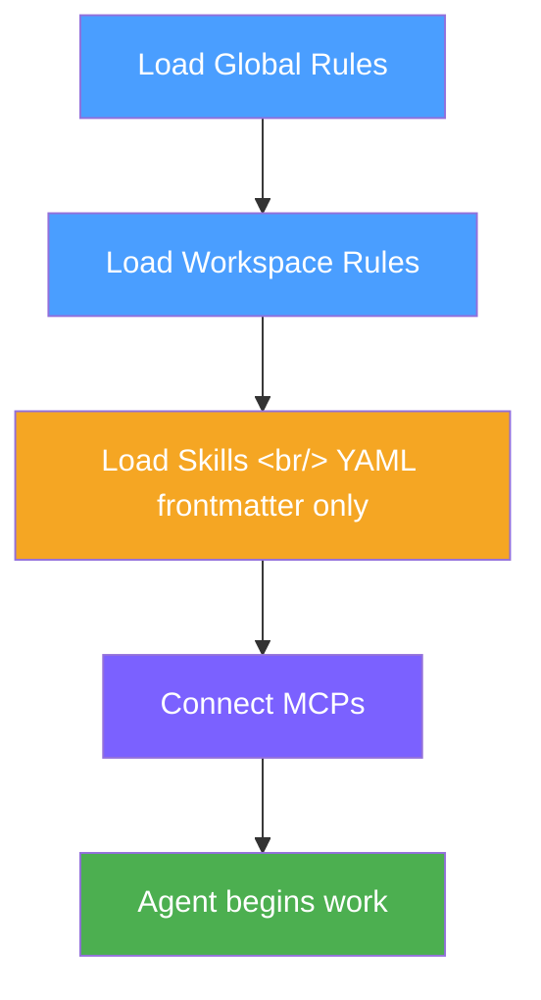
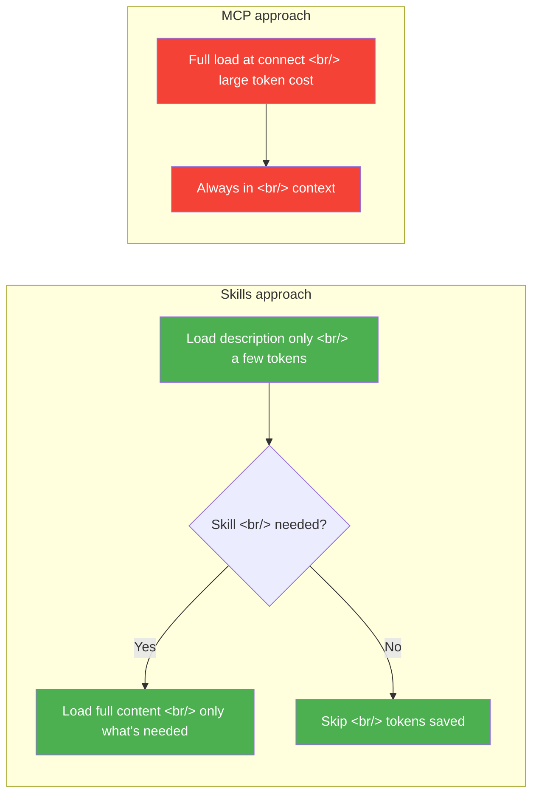

## Overview

[Previous post: Harness — Turning Claude Code from a Generic AI into a Dedicated Employee](/posts/2026-03-06-claude-code-harness/) covered the concept of harness engineering and its core components — Skills, Agents, and Commands in Claude Code. This post looks at how to build and use a harness in practice with **Antigravity**, a free AI development tool from Google. The focus is on the Rules hierarchy, token efficiency of Skills, MCP integration, and the process of building a payment-enabled SaaS through vibe coding.

<!--more-->

## Antigravity: The Harness in Action

Antigravity is a free AI development tool from Google. It's gaining attention as an alternative to paid tools like Cursor ($20/mo), GitHub Copilot ($10/mo), and Replit ($25/mo).

The core structure is an **Agent Manager** that controls an Editor and a Browser. This isn't just code autocomplete — it's an **agent-first development** approach. The agent makes plans, creates files, writes code, and self-corrects when errors occur.

What's particularly impressive is **multi-model support**. Beyond Gemini 3 Pro/Flash, you can choose Claude Sonnet 4.6/Opus 4.6 and GPT OS. Using Anthropic and OpenAI models inside a Google tool is significant from a harness perspective — the same Rules and Skills structure works with different models, letting you find the optimal combination by swapping models.

## Harness Components in Practice

The essence of harness engineering is **designing the control structure and work environment before the AI starts**. Like a horse's harness — not constraining power but directing it — and like a test harness wrapping the execution environment for control.

The flow when an agent activates in Antigravity:

### Rules: Three-Layer Hierarchy

Antigravity's Rules are organized into three layers.

| Layer | Location | Purpose |
|------|------|------|
| **Global Rules** | `.gemini/gemini.md` | Rules applied across all projects |
| **Workspace Rules** | `.agents/rules/` or `.agent/rules/` | Per-project rules |
| **Inline Rules** | Directly in agent chat | Immediate reminders |

Global Rules share a path with the Gemini CLI (`.gemini/`), meaning rules set in Antigravity apply equally in the Gemini CLI. Usage quotas are tracked separately, but harness configuration is unified.

### Activation Mode: When Rules Fire

Rules have four activation modes:

- **Always-on** — always applied
- **Model Decision** — applied when the model judges it necessary
- **GLB (File Pattern Matching)** — applied based on file extension patterns
- **Manual** — only applied when explicitly mentioned

GLB patterns are particularly practical. For example, automatically applying "use UV virtual environments" whenever working with `*.py` files. This is useful in projects that mix Python and TypeScript, enforcing different conventions by file type.

## Skills and MCP: The Token Efficiency Gap

### Progressive Disclosure: The Core Design of Skills

Antigravity's Skills use **Progressive Disclosure**. Initially only the YAML frontmatter (description) is loaded. The full content is only read when the agent determines that particular skill is needed.

This design creates a decisive difference from MCP. An MCP like Context7 loads a large volume of context at connection time. Skills consume only as much context as needed, when it's needed. In token-constrained environments, this difference is significant.

### Skill Creator and Official Skill Installation

Antigravity includes a built-in **Skill Creator** for creating and iteratively improving skills. You can also fetch and install Anthropic's official skills from GitHub.

To apply a skill globally, drag it into the `.gemini/skills/` folder. Without Git, download as ZIP and place it manually.

### MCP: Connecting External Services

MCP (Model Context Protocol) connects 35+ external services to the agent — databases, APIs, GitHub, and more. Configure an agent workflow and you can automate everything from data collection to report generation and dashboard construction.

The key to harness design is combining Skills and MCP appropriately. Frequently used patterns go in Skills; external service integrations go in MCP. This achieves both token efficiency and functionality.

## Vibe Coding All the Way to SaaS

### What Is Vibe Coding?

Vibe coding is a concept Andrej Karpathy proposed in February 2025. Rather than writing code line by line, you describe the desired outcome to AI, which generates the code. The developer's role shifts to setting direction and validating results.

In Antigravity, vibe coding means the agent handles the full cycle: plan → create files → write code → self-fix errors. The **Browser Subagent** controls Chrome directly, automating UI testing and debugging.

### Four Projects, Increasing Complexity

The four projects introduced in the referenced video naturally escalate in difficulty:

| Project | Difficulty | Key elements |
|----------|--------|-----------|
| **LinkInBio** | Beginner | Static page, basic layout |
| **Reading Tracker App** | Introductory | CRUD, data persistence |
| **AI SNS Post Generator** | Intermediate | AI API integration, content generation |
| **AI Background Removal SaaS** | Advanced | Payment (TossPayments), admin dashboard, MRR tracking |

The final SaaS project is the impressive one. A production-level service including TossPayments payment integration, admin dashboard, and MRR (Monthly Recurring Revenue) tracking — all through vibe coding.

### Debugging Framework

Errors happen even in vibe coding. The framework presented is concise:

1. **Read the error message** — understand what failed
2. **Reproduce it** — confirm the error under the same conditions
3. **Pass it to AI with context** — bundle the error log, related code, and reproduction conditions together

Debugging is ultimately part of the harness too. Structuring error context well and passing it clearly is itself a control structure that guides the AI in the right direction.

## Quick Links

- [Harness Engineering — Applying Anthropic Claude Skills in Antigravity](https://www.youtube.com/watch?v=2ThXWO3-Db4) — Antigravity harness structure, Rules/Skills/MCP in practice
- [Building SaaS and Payment Systems without Coding — Antigravity](https://www.youtube.com/watch?v=aZot7xrkwRg) — Vibe coding, 4 project examples, TossPayments integration
- [Previous post: Harness — Turning Claude Code from a Generic AI into a Dedicated Employee](/posts/2026-03-06-claude-code-harness/) — Harness engineering concept and core components

## Insights

In the previous post, I defined harness as "the control structure that transforms AI from generic to specialized." Looking at Antigravity, I see that concept converging into a **pattern** beyond any single tool.

Claude Code's CLAUDE.md and Antigravity's `.gemini/gemini.md` serve the same role with different names. Skills' Progressive Disclosure shares the exact same design philosophy as the Claude Code skill system. The tools differ, but the harness components — Rules, Skills, MCP — map almost 1:1.

What stands out is **token efficiency**. MCP is convenient, but it consumes a large amount of context at connection time. Skills' Progressive Disclosure solves this problem elegantly. When designing a harness, the first question shouldn't be "what do I put in context?" but "when do I put it in context?"

The fact that vibe coding can produce SaaS is a signal that the bottleneck in development is shifting from coding ability to **harness design ability**. What Rules to set, what Skills to prepare, how to structure error context — these decisions determine output quality.
