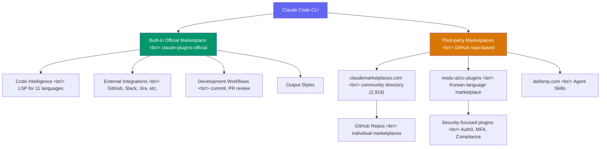
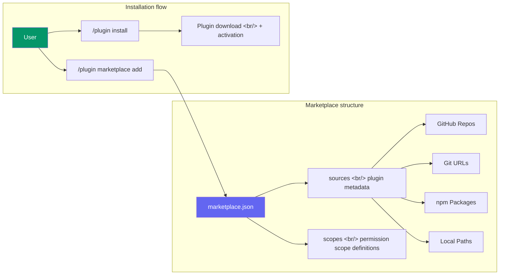

## Overview

Since Claude Code introduced its plugin system, the ecosystem has been expanding rapidly. It started with one official marketplace, but there are now community directories and a dedicated Korean-language marketplace among the options. This post compares the four major marketplaces and lays out criteria for choosing based on your needs.

<!--more-->

## Ecosystem Structure

The Claude Code plugin ecosystem divides into three broad layers.



## 1. Official Marketplace — claude-plugins-official

The default marketplace operated directly by Anthropic. Available automatically with Claude Code installation.

### Main Categories

| Category | Content | Examples |
|---------|------|------|
| **Code Intelligence** | LSP-based language support (11 languages) | TypeScript, Python, Rust, Go, etc. |
| **External Integrations** | External service connections | GitHub, GitLab, Jira, Slack, Figma |
| **Development Workflows** | Development process automation | commit-commands, pr-review-toolkit |
| **Output Styles** | Output format customization | — |

### Installation

```bash
# Install a plugin
/plugin install plugin-name@claude-plugins-official

# List installed plugins
/plugin list
```

**Pros**: Backed by Anthropic, so stability and compatibility are guaranteed. No marketplace registration required.

**Cons**: Limited plugin selection; difficult to reflect the full range of community needs.

## 2. claudemarketplaces.com — Community Directory

An independent project run by @mertduzgun with no official relationship with Anthropic. Currently indexes **2,919 marketplaces**, making it the largest by scale.

### Popular Marketplaces (by Stars)

| Marketplace | Stars | Plugins | Notes |
|------------|------:|----------:|------|
| f/prompts.chat | 144.8k | — | Prompt-centric |
| anthropics/claude-code | 65.1k | 13 | Official repo |
| obra/superpowers | 46.9k | — | Extended capabilities |
| upstash/context7 | 45k | — | Context management |
| affaan-m/everything-claude-code | 41.3k | — | Comprehensive resource |
| ComposioHQ/awesome-claude-skills | 32k | 107 | Skills collection |
| wshobson/agents | 28k | 73 | Agent-focused |
| eyaltoledano/claude-task-master | 25.3k | — | Task management |

### Category Breakdown

Organized into granular categories including 3D-Development, Agents, Authentication, Automation, Backend, Claude, and Code-Quality. Sponsored listings (ideabrowser.com, supastarter, etc.) are included, so it's worth developing the habit of checking whether a listing is sponsored.

**Pros**: Massive scale, category search, Stars-based popularity indicators.

**Cons**: No quality verification; security judgment is the user's responsibility since this is unofficial.

## 3. skillsmp.com (SkillsMP)

A marketplace specializing in Agent Skills, with Korean UI support at `skillsmp.com/ko`. At the time of writing, HTTP 403 errors are occurring on access, so stability needs to be verified.

**Pros**: Korean UI, Agent Skills specialization.

**Cons**: Unstable access (403 errors), unable to verify content.

## 4. modu-ai/cc-plugins — Korean Community

A Korean-optimized marketplace positioned as the "ModuAI Official Claude Code Plugin Marketplace."

### Characteristics

- **Stars**: 56 (early stage)
- **License**: GPL-3.0 (Copyleft)
- **Tech stack**: MoAI-ADK (AI Development Kit), DDD methodology
- **Focus areas**: Auth0 security, MFA, token security, compliance

### Installation

```bash
# Register marketplace
/plugin marketplace add modu-ai/cc-plugins

# Install after registration
/plugin install plugin-name@modu-ai-cc-plugins
```

**Pros**: Korean documentation, security-focused plugins, domestic community support.

**Cons**: Still early stage with limited plugins; understanding the GPL-3.0 license restrictions is required.

## Marketplace Comparison Summary

| Item | Official (Anthropic) | claudemarketplaces.com | skillsmp.com | modu-ai/cc-plugins |
|------|:---:|:---:|:---:|:---:|
| **Scale** | Small | Large (2,919) | Unknown | Small |
| **Operator** | Anthropic | Community (individual) | Unknown | Korean community |
| **Quality verification** | Yes | No | Unknown | Partial |
| **Korean support** | No | No | Yes | Yes |
| **Security trustworthiness** | High | Low (manual verification needed) | Unknown | Medium |
| **Installation ease** | Built-in | Separate registration | — | Separate registration |
| **Auto-update** | Yes (configurable) | Varies by marketplace | — | — |
| **Focus** | General | General | Agent Skills | Security |

## Plugin System Architecture

The marketplace system in Claude Code runs on GitHub repos as its foundation.



### Supported Plugin Source Types

| Source type | Example | Use case |
|----------|------|------|
| GitHub repo | `owner/repo` | Most common |
| Git URL | `https://github.com/...` | Direct URL specification |
| Local path | local directory path | Local development/testing |
| npm package | `@scope/package` | Node.js ecosystem |

### Team Marketplace Configuration

For shared team marketplaces, configure in `.claude/settings.json`:

```json
{
  "extraKnownMarketplaces": [
    "your-org/internal-plugins"
  ]
}
```

## Selection Guide — Which Marketplace to Use?

### Recommendations by Situation

**"Starting from scratch"** — begin with the official marketplace. No setup required and you can start by strengthening code intelligence with LSP plugins.

**"Need a wide variety of plugins"** — search claudemarketplaces.com, check Stars and recent update dates, then register individual marketplaces. ComposioHQ/awesome-claude-skills (107 plugins) and wshobson/agents (73 plugins) are both practical options.

**"Working in a Korean-language environment"** — register modu-ai/cc-plugins for Korean documentation and domestic community support.

**"Security is a priority"** — use the official marketplace as your base and only install third-party plugins after personally reviewing the source code.

## Security Considerations

Security is the most critical issue in the plugin ecosystem.

1. **Anthropic does not verify third-party plugins.** The official documentation explicitly states "user must trust plugins."

2. **Before installing, check**:
   - GitHub repo Stars, Issues, and recent commit activity
   - License (Copyleft licenses like GPL-3.0 can affect commercial projects)
   - Permission (scopes) the plugin requests
   - Whether the source code makes external API calls or transmits data

3. **Auto-update settings**: Only enable auto-update for trusted marketplaces; manage others manually.

4. **Sponsored listing caution**: Sponsored listings on claudemarketplaces.com are not quality endorsements — they are advertisements.

## Quick Links

- [Claude Code official plugin docs](https://code.claude.com/docs/en/discover-plugins)
- [claudemarketplaces.com](https://claudemarketplaces.com/)
- [skillsmp.com](https://skillsmp.com/ko)
- [modu-ai/cc-plugins](https://github.com/modu-ai/cc-plugins)
- [Marketplace creation guide](https://code.claude.com/docs/ko/plugin-marketplaces)

## Insights

The Claude Code plugin ecosystem is still in an **early growth phase**. The pace of growth — fast enough to index 2,919 marketplaces — is impressive, and both the official marketplace's organized category structure and the Korean community's self-run marketplace are positive signals. However, the lack of quality verification, the absence of a compatibility standard between plugins, and a trust model that relies solely on GitHub Stars all need improvement. The VS Code extension ecosystem took years to mature, and Claude Code will need time too. For now, a rational strategy is to center your usage on the official marketplace while selectively leveraging community marketplaces.
