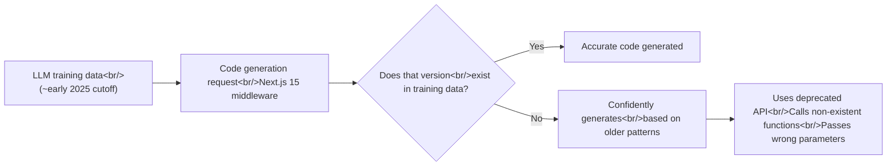
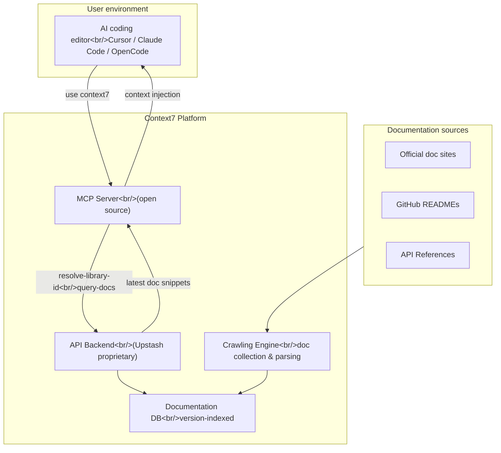

## Overview

Anyone who has used an AI coding assistant has probably run into this: Cursor or Claude Code confidently writes code that calls an API that doesn't exist, or uses a pattern that was deprecated two years ago. LLMs have a temporal cutoff in their training data, and libraries update constantly. **Context7** is a platform built to bridge that gap — it injects the latest official documentation directly into LLM prompts. With approximately 49,800 GitHub stars and growing fast, here's a thorough look at what it does and how.

<!--more-->

## The LLM Hallucination Problem: Why It Happens

Hallucination when LLMs generate code is not just a "mistake" — it's a structural problem.



Common examples:

| Situation | Symptom |
|------|------|
| Next.js App Router code | Mixes in Pages Router patterns |
| Latest Supabase Auth API | Calls `supabase.auth.api` (deprecated) |
| Tailwind CSS v4 config | Generates v3 config format |
| Cloudflare Workers new API | Combines non-existent methods |

The core problem: **LLMs don't say "I don't know."** If there's a similar pattern in training data, they generate plausible-looking code from it, and the developer doesn't realize until a runtime error surfaces.

## How Context7 Solves It

Context7's approach is simple but effective: **before the LLM generates code, inject the latest official documentation for the relevant library into the prompt context.**



### How It Works

1. User adds `use context7` to the prompt
2. Context7 MCP server identifies the library (`resolve-library-id`)
3. Searches the library's latest docs for relevant sections (`query-docs`)
4. Injects retrieved doc snippets into the LLM context
5. LLM generates code based on current documentation

Why this step matters: it's not just "read the latest docs" — it **selectively extracts only the sections relevant to the query**. Putting the entire documentation in context wastes tokens and can actually degrade performance.

## CLI vs. MCP: Two Usage Modes

Context7 supports two modes.

### 1. CLI + Skills Mode (No MCP Required)

```bash
# Setup
npx ctx7 setup   # OAuth auth → API key creation → skill installation

# Search for a library
ctx7 library nextjs middleware

# Fetch docs for a specific library
ctx7 docs /vercel/next.js "middleware authentication JWT"
```

CLI mode is useful in environments that don't support MCP, or when you just need a quick terminal lookup.

### 2. MCP Mode (Native Integration)

In MCP-supporting clients, Context7 operates automatically.

**MCP Tools provided**:

| Tool | Purpose | Input | Output |
|------|------|------|------|
| `resolve-library-id` | Convert library name to Context7 ID | `"nextjs"` | `/vercel/next.js` |
| `query-docs` | Search relevant docs by library ID | library ID + query | doc snippets |

**Key advantage of MCP mode**: the user only adds `use context7` to the prompt, and the LLM automatically performs the tool calls.

### Mode Comparison

| Criterion | CLI mode | MCP mode |
|------|----------|----------|
| Setup complexity | Low (one npx command) | MCP server registration required |
| Automation level | Manual | Fully automatic |
| MCP support required | No | Yes |
| Best for | Quick doc lookups, non-MCP environments | Everyday AI coding workflow |

## Library ID System and Version Targeting

Context7 Library IDs use GitHub-style paths:

```
/supabase/supabase
/vercel/next.js
/mongodb/docs
/langchain-ai/langchainjs
```

This ID system is interesting because it **explicitly identifies the source of documentation**, not just a package name. Searching just `react` might yield multiple results, but `/facebook/react` points to exactly one source.

### Version Targeting

Specify a version in the prompt and Context7 automatically matches that version's docs:

```
Create a Next.js 15 middleware that validates JWT. use context7
```

Context7 detects "Next.js 15" from this prompt and fetches middleware-related sections from the v15 documentation.

## Practical Usage in Claude Code

### Setup

```bash
npx ctx7 setup
```

### Practical Prompt Patterns

**Basic usage**:
```
Show me how to use a service role key to bypass Row Level Security
in a Supabase Edge Function. use context7
```

**Version specification**:
```
How do I set up a custom theme in Tailwind CSS v4. use context7
```

### Without Context7 vs. With Context7

```typescript
// ❌ Without Context7 — LLM may generate outdated patterns
import { createMiddlewareClient } from '@supabase/auth-helpers-nextjs'
// auth-helpers-nextjs is deprecated, replaced by @supabase/ssr

// ✅ With Context7 — based on latest official docs
import { createServerClient } from '@supabase/ssr'
import { NextResponse, type NextRequest } from 'next/server'

export async function middleware(request: NextRequest) {
  let supabaseResponse = NextResponse.next({ request })
  const supabase = createServerClient(
    process.env.NEXT_PUBLIC_SUPABASE_URL!,
    process.env.NEXT_PUBLIC_SUPABASE_ANON_KEY!,
    {
      cookies: {
        getAll() { return request.cookies.getAll() },
        setAll(cookiesToSet) {
          cookiesToSet.forEach(({ name, value }) => 
            request.cookies.set(name, value))
          supabaseResponse = NextResponse.next({ request })
          cookiesToSet.forEach(({ name, value, options }) =>
            supabaseResponse.cookies.set(name, value, options))
        },
      },
    }
  )
  await supabase.auth.getUser()
  return supabaseResponse
}
```

## The Upstash Connection and Business Model

Context7 is an **Upstash** project. Upstash is an infrastructure company offering serverless Redis, Kafka, and QStash that has been expanding into the AI/LLM tooling ecosystem.

### Open Source Boundary

| Component | Open? |
|----------|----------|
| MCP Server source | Open source (GitHub) |
| CLI tool | Open source |
| API Backend | Closed (Upstash proprietary) |
| Crawling/Parsing Engine | Closed |
| Documentation DB | Closed |

The MCP server and CLI are open source to build community trust and adoption. The core value — the document crawling, parsing, and indexing engine — is kept proprietary to form a business moat.

**Revenue model**: Basic usage is free (rate limited); generating an API key at context7.com/dashboard unlocks higher rate limits.

## Comparison with Alternatives

| Approach | Accuracy | Automation | Build cost | Dependency |
|------|--------|--------|----------|--------|
| Manual doc copy-paste | High | None | None | None |
| Self-hosted RAG | High | High | Very high | Own infra |
| Context7 | High | High | Near zero | Upstash |
| Web search integration | Medium | Medium | Low | Search API |

Context7's biggest advantage is **value relative to setup cost**. One `npx ctx7 setup` command gives you access to current docs for dozens of libraries.

## Critical Analysis

### Strengths

1. **Extremely low barrier to entry**: one `npx ctx7 setup` command and you're done
2. **Version awareness**: specify a version in the prompt and it auto-matches
3. **Wide client support**: integrates with 30+ clients including Cursor, Claude Code, and OpenCode
4. **Community momentum**: ~49,800 stars is the fuel to keep improving the doc DB's quality and coverage

### Limitations and Risks

1. **Single point of failure**: the backend API is entirely Upstash-dependent — no fallback if the service goes down
2. **Opaque coverage**: it's not transparently documented which libraries are in the DB or how current they are
3. **Prompt token consumption**: doc snippets injected into context consume tokens
4. **"use context7" keyword dependency**: requiring a keyword in the prompt means the user has to decide when to use it
5. **Vendor lock-in path**: the classic freemium model — free use → hit rate limit → paid conversion

## Quick Links

- [Context7 GitHub](https://github.com/upstash/context7)
- [Context7 website](https://context7.com)
- [API key generation](https://context7.com/dashboard)
- [Claude Code plugin marketplace](https://claudemarketplaces.com/plugins/upstash-context7)

## Insights

Context7 is not technically complex. The idea of "inject current docs into LLM context" is one anyone could conceive. But **actually building the infrastructure that continuously crawls thousands of libraries, indexes them by version, and accurately extracts relevant sections — and offers this for free** — is a completely different problem. Context7's real value isn't the code; it's the **data pipeline**.

From the perspective of the MCP ecosystem, Context7 is one of the most compelling demonstrations of *why* MCP is needed. That said, in the long run, this kind of functionality will likely get built into AI coding tools themselves. If Cursor or Claude Code start offering native documentation indexing, Context7's standalone value proposition will diminish.
