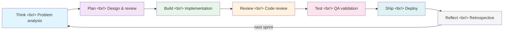
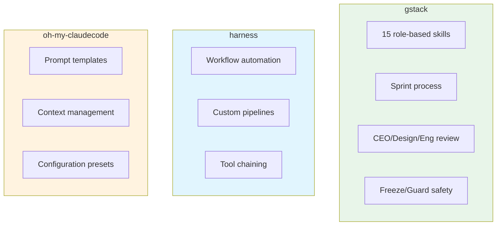

## Overview

Y Combinator CEO **Garry Tan** has open-sourced his personal Claude Code development environment. **gstack** is a skill framework that transforms Claude Code into a virtual engineering team of 15 specialized skills and 6 power tools. It crossed 10,000 GitHub stars on its first day and currently sits above 27,000. Garry Tan's claim of writing over 600,000 lines of production code in 60 days — and the assertion that you can generate 10,000–20,000 usable lines of code per day — drove explosive attention from the developer community.

<!--more-->

## The Sprint Architecture

gstack's core is structuring the full software development lifecycle into a **7-stage sprint process**. Rather than just generating code, it replicates inside Claude Code the cycle that actual engineering teams follow: think → plan → build → review → test → ship → reflect.



The notable feature is that **10–15 sprints can run in parallel**. Claude Code's multi-task capability is used to develop multiple features simultaneously, with each sprint going through independent review and test stages.

## Analyzing the 15 Skills

gstack maps each engineering team role to an independent skill. Each skill is invoked with a `/` command and may auto-load based on context.

### CEO and Leadership Roles

| Skill | Command | Role |
|------|--------|------|
| CEO Review | `/plan-ceo-review` | Review plans from a business perspective, adjust priorities |
| Design Review | `/plan-design-review` | UX/UI perspective design review |
| Eng Review | `/plan-eng-review` | Technical feasibility, architecture review |
| Office Hours | `/office-hours` | Open Q&A, direction discussions |

**CEO Review** follows what Garry Tan calls the "Boulder Ocean" philosophy. The principle is that the CEO doesn't interfere with implementation details, but provides clear feedback on strategic direction and priorities. Most recommendations from this review are designed to be accepted by default, so Claude can proceed quickly with its own judgment.

### Engineering Roles

| Skill | Command | Role |
|------|--------|------|
| Code Review | `/review` | Perform PR-level code review |
| QA | `/qa` | Automated testing and quality validation |
| Ship | `/ship` | Manage deployment process |
| Investigate | `/investigate` | Bug tracking, log analysis |
| Careful | `/careful` | Switch to cautious mode, detect risky changes |

### Operations and Documentation Roles

| Skill | Command | Role |
|------|--------|------|
| Document Release | `/document-release` | Auto-generate release notes |
| Retro | `/retro` | Sprint retrospective, identify improvements |
| Browse | `/browse` | Web search and reference collection |
| Codex | `/codex` | Codebase knowledge management |

### Power Tools (Safety Mechanisms)

| Tool | Command | Function |
|-----|--------|------|
| Freeze | `/freeze` | Prevent changes to specific files/directories |
| Guard | `/guard` | Watch for changes and warn |
| Unfreeze | `/unfreeze` | Release freeze |

`/freeze` and `/guard` are especially important safety mechanisms. When running parallel sprints, they prevent conflicts from multiple Claude instances simultaneously modifying the same file. Freezing a core config file or database schema means that sprint won't touch those files.

## Installation and Usage

Installation is straightforward — clone into Claude Code's skills directory and run the setup script:

```bash
git clone https://github.com/garrytan/gstack.git ~/.claude/skills/gstack
cd ~/.claude/skills/gstack
./setup
```

Immediately usable from Claude Code:

```
> /plan-ceo-review
> I want to build a Pomodoro timer app. React + TypeScript.

[CEO Review skill activated]
- Goal clarity: ✅
- Market differentiation: recommend — define a differentiator vs. existing timers
- Tech stack fit: ✅ React + TS is appropriate for this scale
- MVP scope: recommend limiting to core timer + session history

Accept? [Y/n]
```

After CEO review, the flow naturally continues:

```
> /plan-eng-review

[Eng Review skill activated]
- Component structure proposal (ASCII flowchart generated)
- State management: useReducer recommended
- Test strategy: Vitest + React Testing Library
```

One distinctive feature of gstack is the **automatic ASCII flowchart generation** that visualizes architecture during the planning stage. ASCII art is used instead of Mermaid because it's immediately readable in Claude Code's terminal environment.

## Comparison with Other Tools

The Claude Code ecosystem has other extension tools beyond gstack. **harness** and **oh-my-claudecode** are the most notable.



| Characteristic | gstack | harness | oh-my-claudecode |
|------|--------|---------|------------------|
| Core philosophy | Virtual team simulation | Workflow automation | Prompt optimization |
| Skill count | 15 + 6 power tools | Custom-defined | Template-based |
| Review process | CEO/Design/Eng 3-level | None | None |
| Parallel execution | 10-15 sprints | Pipeline-based | Not supported |
| Safety mechanisms | freeze/guard/unfreeze | None | None |
| Installation | git clone + setup | npm/pip | dotfiles |

gstack's most distinctive quality is that it is **process-oriented**. Where other tools focus on "how to use Claude Code better," gstack tries to "transplant the way a software team actually works into Claude Code." The CEO Review concept as a layer simply doesn't exist in other tools.

## What Garry Tan's Background Tells Us

Garry Tan is not just a CEO. He was an early Palantir engineer who personally designed the Palantir logo, then became a YC partner before taking the CEO role. This background is directly reflected in gstack's design:

- **Palantir experience** → data-driven decision making, structured review processes
- **YC experience** → fast MVP, sprint-based development, "Ship fast" culture
- **Design sensibility** → the existence of the Design Review skill; treating UX as equal to code review

The 10,000–20,000 lines per day figure can sound like an exaggeration, but given parallel sprints and Claude Code's code generation capabilities, it's not physically impossible. What "usable" code means in this context, however, is worth debating.

## Critical Analysis

### Strengths

- **Structured development process**: enforcing plan → review → build stages rather than "just write code" improves quality
- **Safety mechanisms**: `/freeze` and `/guard` for preventing conflicts in parallel work are genuinely practical
- **Low barrier to entry**: one git clone installs it; MIT license makes it freely usable
- **Context auto-loading**: relevant skills activate automatically based on context, removing the need for manual invocation each time

### Weaknesses and Concerns

- **Claude Code lock-in**: only works with Anthropic's Claude Code; unusable in Cursor, Windsurf, or other AI coding tools
- **"Magic bullet" illusion**: a significant portion of the 27,000 stars comes from Garry Tan's name recognition. The same tool from an unknown developer would likely not have attracted this level of attention.
- **LOC metric limitations**: lines of code are a poor measure of productivity. Whether all 600,000 lines are meaningful code, or whether the figure includes boilerplate and generated scaffolding, is unclear.
- **Limits of team simulation**: whether CEO Review, Design Review, and similar skills can replace the depth of actual human reviewers needs verification. LLM review is closer to pattern matching; domain-specific business judgment is hard to replicate.
- **TypeScript + Go Template mix**: skill definitions are spread across multiple languages, creating a barrier for customization.

## Quick Links

- [GitHub repository: garrytan/gstack](https://github.com/garrytan/gstack)
- [Claude Code official docs](https://docs.anthropic.com/en/docs/claude-code)
- [Y Combinator](https://www.ycombinator.com/)
- [YouTube: gstack — 10K GitHub stars in one day](https://www.youtube.com/watch?v=vfn_Ezu1qfk)

## Insights

The most interesting pattern gstack reveals is the **direction AI coding tools are evolving**. The early goal was "generate code faster." gstack extends the goal to "encapsulate the entire software development process inside AI." This represents a shift from a simple code generation tool to a **development methodology framework**.

The existence of safety mechanisms like `/freeze` and `/guard` in particular is evidence that parallel AI agent execution creates real problems in practice. Managing conflicts when multiple Claude instances modify the same codebase simultaneously is a challenge the entire AI coding tool ecosystem will need to solve.

That said, gstack's popularity clearly owes more to the Garry Tan brand than to the tool's inherent quality. What matters is whether this framework has been validated in actual production environments, and whether developers other than Garry Tan can experience the same productivity gains. 27,000 stars don't equal 27,000 active users. In the age of vibe coding, tool selection should be deliberate — judged by whether something genuinely helps your workflow, not by star count.
