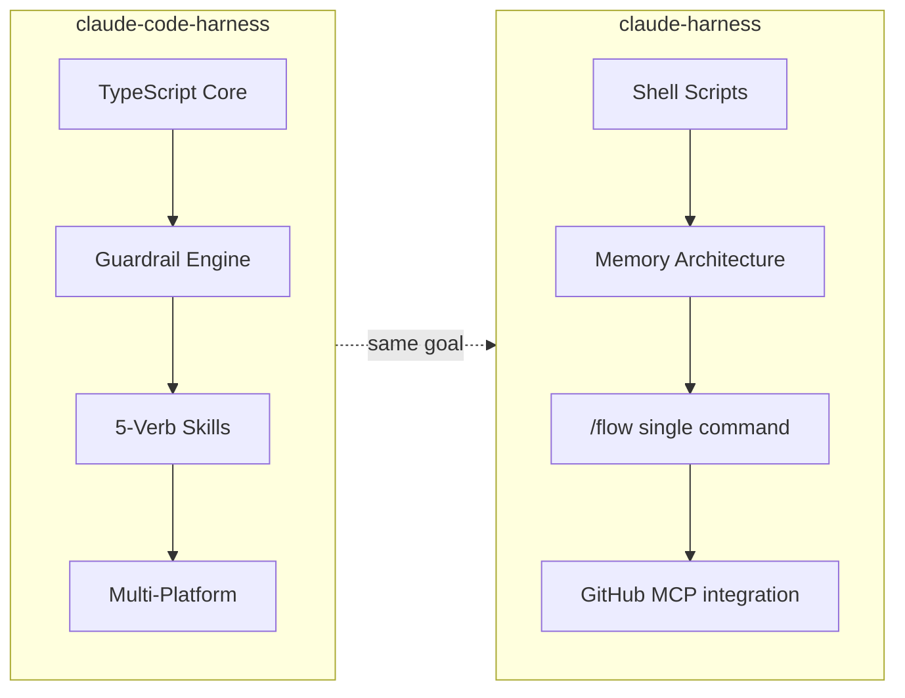
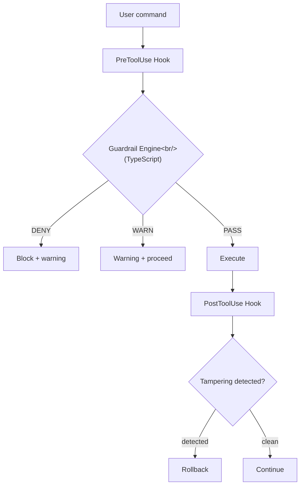
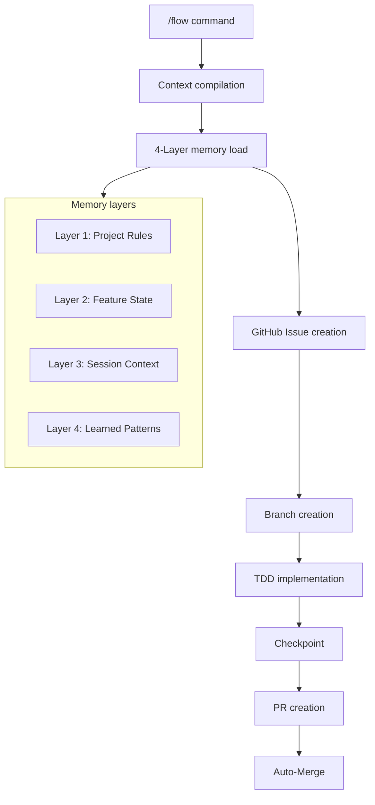
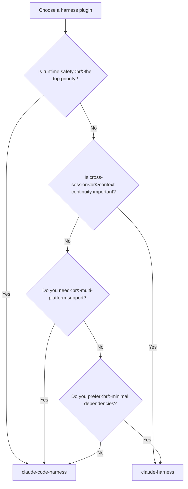

## Overview

> **Harness series posts:**
> 1. [Harness — Turning Claude Code from a Generic AI into a Dedicated Employee](/posts/2026-03-06-claude-code-harness/) — concept and core structure
> 2. [Harness Engineering #2 — Building Real Harnesses with Antigravity](/posts/2026-03-19-harness-antigravity/) — Google Antigravity in practice
> 3. **This post** — community harness plugin comparison
> 4. [HarnessKit Dev Log #1 — Adaptive Harness Plugin for Zero-Based Vibe Coders](/posts/2026-03-20-harnesskit-dev1/) — a plugin built directly from these findings

This post was written as preliminary research before designing [HarnessKit](/posts/2026-03-20-harnesskit-dev1/). The goal was to analyze the strengths and weaknesses of existing harness plugins and determine what to adopt and what to improve. I compared the two most active implementations on GitHub — Chachamaru127's [claude-code-harness](https://github.com/Chachamaru127/claude-code-harness) (281★) and panayiotism's [claude-harness](https://github.com/panayiotism/claude-harness) (73★). They solve the same problem through completely different approaches.

<!--more-->

## Design Philosophy Comparison



Both plugins start from Anthropic's "[Effective harnesses for long-running agents](https://www.anthropic.com/engineering/effective-harnesses-for-long-running-agents)" article, but their implementation strategies diverge.

**claude-code-harness** focuses on **runtime safety**. A TypeScript guardrail engine monitors every tool call and blocks dangerous commands with deny/warn rules. The core value: "proceed without breaking down in the same ways repeatedly."

**claude-harness** focuses on **context continuity**. A 5-layer memory architecture preserves context across sessions, and a single `/flow` command automates everything from planning to merge. The core value: "once started, it flows automatically to completion."

## Architecture Details

### claude-code-harness — TypeScript Guardrail Engine



| Component | Description |
|-----------|------|
| `core/guardrails/` | pre-tool, post-tool, permission, tampering detection |
| `core/engine/lifecycle.js` | Session lifecycle management |
| `core/state/` | State schema, migrations, storage |
| `skills-v3/` | 5-verb skills (plan, work, review, validate, release) |
| `agents-v3/` | reviewer, scaffolder, worker, team-composition |

The **5-Verb System** is this plugin's backbone:

1. **Plan** — structure requirements into `Plans.md`
2. **Work** — implement (`--parallel` supported, Breezing mode)
3. **Review** — code review process
4. **Validate** — re-runnable validation (generates evidence pack)
5. **Release** — merge + release

One distinctive feature is **multi-platform support**. Configuration files for Cursor, Codex, and OpenCode are included alongside Claude Code — a statement of intent to avoid lock-in to any single AI coding tool.

The **guardrail engine** is a TypeScript-compiled binary that receives JSON via stdin on every tool call and performs pattern matching. Unlike Shell-based `grep` matching, it enables structured, AST-level inspection. `tampering.js` even detects attempts to bypass the guardrail configuration itself.

### claude-harness — Shell-Based Memory Architecture



| Component | Description |
|-----------|------|
| `hooks/` | 8 hooks (session-start, pre-tool-use, stop, pre-compact, etc.) |
| `skills/` | 6 skills (setup, start, flow, checkpoint, merge, prd-breakdown) |
| `schemas/` | JSON Schema state validation (active-features, memory-entries, loop-state, etc.) |
| `setup.sh` | One-time initialization |

The **`/flow` single command** is this plugin's centerpiece. One command handles context compilation → GitHub Issue → Branch → TDD implementation → Checkpoint → PR → Merge. Fine-grained control via options:

```
/flow "Add dark mode"           # full lifecycle
/flow --no-merge "Add feature"  # stop before merge
/flow --autonomous              # batch-process entire feature
/flow --team                    # ATDD (Agent Teams)
/flow --quick                   # skip planning (simple tasks)
```

The **memory architecture** is the differentiator. Four layers (Project Rules → Feature State → Session Context → Learned Patterns) structure context, automatically compiled at session start. The `pre-compact` hook saves critical information before context compression, preventing context loss during long sessions.

All hooks are **pure Shell scripts**. They run on `bash` + `jq` alone, without Node.js or Python runtimes. Simple to install with no dependencies — but limited for complex pattern matching.

## Comparison Table

| Criterion | claude-code-harness | claude-harness |
|------|-------------------|---------------|
| **Language** | TypeScript (core) + Shell (hooks) + Markdown (skills) | Shell + Markdown |
| **Stars** | 281 | 73 |
| **Version** | v3.10.6 | v10.2.0 |
| **Core model** | 5-Verb (Plan→Work→Review→Validate→Release) | /flow single command (end-to-end) |
| **Guardrails** | TypeScript engine (deny/warn/pass + tampering detection) | Shell-based pre-tool-use hook |
| **Memory** | State schema + migrations | 4-Layer architecture (Project→Feature→Session→Learned) |
| **GitHub integration** | Indirect (gh CLI) | GitHub MCP integration |
| **TDD** | Recommended in skills | Enforced in /flow (RED→GREEN→REFACTOR) |
| **Multi-platform** | Claude Code, Cursor, Codex, OpenCode | Claude Code only |
| **Agents** | reviewer, scaffolder, worker, team-composition | Agent Teams (ATDD mode) |
| **PRD support** | Plans.md-based | `/prd-breakdown` → auto-create GitHub Issues |
| **Autonomous execution** | `/harness-work all` (batch) | `/flow --autonomous` (feature loop) |
| **Runtime dependency** | Node.js (TypeScript core) | None (bash + jq) |

## Which Plugin Is Right for You?



**Choose claude-code-harness when:**
- Dangerous command blocking matters in a team environment
- You use multiple AI coding tools like Cursor and Codex in parallel
- You need to preserve validation results as evidence
- You need granular step-by-step workflow control

**Choose claude-harness when:**
- You want full automation from a single command
- Context loss in long sessions is a real problem for you
- You want a lightweight start with no Node.js dependency
- You need tight GitHub Issues/PR integration

## Relationship with Anthropic Superpowers

Both plugins are aware of [obra/superpowers](https://github.com/obra/superpowers) (71,993★). The benchmark document in claude-code-harness directly compares all three, summarizing each one's strengths:

> If you want to expand your workflow's **breadth**: Superpowers.
> If you want to reinforce the discipline of **requirements → design → tasks**: cc-sdd.
> If you want to transform plan · build · review · validate into a **reliable standard flow that doesn't collapse**: Claude Harness.

In practice, Superpowers is closer to a **workflow framework** than a harness. It provides the flow from brainstorming → writing-plans → executing-plans → code-review, but doesn't foreground infrastructure-level features like runtime guardrails or memory architecture. The three plugins aren't competing — **they operate at different layers**.

## Insights

- **TypeScript vs. Shell — the tradeoff is clear.** The TypeScript guardrail engine enables structured checks and tampering detection but requires Node.js. Shell hooks have zero dependencies but are limited in pattern matching precision. The project's security requirements determine the right choice.
- **"5-Verb" and "/flow" are different solutions to the same problem.** Explicit stage separation gives independent control over each stage but creates friction. A unified single command reduces friction but makes granular intervention harder. The larger the team, the more the former applies; for solo developers, the latter tends to win.
- **Memory layering is harness engineering's next frontier.** panayiotism's 4-layer memory architecture directly addresses the fundamental problem of preserving context across sessions. Chachamaru127 also has state/migration modules, but the emphasis is on guardrails rather than memory. Long-term, memory architecture is likely to become the defining factor in harness quality.
- **The harness ecosystem is differentiating.** General workflow (Superpowers), runtime safety (claude-code-harness), context continuity (claude-harness), adaptive presets (HarnessKit) — each attacks a different axis. This signals that harnesses are evolving from a single solution into a **tool chain**.
