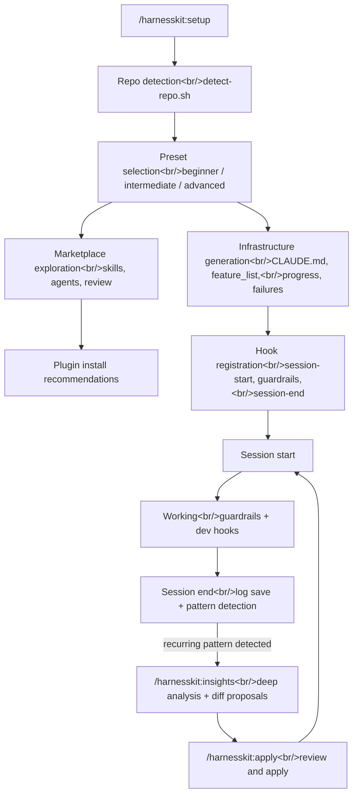

## Overview

HarnessKit is a **Claude Code Plugin for zero-based vibe coders**. After analyzing Anthropic's "Effective harnesses for long-running agents" article and existing harness engineering implementations (autonomous-coding, claude-harness, and others), I designed it to adopt their strengths and address their weaknesses. The core cycle is **detect → configure → observe → improve**, and the full journey from design spec to v0.1.0 implementation took 19 hours.

<!--more-->

## Design: What Is Harness Engineering?

### Background

In vibe coding, an AI agent loses all context when a session ends. Building **infrastructure outside the session** — recording `passes: false` in feature_list.json, using progress files for handoffs, learning from failures.json — is what keeps the agent consistent. That's the heart of harness engineering.

The problems with existing implementations were clear:
- Repo properties have to be figured out manually
- The same guardrails apply regardless of experience level
- No improvement loop after initial setup

### Design Principle: Marketplace First, Customize Later

The initial design kept skill seed templates inside the plugin and generated them with `/skill-builder`. But through discussion, a **"don't reinvent the wheel"** principle was established:

> "If there's already a powerful plugin out there, just use it."

As a result, all skills/agents templates were removed. The revised structure explores and installs validated marketplace plugins first, then analyzes usage patterns and uses `/skill-builder` to customize only the gaps.



## Implementation: 4 Plans, One Day

### Plan 1: Plugin Skeleton + Repo Detection

The plugin manifest (`plugin.json`) and repo auto-detection script are the foundation. `detect-repo.sh` identifies language, framework, package manager, test framework, and linter purely from file existence patterns. Zero token consumption.

```bash
# detect-repo.sh core logic (excerpt)
TOOL=$(echo "$INPUT" | jq -r '.tool_name' 2>/dev/null || echo "")
[ "$TOOL" != "Bash" ] && exit 0

CMD=$(echo "$INPUT" | jq -r '.tool_input.command // ""' 2>/dev/null || echo "")
```

Presets have three levels:

| Preset | Guardrails | Briefing | Nudge threshold |
|--------|----------|--------|-------------|
| beginner | Strong (mostly BLOCK) | Detailed (full) | 2 sessions |
| intermediate | Balanced (core BLOCK, some WARN) | Summary (concise) | 3 sessions |
| advanced | Minimal (mostly WARN/PASS) | One-liner (minimal) | 5 sessions |

### Plan 2: File Generation + Toolkit

The `init.md` skill generates all harness infrastructure files. CLAUDE.md is composed from `base.md` + framework templates + preset filters. `.claudeignore` applies exclusion patterns matched to the detected framework.

Dev hooks are also registered here:
- `post-edit-lint.sh` — PostToolUse: auto-lint after file edits
- `post-edit-typecheck.sh` — PostToolUse: run tsc after `.ts`/`.tsx` edits
- `pre-commit-test.sh` — PreToolUse: run tests before git commit (beginner only)

### Plan 3: Hooks System (TDD)

The trickiest part. Three core hooks implemented with TDD.

**guardrails.sh (PreToolUse)**: receives JSON via stdin and performs pattern matching:

```json
{"tool_name": "Bash", "tool_input": {"command": "git push --force origin main"}}
```

Per-preset rule matrix:

| Pattern | Beginner | Intermediate | Advanced |
|------|----------|--------------|----------|
| `sudo` | BLOCK | BLOCK | BLOCK |
| `rm -rf /` | BLOCK | BLOCK | BLOCK |
| Write to `.env` | BLOCK | BLOCK | WARN |
| `git push --force` | BLOCK | BLOCK | WARN |
| `git reset --hard` | BLOCK | WARN | PASS |
| `it.skip`, `test.skip` | WARN | PASS | PASS |

**session-start.sh (SessionStart)**: reads progress, features, and failures, then outputs a briefing appropriate for the preset.

**session-end.sh (Stop)**: reads the `current-session.jsonl` scratch file, generates a session log, and updates failures.json.

### Plan 4: Insights + Apply

`/harnesskit:insights` analyzes accumulated session data across five dimensions:
1. Error patterns (recurring errors, root causes)
2. Feature progress (completion rate, bottlenecks)
3. Guardrail activity (BLOCK/WARN frequency)
4. Toolkit usage (which plugins are being used)
5. Preset fitness (conditions for upgrade/downgrade)

Rejected proposals are recorded in `insights-history.json` and suppress the same category + target combination for 10 sessions.

## Problem Solving

### session-end.sh grep pipe failure

`grep` returns exit code 1 when there are no matches. In a `grep ... | jq -s ...` pipe, this caused issues. The `|| echo "[]"` fallback produced partial output (`[]\n[]`) that broke `jq --argjson`.

**Fix**: store grep results in a variable first (`|| true`), then pipe to jq only when non-empty.

### Feedback that the project had no direct impact on user projects

The initial spec only generated files inside `.harnesskit/`. From the user's perspective: "I installed the harness but I can't feel the difference while coding."

> "I expected direct installation into the initial repo, but from what we've discussed, it doesn't feel like that's happening."

**Fix**: Added an entire Section 9 defining Harness Toolkit Generation, including marketplace plugin exploration/installation, dev hook configuration, dev command registration, and agent recommendations. Then refactored once more to "Marketplace First, Customize Later."

### Insights auto-execution vs. manual trigger

The user initially expected hooks to automatically run `/insights` and make suggestions.

> "At first I assumed hooks would run /insights and make proposals — is it a different approach?"

**Fix**: Agreed on a hybrid approach. Shell hooks detect recurring patterns with zero token cost and output a nudge. The actual `/insights` is manually triggered by the user, at which point Claude performs deep analysis. Diagnosis (built-in insights) and prescription (HarnessKit insights) are separated.

## Commit Log

| Message | Changes |
|--------|------|
| docs: add HarnessKit design spec and harness engineering research guide | Initial design spec |
| docs: resolve spec review issues (10/10 fixed, approved) | 10 spec review items addressed |
| docs: add Harness Toolkit generation, file impact matrix, v2 roadmap | Section 9 + v2 roadmap |
| docs: integrate /skill-builder for skill generation and improvement | skill-builder integration |
| docs: add 'Curate Don't Reinvent' principle across all toolkit areas | External delegation principle |
| docs: add 4 implementation plans for HarnessKit v0.1.0 | Plans 1-4 written |
| feat: initialize plugin skeleton with manifest and directory structure | plugin.json + directory structure |
| feat: add beginner/intermediate/advanced preset definitions | 3-level preset JSON |
| feat: add repo detection script with test suite | detect-repo.sh + 11 tests |
| feat: add /harnesskit:setup skill with detection, preset selection, and reset mode | setup skill |
| feat: add orchestrator agent for multi-step flow coordination | orchestrator agent |
| test: add integration test for setup flow components | 19 setup flow tests |
| feat: add CLAUDE.md templates (base + nextjs + fastapi + react-vite + django + generic) | 6 CLAUDE.md templates |
| feat: add .claudeignore and feature_list starter templates | .claudeignore + starter.json |
| feat: add skill seed templates for /skill-builder generation | 8 seed templates |
| feat: add agent templates (planner, reviewer, researcher, debugger) | 4 agent templates |
| feat: add dev hooks (auto-lint, auto-typecheck, pre-commit-test) | PostToolUse/PreToolUse dev hooks |
| feat: add dev command skills (test, lint, typecheck, dev) and update manifest | 4 dev command skills |
| feat: add init skill — orchestrates all harness + toolkit generation | init.md |
| test: add template validation tests for init | 34 template validation tests |
| test: add fixtures for hooks testing | mock JSON/JSONL fixtures |
| feat: add guardrails hook with preset-aware blocking rules | guardrails.sh + 7 tests |
| feat: add session-start hook with preset-aware briefing | session-start.sh + 3 tests |
| feat: add session-end hook with log saving, failure tracking, and nudge detection | session-end.sh + 5 tests |
| test: add hooks integration test — full session lifecycle | 6 integration tests |
| feat: add /harnesskit:status skill — quick dashboard | status.md |
| feat: add /harnesskit:insights skill — analysis, report, and proposal generation | insights.md |
| feat: add /harnesskit:apply skill — proposal review and application | apply.md |
| feat: register all skills in plugin manifest | plugin.json final update |

## Insights

**The power of Subagent-Driven Development**: I delegated all four Plans to subagents as task units and ran two-stage validation — spec compliance review plus code quality review. The ability to ship a v0.1.0 with 85 passing tests in a single day was fundamentally made possible by this approach.

**Evolution of the "Marketplace First" principle**: The initial design had me writing seed templates and customizing with `/skill-builder`. User feedback — "why build this when good plugins already exist?" — prompted a pivot. Removing all skill/agent templates in favor of marketplace-first exploration meant deleting a significant amount of code, but dramatically reduced ongoing maintenance burden.

**The 0-token shell hook design**: guardrails, session-start, and session-end all run on pure bash + jq — no Claude API calls. This minimizes per-session token consumption while automating dangerous action blocking, briefings, and log collection.

**A data pipeline for v2**: The real value of v1 is less in the features themselves than in the data accumulation structure. As session-logs, failures.json, and insights-history.json build up, v2 can offer automatic agent generation, automatic skill generation, and automatic preset adjustment. v1 is the foundation for v2.
