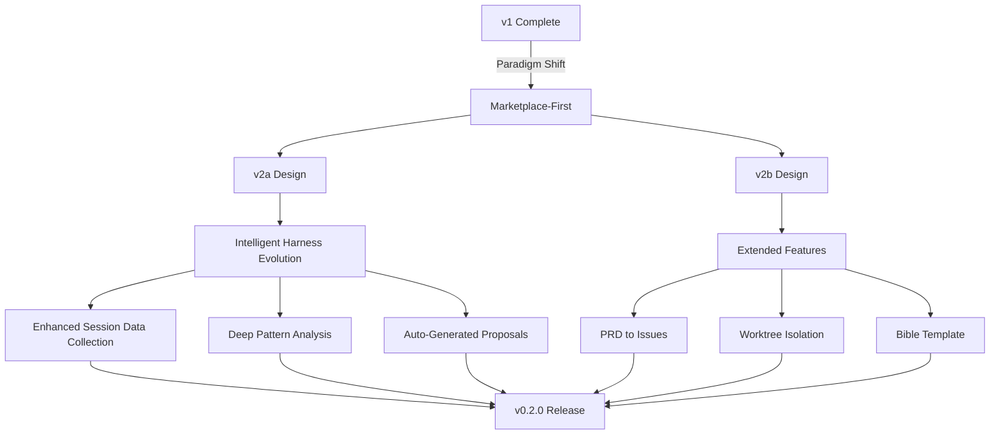

## Overview

[Previous post: #1 — Designing and Building an Adaptive Harness Plugin for Zero-Based Vibe Coders](/posts/2026-03-20-harnesskit-dev1/)

Right after v1 passed all 85 tests, a fundamental question came up — "Do we really need custom templates when the marketplace already has proven plugins?" That question set the direction for a 26-hour marathon session.

<!--more-->



---

## The Marketplace-First Pivot

### Background

v1 had over 12 custom skill/agent templates — 8 skill templates (nextjs, python-fastapi, common, generic, etc.) and 4 agent templates (planner, reviewer, researcher, debugger). These carried significant maintenance overhead, and the Claude Code plugin marketplace already had proven alternatives.

### What Changed

One core commit tells the whole story: **delete all custom skill/agent templates**. Instead, HarnessKit pivoted to **curating** marketplace plugins, and only generating custom skills via `/skill-builder` when insights data justifies it.

> "Curate, Don't Reinvent" — stop reinventing the wheel; curate what's already proven.

The init, apply, and insights skills were all rewritten around this principle.

---

## v2a: Intelligent Harness Evolution

### Background

v1's observation system was limited to basic session log collection. v2a aimed for an intelligent evolution system that **analyzes collected data for patterns and automatically proposes improvements**.

Three key decisions emerged from brainstorming:
- **Incremental complexity** — look at insights data to judge when to evolve
- **Diff-based proposals** — surface changes as diffs; user approves before applying
- **Minimal commands** — "more commands don't mean better usability"

### Implementation

The v2a spec defined five core capabilities:

1. **Enhanced session data collection** — tool call sequences, time distributions, plugin usage patterns
2. **Deep pattern analysis** — time-sink detection, repeated behavior identification, coverage gap analysis
3. **Auto-generated proposals** — suggest agent, skill, and hook creation based on usage patterns
4. **Review internalization pipeline** — marketplace plugin → custom replacement when data justifies it
5. **A/B testing integration** — skill quality comparison tied to `/skill-builder`

```python
# Example: session-end data extraction in v2a (base.md logging protocol)
# Automatically records tool call sequences, time distributions, plugin usage
```

Implementation was carried out via subagent-driven development, split into 7 tasks.

---

## v2b: Extended Harness Features

### PRD to GitHub Issues (`/harnesskit:prd`)

This skill takes a PRD document, decomposes it into GitHub issues, and syncs them to `feature_list.json`. It helps vibe coders manage requirements systematically.

### Worktree Isolation (`/harnesskit:worktree`)

A harness-aware git worktree management skill. It provides isolated environments for parallel development by leveraging Claude Code's built-in worktree support rather than building from scratch — a direct extension of the marketplace-first principle.

### Bible Template — An Interesting Design Evolution

The Bible is a curated template encoding harness engineering principles. It was initially designed to let users freely extend it, but an important concern was raised during the session:

> "If users can add to it freely, won't inconsistent guidelines degrade plugin quality?"

This feedback led to the Bible being redesigned as a **constant, curator-only template** — only plugin maintainers can update it. A deliberate constraint to prevent quality degradation.

---

## Plugin Format Restructuring

The transition to the official Claude Code plugin format happened in two rounds:

1. **Round 1**: `harnesskit/` nested directory → `skills/SKILL.md` flat structure
2. **Round 2**: `skills/setup.md` → `skills/setup/SKILL.md` directory-based structure (official convention)

This was a large-scale refactoring that touched over 26 files.

### Productization

The final step was turning HarnessKit into a shippable product:
- Production-grade README and MIT license
- **Privacy Policy**: "No external data collection" — all data stored locally in `.harnesskit/`
- Version bump to 0.2.0, all v2b skills registered
- Enhanced monorepo detection: `detect-repo.sh` now scans backend/frontend subdirectories

---

## Commit Log

| Message | Change |
|---------|--------|
| refactor: marketplace-first approach — remove skill/agent templates | Mass deletion + rewrite |
| docs: add HarnessKit v2a design spec | v2a design doc |
| docs: add v2a implementation plan | Implementation plan |
| feat(v2a): add tool usage and plugin logging protocol | base.md logging |
| test(v2a): add session data fixtures | Test fixtures |
| feat(v2a): add tool call sequence, time distribution extraction | Data extraction |
| feat(v2a): add v2a config schema initialization | Config schema |
| feat(v2a): add v1→v2a migration path | Migration path |
| feat(v2a): add review internalization, custom toolkit to status | Status dashboard |
| feat(v2a): add agent/hook/review proposals to apply | Apply execution path |
| feat(v2a): add time-sink, repeated actions, coverage gap analysis | Deep analysis |
| docs: add HarnessKit v2b design spec | v2b design doc |
| docs: redesign bible as constant curated template | Bible redesign |
| feat(v2b): add curated bible template | Bible implementation |
| feat(v2b): add /harnesskit:prd skill | PRD skill |
| feat(v2b): add /harnesskit:worktree skill | Worktree skill |
| feat(v2b): add A/B eval comparison to apply | Skill comparison eval |
| feat(v2b): register prd + worktree skills, bump to 0.2.0 | Version bump |
| docs: add production README, LICENSE, .gitignore | Productization |
| refactor: restructure to official Claude Code plugin format | Round 1 restructure |
| docs: add privacy policy | Privacy policy |
| refactor: restructure skills/agents to official plugin format | Round 2 restructure |
| feat: enhance detect-repo.sh for monorepos | Monorepo detection |

---

## Takeaways

The most striking thing about this 26-hour session was adopting the **"Curate, Don't Reinvent"** principle. Boldly deleting over 12 carefully crafted templates from v1 and pivoting to a marketplace-first approach was a significant shift — technically and philosophically. The Bible template's redesign is another interesting case: moving from "give users freedom" to "deliberately constrain for quality" is an important lesson about plugin ecosystem maturity. The core of v2a/v2b comes down to **data-driven judgment** — create custom skills only when insights justify it, and use proven marketplace plugins until then.
