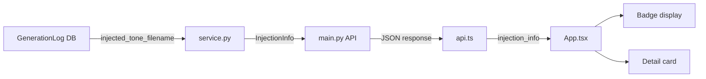
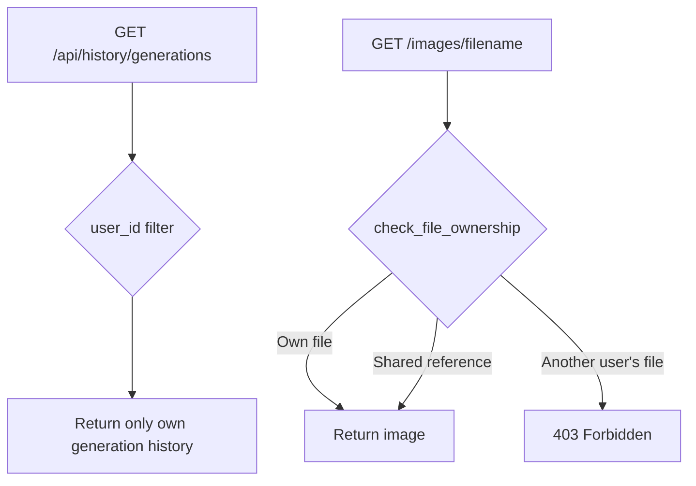

## Overview

Following the Google OAuth login wall implementation in the previous post, this session focused on three things: **visual feedback for the auto-injection system** (tone/angle), **per-user data isolation**, and **image generation parallelization**. The UI received major improvements so users can intuitively see the comparison generation results (tone+angle vs tone-only) defined in PRD v3.

[Previous post: #1 — Hybrid Image Search Dev Log — Implementing Google OAuth Login Wall](/posts/2026-03-17-hybrid-search-auth/)

<!--more-->

## Auto-Injection Reference Visualization

### Background

One of PRD v3's core features is automatic tone/angle reference injection. But users had no way of seeing which images were actually being applied as tone or angle references. Looking at generated images and wondering "why did it come out with this color palette?" with no way to check was a real problem.

### Implementation

We built an injection info pipeline from backend to frontend.



**Backend** — Added an `InjectionInfo` model to `schemas.py` and updated `service.py` to read `injected_tone_filename` and `injected_angle_filename` fields from the DB and convert them to a structured response:

```python
def _build_injection_info_from_row(row: dict) -> InjectionInfo | None:
    tone_fn = row.get("injected_tone_filename")
    angle_fn = row.get("injected_angle_filename")
    reason = row.get("injection_reason")
    if not tone_fn and not angle_fn:
        return None
    return InjectionInfo(
        tone=InjectedReference(filename=tone_fn, score=0.0) if tone_fn else None,
        angle=InjectedReference(filename=angle_fn, score=0.0) if angle_fn else None,
        reason=reason,
    )
```

**Frontend** — Two visual elements were added:

1. **Thumbnail badges**: `Tone` and `Angle` tags displayed in the top-left of image cards in amber/blue colors
2. **Detail modal card**: `GeneratedImageDetail.tsx` shows the actual injected reference images as thumbnails, with the injection reason as text

### Debugging — References Not Showing Up

After the initial implementation, an actual generation run showed no tone/angle indicators at all. A screenshot confirmed `injection_info` was coming back as null. The cause was a field name mismatch between the DB column names and the actual row keys in `_build_injection_info_from_row`. Fixing the mapping resolved it.

Additionally, the reference image selection logic had a bug where the `ImageCategories` struct wasn't loading properly. Fixed by parsing the `categories` field when loading `images.json`:

```python
categories = ImageCategories(**img["categories"]) if "categories" in img else ImageCategories()
doc = ImageDocument(
    id=img["id"],
    filename=img["filename"],
    labels=labels,
    categories=categories,
)
```

### Comparison Image Hover Overlay

To compare the tone+angle version against the tone-only version, we added a hover overlay that shows the comparison image on the same card. A side-by-side card display was considered, but hover switching on the same card was chosen for better usability.

During implementation, the `Tone` badge was shifting position on hover. Fixed by using CSS `position: absolute`, and text size was increased for readability.

## Search Results Horizontal Scroll

### Background

The search results popup opened by the "Find References" button used a `grid grid-cols-6` vertical grid layout. With many images, scrolling became long and comparison was difficult.

### Implementation

All three grids in the popup (by component, combined results, view all) were replaced with a **single horizontal row with left/right arrows**.

A reusable `ScrollableRow` component was created:

```tsx
const ScrollableRow: React.FC<{ children: React.ReactNode }> = ({ children }) => {
    const scrollRef = useRef<HTMLDivElement>(null);
    const [canScrollLeft, setCanScrollLeft] = useState(false);
    const [canScrollRight, setCanScrollRight] = useState(true);

    const scroll = (direction: 'left' | 'right') => {
        const el = scrollRef.current;
        if (!el) return;
        const scrollAmount = 540; // ~3 cards
        el.scrollBy({ left: direction === 'left' ? -scrollAmount : scrollAmount, behavior: 'smooth' });
    };

    return (
        <div className="relative group/scroll">
            {canScrollLeft && (
                <button onClick={() => scroll('left')}
                    className="absolute left-0 top-0 bottom-0 z-10 w-10 ...">
                    <ChevronLeft size={20} />
                </button>
            )}
            <div ref={scrollRef} onScroll={updateScrollState}
                className="flex gap-2.5 overflow-x-auto custom-scrollbar-hidden">
                {children}
            </div>
            {canScrollRight && (
                <button onClick={() => scroll('right')} className="...">
                    <ChevronRight size={20} />
                </button>
            )}
        </div>
    );
};
```

All existing `grid grid-cols-6 gap-2.5` layouts were replaced with `<ScrollableRow>`, and each image card got `flex-shrink-0 w-[200px]` for a fixed width. Initially 160px, but 200px proved better for the horizontal layout.

## Per-User Data Isolation

### Background

In a multi-user environment, generation history was being fetched without a `user_id` filter. This was a security issue where other users' generated images could appear in someone's history.

### Implementation

Rather than just limiting what's displayed, we implemented true isolation at the backend level:



1. **`get_generation_history(user_id=...)`** — Added `user_id` filter to query
2. **`check_file_ownership(filename, user_id)`** — Verifies ownership of generated/uploaded files. Reference images (`image_ref_*` directories) are shared assets and are allowed; `gen_*`/`upload_*` files are owner-only
3. **`/images/{filename}` endpoint** — Added auth dependency and ownership check

```python
async def check_file_ownership(filename: str, user_id: int) -> bool:
    """Check if a generated or uploaded file belongs to the given user.
    Returns True if the file is not found in any table (legacy/orphan data).
    """
```

## Async Parallel Generation

### Background

PRD 2.4 specified running comparison generation (tone+angle vs tone-only) in parallel with `Promise.all`, but the backend was actually using sequential `await` calls. For 4-image generation, this doubled the wait time.

### Implementation

Parallelized Gemini API calls using `asyncio.gather` and `asyncio.Semaphore`:

```python
import asyncio

# Limit concurrent Gemini API calls
_gemini_semaphore = asyncio.Semaphore(4)
```

Refactored the `_generate_batch` function that previously used sequential for-loops, so that in comparison mode both batches run concurrently via `asyncio.gather`. The Semaphore limits concurrent calls to prevent API rate limit issues.

## DB Management Convenience — `make db-clean`

Frequently resetting data during development meant manually typing sqlite3 commands every time. Added a `db-clean` Makefile target:

```makefile
db-clean:
	@sqlite3 data/logs.db "DELETE FROM search_logs; DELETE FROM image_selections; DELETE FROM generation_logs; DELETE FROM manual_uploads;"
	@echo "Cleared: search_logs, image_selections, generation_logs, manual_uploads"
```

This preserves the schema and `alembic_version`, `images`, `users` tables while clearing log data.

## Commit Log

| Message | Change |
|---------|--------|
| perf: parallelize image generation with async Gemini API | `backend/src/main.py` |
| data: update images.json with refreshed labels and metadata | `data/images.json` |
| feat: comparison hover overlay, injection badges, and scrollable search results | `App.tsx`, `GeneratedImageDetail.tsx`, `SearchResultsPopup.tsx` |
| feat: add comparison images and injection info to generation history API | `schemas.py`, `api.ts` |
| chore: add db-clean Makefile target for clearing log tables | `Makefile` |
| chore: remove stale docs and skill file, update gitignore | `.gitignore` + 4 files |
| fix: isolate user data — filter history by user_id and enforce image ownership | `database/__init__.py`, `service.py`, `main.py` |
| docs: update README with auto-injection system | `README.md` + 2 files |

## Takeaways

- **Visual feedback is also a debugging tool** — while wiring up the tone/angle injection display, we discovered several bugs in the actual injection logic (categories not loading, field name mismatches). Making things visible makes bugs visible too.
- **Data isolation from the start** — adding multi-user support after the fact means hunting through every existing query. `user_id` filters belong in the table design phase.
- **Semaphore for controlled parallelism** — `asyncio.gather` alone can hit rate limits. Pair it with something like `Semaphore(4)` for stable behavior.
- **Horizontal scroll UX** — for image search results, horizontal scrolling is more intuitive than a vertical grid. Showing category results one row at a time makes comparison easier. Arrow buttons that appear on hover, combined with a hidden scrollbar, is a good pattern for maintaining usability.
