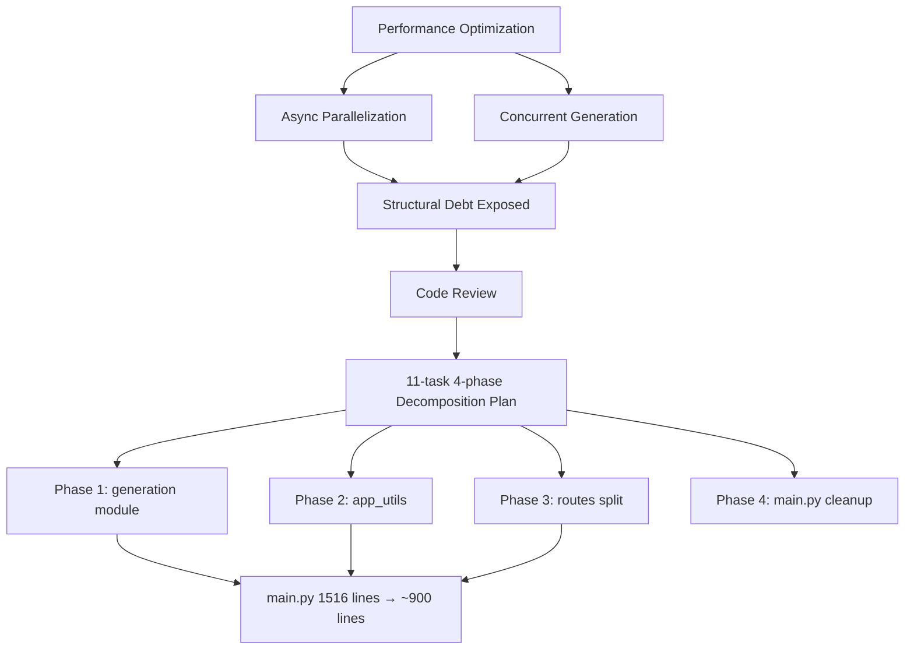
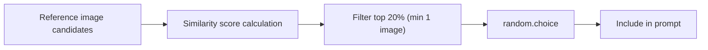

## Overview

[Previous post: #2](/posts/2026-03-20-hybrid-search-dev2/)

This session was about moving from "make it work" to "make it right." After converting the Gemini API to async and adding concurrent generation support, the structural debt exposed by the performance work made it clear: the 1,516-line `main.py` needed to be broken apart. We planned an 11-task, 4-phase decomposition and got started.

<!--more-->



---

## Async Parallelization

### Background

The existing image generation pipeline was calling synchronous `client.models.generate_content()` inside `async def` — blocking the entire event loop. The `google-genai` SDK v1.62.0 already had an async API (`client.aio.models.generate_content()`), but it wasn't being used.

### Implementation: Two-Level Parallelization

```python
# Level 1: Within-batch parallelization — generate individual images concurrently
async def _generate_single_image(...):
    async with semaphore:  # Semaphore(4) — respects API rate limits
        return await client.aio.models.generate_content(...)

results = await asyncio.gather(
    *[_generate_single_image(item) for item in batch]
)

# Level 2: Cross-batch parallelization — primary + comparison run concurrently
primary, comparison = await asyncio.gather(
    generate_batch(primary_items),
    generate_batch(comparison_items)
)
```

For 4-image generation with comparison mode, what used to require 8 sequential calls now runs in parallel within the `Semaphore(4)` limit, resulting in a significant perceived speedup.

### Frontend: Concurrent Generation Support

Even after the async conversion, the UI was still locking the button during generation. Replaced `generating: boolean` with `generatingCount: number` to allow multiple generation requests to run simultaneously.

```typescript
// Before: boolean lock — only one at a time
const [generating, setGenerating] = useState(false);

// After: counter — allows concurrent generation
const [generatingCount, setGeneratingCount] = useState(0);
// Button disabled only when prompt is empty
// Spinner: "Generating 2 images..."
```

---

## Generation Quality Improvements

### Structured Prompts

Added **structured section headers** (`### Core Generation Subject ###`, dividers, etc.) to the prompts sent to Gemini for clearer instruction delivery. Added a full prompt preview to the detail view so users can see exactly what prompt was sent.

### Reference Image Randomization

Previously, tone/angle reference selection always picked the single highest-scoring image — a deterministic structure that produced identical results for the same query.



Changed to `random.choice` from the top 20% pool. Applied to both search-based and fallback paths, for both tone and angle references. A small change with a significant impact on generation diversity.

---

## Structural Refactoring: Decomposing main.py

### Code Review Findings

After requesting a code review post-async-addition, main.py's problems became clear:
- **1,516 lines with 7 responsibilities**: app bootstrap, auth, image serving, search, generation injection, Gemini service, generation orchestration
- **No APIRouter usage** — all routes registered directly with `@app.get`/`@app.post`
- **Global mutable state** — `images_data`, `hybrid_pipeline` etc. as module-level variables
- **145-line `_generate_single_image` function**

### Decomposition Plan

An 11-task, 4-phase decomposition plan was established:

| Phase | Target | Result |
|-------|--------|--------|
| 1 | `generation/injection.py`, `prompt.py`, `service.py` | Core generation logic separated |
| 2 | `app_utils.py` | Shared utilities |
| 3 | `routes/auth.py`, `meta.py`, `images.py`, `search.py`, `history.py`, `generation.py` | APIRouter-based route separation |
| 4 | Final main.py cleanup | ~100 lines target |

### Execution and Technical Decisions

Carried out via subagent-driven development — each task delegated to a separate subagent with a 2-stage review (spec compliance + code quality).

Key decisions made during refactoring:
- **Global variables → explicit parameters**: Functions that read `images_data`, `hybrid_pipeline`, etc. now receive them as explicit parameters
- **Circular import prevention**: Route modules only access main.py globals inside function bodies (not at module scope)
- **`_gemini_semaphore`**: Moved to `generation/service.py`, removed from main.py
- **Bug found**: `get_image_file_legacy` missing auth dependency — logged but intentionally left for behavior-preserving refactor

### Results

By session end: Phase 1 complete, Phase 2 complete, Phase 3 in progress (`routes/auth.py`, `routes/meta.py` extracted). **main.py reduced from 1,516 lines to approximately 900**, with remaining route extractions still pending.

---

## Commit Log

| Message | Change |
|---------|--------|
| feat: allow concurrent image generations by removing button lock | boolean → counter, concurrent generation UI |
| feat: add structured prompt headers and full prompt preview | Prompt quality + debugging |
| feat: randomize tone/angle ref selection from top 20% candidates | Generation diversity |
| refactor: extract generation/injection.py from main.py | Phase 1 — injection separation |
| refactor: extract generation/prompt.py from main.py | Phase 1 — prompt separation |
| refactor: extract generation/service.py from main.py | Phase 1 — Gemini service separation |
| refactor: extract app_utils.py with shared utilities | Phase 2 — utilities separation |
| refactor: extract routes/auth.py with APIRouter | Phase 3 — auth route separation |

---

## Takeaways

This session illustrates a classic pattern: **performance optimization triggering structural refactoring**. Adding async parallelization pushed main.py's complexity past a threshold, and the code review gave the systematic decomposition its opening. The most important principle throughout was **behavior preservation** — intentionally maintaining existing bugs while changing only the structure. The reference image randomization was nearly a one-liner change, but it demonstrates an important point for generative AI pipelines: "probabilistic diversity" contributes more to user experience than "deterministic optimal."
