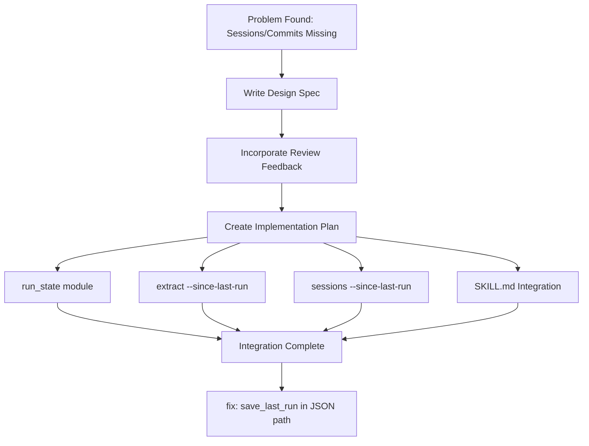
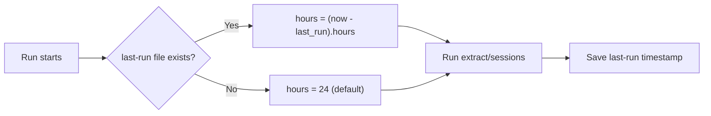

## Overview

[Previous post: #1 — Sessions Command and Dev Log Automation](/posts/2026-03-17-log-blog-sessions/)

While running the log-blog skill, a fundamental issue surfaced: only browser history was being extracted, and Claude Code sessions with commit-based dev logs weren't included in the initial list. To fix this, we merged both flows and added a `--since-last-run` flag to automatically manage the time range.

<!--more-->



---

## The Problem

Running the log-blog skill had Step 1 running `extract --json` to pull browser history only. Claude Code sessions and git commit-based dev logs only got listed if explicitly requested.

User feedback was direct:

> "There's no way I didn't commit anything — is this a bug?"
> "Why isn't it creating posts from sessions and commits?"

Since both workflows (browser history + dev logs) would be run daily, an integrated flow that surfaces both from the start was clearly needed.

---

## Design: Unified Skill Flow

### Core Decision

After considering three approaches in brainstorming, we went with **running both simultaneously every time, even if it takes longer**:

- Step 1: Run `extract` and `sessions --list` **concurrently**
- Step 3: **Present both** browser-based items and dev log candidates together
- After user approval: browser items proceed via `fetch`, dev logs via `sessions --project`

### --since-last-run Tracking

The problem with the `--hours 24` default: run it every other day and you miss a day; run it twice in a day and you get duplicates.

Solution: **automatic time range calculation based on last-run timestamps**



---

## Implementation

### run_state Module

Added `run_state.py` to manage last-run timestamps:

```python
# Load/save the last run time
def load_last_run() -> Optional[datetime]: ...
def save_last_run(timestamp: datetime) -> None: ...
def hours_since_last_run() -> Optional[float]: ...
```

Timestamps are stored in ISO 8601 format in a `.log-blog-last-run` file at the project root.

### --since-last-run Flag for extract/sessions

The `--since-last-run` flag was added to both `extract` and `sessions` commands. When set:
1. Calculate elapsed time since last run via `hours_since_last_run()`
2. Use that time as the `--hours` value
3. Fall back to 24 hours if no last-run file exists
4. Call `save_last_run()` after execution completes

### SKILL.md Integration

Updated the skill document so Step 1 runs both commands simultaneously:

```bash
# Step 1: Run concurrently
uv run log-blog extract --json --since-last-run
uv run log-blog sessions --list --since-last-run
```

Also improved the Step 3 user review screen so dev log candidates are automatically included.

### Bug Fix: save_last_run in JSON Output Path

The final commit fixed a bug where `save_last_run` wasn't being called when using the `--json` flag. The timestamp now gets saved after execution completes in the JSON output path as well.

---

## Commit Log

| Message | Change |
|---------|--------|
| docs: add unified skill flow and session data bug fix design spec | Design spec |
| docs: address spec review feedback | Review feedback incorporated |
| docs: add last-run tracking feature to unified skill flow spec | last-run tracking spec |
| docs: add implementation plan | Implementation plan |
| feat: add run_state module for last-run timestamp tracking | run_state module |
| feat: add --since-last-run flag to extract command | extract flag |
| feat: add --since-last-run flag to sessions command | sessions flag |
| feat: unify browser history and dev log flows in SKILL.md | Skill integration |
| fix: save_last_run in JSON output path of extract command | JSON path bug fix |

---

## Takeaways

The trigger for this improvement was "frustration felt while actually using the tool." Dogfooding — developers using their own tools — continues to prove its value. The `--since-last-run` flag is technically simple (store/load a timestamp), but its impact on user experience is significant: it completely eliminates the judgment call of "how many hours should I specify?" The structured design → review → implement workflow playing out systematically across 9 commits also shows how much the log-blog project itself has matured.
