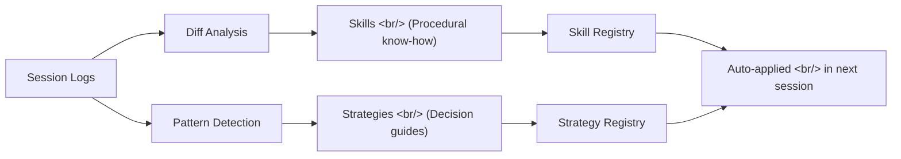
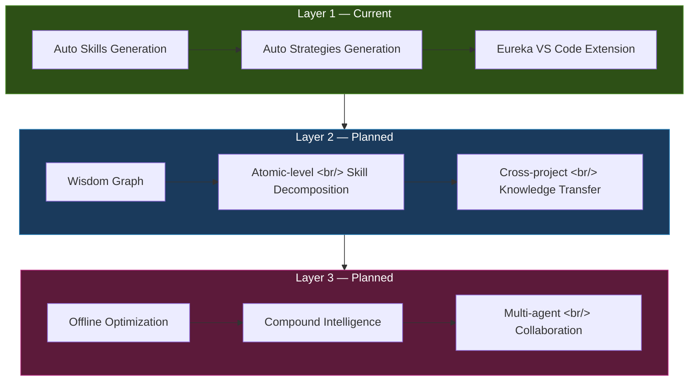

## Overview

The era of AI coding agents generating code has already arrived. But one fundamental question remains — **how does the agent itself improve?** Most AI coding tools today start from a blank slate every session. Whatever was learned in previous work doesn't carry over.

[MEGA Code](https://www.megacode.ai/) takes this problem head-on. It's an ambitious project that automatically extracts **Skills** (reusable know-how) and **Strategies** (decision-making guides) from session logs, building infrastructure where AI coding agents accumulate experience and evolve on their own. According to their benchmarks, it reduces token usage to 1/5 while tripling structural quality.

This post digs into MEGA Code's core concepts, 3-Layer architecture, analysis of their benchmark claims, and comparisons with other meta-learning approaches.

<!--more-->

## Core Concepts: Skills vs Strategies

MEGA Code's self-evolution mechanism is built on two key concepts. They look similar at a glance, but their roles and extraction methods are fundamentally different.

### Skills — Reusable Know-How

A **Skill** is concrete procedural knowledge for performing a specific task. It answers "How to do it."

Examples:
- **Writing React component tests**: The pattern sequence of mounting components with Jest + React Testing Library, simulating user events, and writing assertions
- **Standardizing API error handling**: try-catch block structure, branching by error type, message format to expose to users
- **Generating DB migration scripts**: The procedure for detecting schema changes and creating rollback-capable migration files

Skills are extracted from diffs. When the agent's code modification history (before → after) shows a pattern that can be applied repeatedly, it gets registered as a Skill.

### Strategies — Decision-Making Guides

A **Strategy** is a set of criteria for making situation-dependent judgments. It answers "What to choose."

Examples:
- **Choosing a state management tool**: React Context for under 10 components, Zustand for complex global state, TanStack Query when server state is primary
- **Deciding test strategy**: Unit tests for utility functions, integration tests for API interactions, E2E tests for core user flows
- **Prioritizing refactoring**: Start with frequently-changed files, start with modules with fewer dependencies

Strategies are extracted from repeated editing patterns. When the agent consistently makes the same choice in similar situations, those decision criteria get abstracted into a Strategy.

## The Diff-to-Skill Pipeline

MEGA Code's core engine is the pipeline that converts session log diffs into Skills. Rather than simply storing code change history, it's a process of elevating them into abstracted, reusable knowledge.

### How the Pipeline Works

1. **Diff collection**: Every code modification by the agent records a before/after diff
2. **Pattern clustering**: Similar diffs are grouped together. For example, if "adding error handling after an API call" appears 3+ times, it becomes one cluster
3. **Abstraction**: Specific variable names and function names are removed, leaving only the essence of the pattern. `fetchUser` → `fetchEntity`, `UserError` → `EntityError` — generalizing like this
4. **Skill creation**: The abstracted pattern is given a name, description, application conditions, and code template, then registered as a Skill
5. **Validation**: A feedback loop validates whether the generated Skill is actually useful in new sessions

An interesting aspect of this process is the existence of a **quantitative threshold**. Patterns that appear only once are ignored; only repeatedly occurring patterns get promoted to Skills. This reduces noise and ensures only genuinely reusable knowledge accumulates.

### Strategy Extraction Mechanism

Strategy extraction operates at a higher level. Rather than analyzing diffs themselves, it analyzes the agent's **choice patterns**.

For example, when the agent writes state management code:
- Session A: Small app → chose Context API
- Session B: Complex app → chose Zustand
- Session C: Server-state-heavy → chose TanStack Query

As this choice history accumulates, a Strategy is auto-generated: "Choose state management tools differently based on app complexity and state characteristics."

## The 3-Layer Architecture

MEGA Code proposes a 3-stage architecture that progressively increases complexity.

### Layer 1: Auto Skills & Strategies + Eureka (Current)

The currently available stage. Skills and Strategies are automatically extracted from session logs and surfaced to developers through the VS Code extension **Eureka**.

**What Eureka does:**
- Browse extracted Skills/Strategies directly within VS Code
- Auto-recommend Skills matching the current work context
- Interface for manually editing Skills or registering new ones
- Separate Skills/Strategies management per project

Eureka isn't just a code snippet manager. **Context-aware recommendations** are the core. It analyzes the currently open file, cursor position, and recent edit history to proactively suggest relevant Skills.

### Layer 2: Wisdom Graph (Planned)

The idea is to decompose Skills and Strategies down to **atomic level**. A composite Skill gets broken into smaller units, and the relationships between them are modeled as a graph.

**Why atomic decomposition matters:**

Layer 1 Skills are relatively coarse-grained. "Writing React component tests" contains multiple substeps internally. The problem is that even when only a subset is needed, the entire Skill gets applied, consuming unnecessary tokens.

The Wisdom Graph solves this:
- `Mount component` → `Simulate events` → `Write assertions` — each is an independent atomic Skill
- Selectively compose only what's needed
- Cross-project knowledge transfer becomes possible

This is similar to the Unix philosophy: "small programs that do one thing well, combined."

### Layer 3: Offline Optimization + Compound Intelligence (Planned)

The most ambitious stage. The agent optimizes existing Skills/Strategies in **offline** mode (outside of live sessions), and implements **Compound Intelligence** that integrates experience from multiple agents.

When this stage is realized:
- Know-how Agent A learned from frontend work gets applied to Agent B's backend tasks
- Skills accumulated overnight are automatically organized, merged, and optimized
- Knowledge is shared in Multi-agent scenarios where multiple agents collaborate

## Benchmark Analysis

The benchmark numbers MEGA Code published are impressive:

| Metric | Baseline | MEGA Code | Improvement |
|--------|----------|-----------|-------------|
| Token usage | 897K | 169K | **81% reduction (approx. 1/5)** |
| Structural quality | 1x | 3x | **3x improvement** |

### 81% Token Reduction

What this number means:
- **Cost reduction**: LLM API call costs drop to 1/5
- **Speed improvement**: Fewer tokens to process means faster response times
- **Context window efficiency**: More of the limited context window allocated to genuinely useful information

The mechanism for token reduction is clear. As Skills accumulate, the agent no longer needs to "think from scratch" each time — it applies proven patterns directly. Similar to few-shot prompting, but rather than reducing the prompt itself, it **eliminates unnecessary exploration and trial-and-error**.

### 3x Structural Quality

The fact that the exact measurement criteria for "structural quality" aren't disclosed warrants caution. Possible measurement approaches include:
- Code structure consistency (naming conventions, file structure, etc.)
- Architecture pattern adherence
- Test coverage
- Code review pass rates

More accurate evaluation will be possible when additional details about benchmark conditions (which projects, which tasks, comparison baseline models, etc.) are published.

## Comparison with Other Meta-Learning Approaches

MEGA Code isn't the only project tackling "AI agent self-improvement." Let's compare with similar directions.

### HarnessKit's Observe-Improve Loop

HarnessKit builds a loop that observes agent behavior and improves the process based on results.

- **In common**: Analyzes session history to improve agents
- **Different**: HarnessKit focuses on process-level improvement; MEGA Code focuses on knowledge (Skills/Strategies) level improvement. If HarnessKit optimizes "what order to work in for efficiency," MEGA Code optimizes "what code patterns to apply."

### Superpowers' Memory System

Superpowers gives agents long-term memory.

- **In common**: Knowledge persistence across sessions
- **Different**: Superpowers' memory is closer to relatively raw memory storage; MEGA Code's Skills/Strategies are structured, abstracted knowledge. If memory is a "diary," Skills are more like a "textbook."

### Claude's Memory/CLAUDE.md

Anthropic's Claude Code also maintains project context through `CLAUDE.md` and a memory system.

- **In common**: Knowledge transfer across sessions
- **Different**: Claude's memory is explicitly managed by the user and recorded in `CLAUDE.md`, while MEGA Code targets automatic extraction. MEGA Code is more ambitious in automation level, but extraction accuracy and noise management become the key challenge.

| Approach | Knowledge Form | Extraction Method | Abstraction Level |
|----------|---------------|-------------------|-------------------|
| MEGA Code | Skills + Strategies | Automatic (diff analysis) | High |
| HarnessKit | Process patterns | Semi-automatic (observe loop) | Medium |
| Superpowers | Raw memory | Automatic (session recording) | Low |
| Claude Memory | Structured notes | Manual + semi-automatic | Medium |

## Critical Analysis

### Strengths

1. **Clear problem definition**: Precisely identifies the problem — "agents don't learn from experience"
2. **Skills/Strategies distinction**: The framework cleanly separates procedural knowledge from decision-making knowledge
3. **Progressive architecture**: The 3-Layer approach separates currently available value from future vision
4. **Impressive benchmarks**: 1/5 token reduction translates directly to real cost savings

### Weaknesses and Open Questions

1. **Skill quality control**: How do you verify that automatically extracted Skills are actually useful? If bad patterns get registered as Skills, code quality could actually decline
2. **Project dependency**: Are Skills extracted from Project A valid in Project B? What are the limits of cross-project transfer in environments with different domain conventions?
3. **Skill conflicts**: What happens when two Skills recommend conflicting patterns?
4. **Benchmark transparency**: The measurement criteria and experimental conditions for the 3x structural quality improvement aren't sufficiently disclosed
5. **Layer 2/3 feasibility**: Wisdom Graph and Compound Intelligence are still conceptual. Layer 1's success doesn't guarantee success for Layer 2/3
6. **Lock-in risk**: If Skills/Strategies become tied to the MEGA Code platform, switching to other tools becomes difficult

### Hopes and Concerns

The most exciting part is the **Wisdom Graph**. It has the potential to solve one of the biggest problems with current AI coding tools — "context-free code generation." But whether atomic-level Skill decomposition is actually feasible, and whether those decomposed pieces can be meaningfully recombined, remains unproven.

## Quick Links

- [MEGA Code official site](https://www.megacode.ai/) — Product overview and access request
- [Eureka VS Code Extension](https://marketplace.visualstudio.com/) — Search in VS Code Marketplace
- [MEGA Code Benchmark Report](https://www.megacode.ai/) — Token reduction and quality improvement data

## Takeaways

1. **"Agents that learn from experience" is the next frontier of AI coding.** Code generation capability is already becoming commoditized. Differentiation will come not from "generates better" but from "gets better with use."

2. **The Skills vs Strategies distinction reflects how human experts structure knowledge.** Experienced developers accumulate "how to implement" (procedural knowledge) and "what to choose" (strategic judgment) separately. MEGA Code's attempt to automate this structure is theoretically sound.

3. **Token efficiency is a quality issue beyond cost.** When context windows are limited, reducing unnecessary tokens means allocating more space to genuinely important information. This isn't just cost savings — it's an improvement in the agent's "attention."

4. **Auto-extraction accuracy will be the key bottleneck.** If wrong Skills get registered, the agent repeatedly applies wrong patterns. A meta-version of "garbage in, garbage out" can occur. The quality management mechanism for Skills will determine MEGA Code's success or failure.

5. **Competition is converging on "who completes the self-evolution loop first."** MEGA Code, HarnessKit, Superpowers — all pointing in the same direction. The ultimate winner will likely be not the fastest team, but the one that builds the most trustworthy self-evolution loop.
