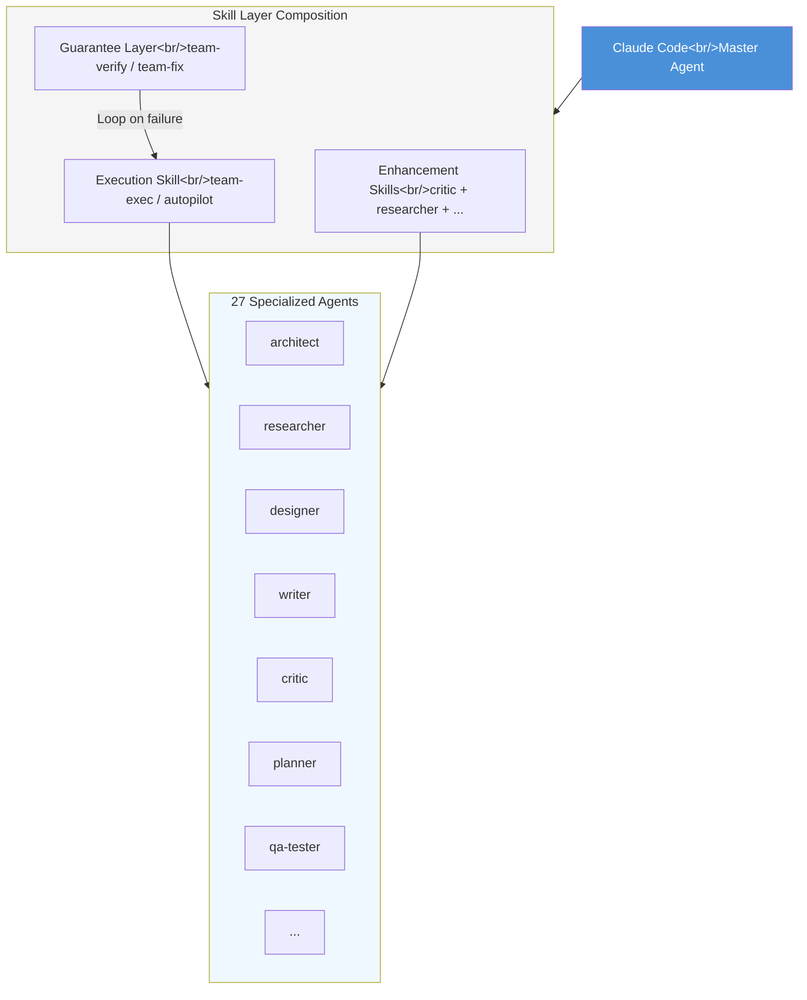
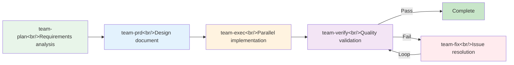
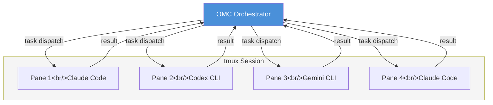

## Overview

[oh-my-claudecode (OMC)](https://github.com/Yeachan-Heo/oh-my-claudecode) is a **Teams-first multi-agent orchestration framework** that runs on top of Claude Code. With over 10,400 GitHub stars and rapid evolution to v4.9.0, it claims "Zero config, Zero learning curve." The core idea is simple — rather than replacing Claude Code's master agent, it layers 27 specialized agents and 28 skills via **skill injection**. This post digs into OMC's architecture, Team Mode pipeline, orchestration mode comparisons, and when to actually use it.

<!--more-->

## Skill Composition Architecture — The Layering Model

What fundamentally differentiates OMC from other Claude Code extensions is **layer composition** rather than **mode switching**.

The traditional approach cuts context and switches modes — "switch to planning mode → switch to execution mode." OMC uses Claude Code's skill system to **stack behaviors**.

The skill composition formula:

```
[Execution Skill] + [0-N Enhancement Skills] + [Optional Guarantee]
```

Specifically:

- **Execution Skill**: The core skill that does actual work (e.g., `team-exec`, `autopilot`)
- **Enhancement Skills**: Skills that inject additional behavior (e.g., `critic`, `researcher`)
- **Optional Guarantee**: A quality assurance layer (e.g., `team-verify`, `team-fix`)

The biggest advantage of this approach is that **context is never severed**. When transitioning from planning to execution, the context of previous conversation is fully preserved. Since skills inject behavior while Claude Code's master agent remains active, there's no context break.



## Team Mode Pipeline

**Team Mode**, which became canonical in v4.1.7, is OMC's core orchestration mode. It's a 5-stage pipeline.



Each stage in detail:

### 1. team-plan — Requirements Analysis

Receives the user's request and has the **architect** and **planner** agents collaborate. Defines scope, identifies required files and modules, and builds a dependency graph.

### 2. team-prd — Design Document

Based on plan results, **writer** and **designer** agents generate a PRD (Product Requirements Document). This document is injected as context for subsequent stages.

### 3. team-exec — Parallel Implementation

Multiple agents implement **in parallel** according to the PRD. This is where tmux CLI workers can be utilized. Each worker runs as an independent Claude Code (or Codex, Gemini) process in a split pane.

### 4. team-verify — Quality Validation

**qa-tester** and **critic** agents validate the implementation. Runs tests, reviews code, and checks requirements fulfillment.

### 5. team-fix — Fix Loop

Addresses issues found during verification. After fixing, returns to team-verify — a **loop structure**. This loop is the core of OMC's quality assurance mechanism.

## Orchestration Mode Comparison

Beyond Team Mode, OMC offers several orchestration modes, each optimized for different situations.

| Mode | Magic Keyword | Characteristics | Best For |
|------|---------------|-----------------|---------|
| **Team Mode** | `team` | 5-stage pipeline, parallel execution | Large multi-file/multi-role tasks |
| **omc team (CLI)** | — | Team Mode directly from CLI | CI/CD integration, script automation |
| **ccg** | — | Codex + Gemini + Claude triple model advisor | Design decisions, architecture review |
| **Autopilot** | `autopilot`, `ap` | Autonomous execution, minimal intervention | Repetitive tasks, well-defined tasks |
| **Ultrawork** | `ulw` | High-intensity focus mode | Complex single-file refactoring |
| **Ralph** | `ralph`, `ralplan` | Plan-centric, careful execution | Planning phase, high-risk changes |

### ccg — Tri-Model Advisor

Particularly interesting is the `/ccg` skill. It gets **Codex** and **Gemini** perspectives inside Claude Code, with Claude synthesizing them. It leverages inter-model viewpoint differences for better decision-making.

### deep-interview — Socratic Questions Before Coding

Asks the user **iterative questions** before starting to code, clarifying requirements. Rather than "what will you build," it first establishes "why are you building this" and "what constraints exist."

## tmux CLI Workers and Multi-Model Support

**tmux CLI Workers**, introduced in v4.4.0, dramatically extended OMC's parallel execution capability.



Key characteristics:

- **Real process spawning**: Independent `claude`, `codex`, `gemini` CLI processes run in each pane
- **Multi-model routing**: Routes to the appropriate model based on task characteristics. Claims **30-50% token cost savings** through smart model routing
- **Visual monitoring**: tmux split-pane lets you see each worker's progress in real time
- **HUD Statusline**: Shows currently active agents, progress stage, and token usage at a glance

## Magic Keyword System

The most distinctive aspect of OMC's user experience is the **magic keyword** system. Orchestration modes are activated with natural language keywords rather than complex commands.

| Keyword | Action |
|---------|--------|
| `ralph` | Activate Ralph mode — plan-first approach |
| `ralplan` | Run only Ralph's planning stage |
| `ulw` | Ultrawork mode — high-intensity focus |
| `plan` | Activate planning skill |
| `autopilot` / `ap` | Autopilot mode — autonomous execution |

These keywords can be used naturally in Claude Code prompts:

```
"ralph, refactor the authentication system in this project"
"ap add type annotations to all test files"
```

## 3-Tier Memory System

Context loss during long sessions is a chronic problem with AI coding tools. OMC addresses this with a 3-tier memory system.

| Tier | Purpose | Characteristics |
|------|---------|-----------------|
| **Priority Memory** | Top-priority context | Always injected into prompts; project rules/constraints |
| **Working Memory** | Current task context | Auto-updated during session; tracks progress state |
| **Manual Notes** | User-defined notes | Manually managed; long-term persistence |

Priority Memory plays a similar role to CLAUDE.md, but is automatically managed by OMC and shared across agents. Working Memory auto-updates at each Team Mode stage so agents in later stages know the decisions made in earlier ones.

## Installation and Quick Start

Installation is done through Claude Code's plugin system:

```bash
# 1. Add plugin
/plugin marketplace add https://github.com/Yeachan-Heo/oh-my-claudecode

# 2. Install
/plugin install oh-my-claudecode

# 3. Initial setup
/omc-setup
```

Ready to use immediately after installation. True to the "Zero configuration" claim, you can start with magic keywords right after `/omc-setup`, no further configuration needed.

The npm package name is `oh-my-claude-sisyphus`, written in TypeScript (6.9M) and JavaScript (5.2M).

## Trade-offs — OMC vs Pure Claude Code

OMC isn't a silver bullet. More layers means more cost.

### When to Use OMC

- **Multi-file/multi-role tasks**: When you need to simultaneously change frontend + backend + tests
- **Long sessions**: Work exceeding 2 hours where context loss becomes an issue
- **Planning-critical work**: Architecture changes, large-scale refactoring — cases where you need to think first, then execute
- **Simulating team workflows**: Working solo but needing an architect → developer → reviewer flow

### When Pure Claude Code Is Better

- **Simple tasks**: Team Mode pipeline is overkill for modifying one function or fixing one bug
- **Token cost sensitivity**: The 5-stage pipeline consumes **significantly more tokens** than pure Claude Code
- **Transparency matters**: The more orchestration layers, the harder it becomes to trace "why was this decision made"
- **Fast iteration needed**: The plan → prd → exec → verify → fix loop takes time

### Core Trade-off Summary

| Item | OMC | Pure Claude Code |
|------|-----|------------------|
| Token cost | High (multi-agent) | Low |
| Task time | Longer but higher quality | Faster but simpler |
| Transparency | Lower due to orchestration layers | High |
| Context retention | Excellent with 3-Tier memory | Basic level |
| Multi-file work | Powerful with parallel execution | Sequential processing |
| Guardrails | Automatic verify/fix loop | Manual review |

## Critical Analysis

OMC is an impressive project, but a few things deserve a sober look.

**Questions about codebase size**. TypeScript 6.9M + JavaScript 5.2M is large for a "Zero config" tool. Most of it is likely skill definitions and agent prompts, but a codebase of this scale carries significant maintenance overhead.

**The reality of "27 agents."** How differentiated the 27 specialized agents actually behave depends on the quality of prompt engineering. Whether the boundary between `architect` and `planner`, or the difference between `critic` and `qa-tester`, is substantive requires verification.

**The 30-50% savings claim for smart model routing**. The benchmark conditions for this figure aren't specified. Routing simple tasks to smaller models would save tokens, but it's unclear whether retry costs for complex tasks are included.

**Guardrail sensitivity**. If the team-verify → team-fix loop is overly sensitive, unnecessary fix cycles could repeat. This translates directly to token waste.

That said, the **skill composition paradigm** OMC proposes has genuine value. The approach of extending behavior through layering rather than mode switching — while preserving context — is compelling as the next step for AI coding tools. Team Mode's plan → prd → exec → verify → fix pipeline in particular reflects the actual workflow of software engineering well.

## Quick Links

- [oh-my-claudecode GitHub](https://github.com/Yeachan-Heo/oh-my-claudecode)
- [ROBOCO introduction post](https://roboco.io/posts/oh-my-claudecode-distilled/)
- [npm: oh-my-claude-sisyphus](https://www.npmjs.com/package/oh-my-claude-sisyphus)

## Takeaways

The **skill composition paradigm** OMC proposes is genuinely valuable. Extending behavior through layering rather than mode switching — preserving context throughout — is a compelling direction for AI coding tools. Team Mode's plan → prd → exec → verify → fix pipeline reflects real software engineering workflows well. That said, quantitative benchmarks showing exactly how much quality improvement this complex orchestration delivers over pure Claude Code are lacking. The time has come to prove it in numbers, not feeling.
