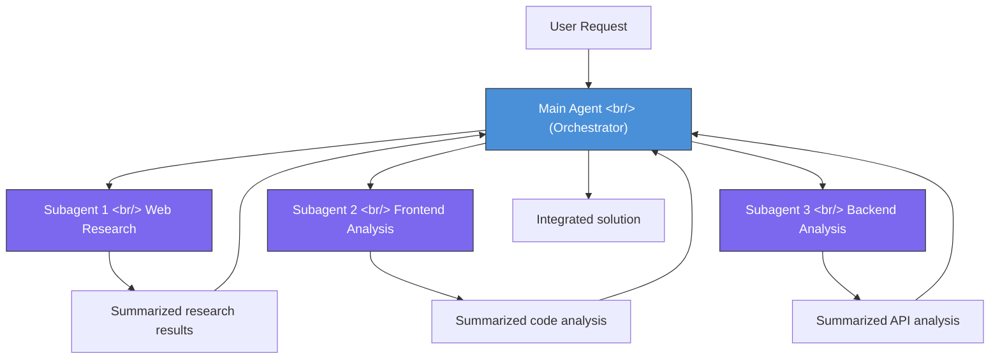
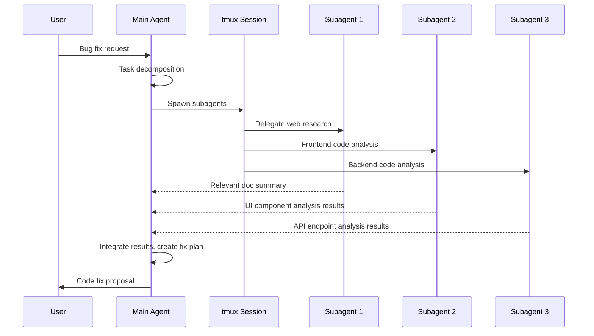

## Overview

The AI coding tool paradigm is shifting. We're moving from a single large LLM handling everything, toward **architectures where multiple lightweight subagents research in parallel and a main agent synthesizes the results**. OpenAI announcing GPT 5.4 mini/nano as "explicitly designed for subagent use" signals that this pattern isn't just a trend — it's becoming the industry standard. Based on Cole Medin's [The Subagent Era Is Officially Here](https://www.youtube.com/watch?v=GX_EsbcXfw8), this post digs into the core concepts and practical strategies of subagent architecture.

<!--more-->

## Why Subagents — The Context Rot Problem

### What Is Context Rot

The more information you put in an LLM's context window, the worse it performs. This is called **context rot**. Even a model with a 200K token context window will "forget" or misjudge the importance of early information when the window is actually filled to 200K.

This problem is particularly severe in AI coding tools:

- **Large codebase analysis**: Loading dozens of files into context causes the model to miss content from the critical files
- **Multi-step debugging**: Simultaneously analyzing frontend code, backend code, and error logs causes information to blur together
- **Web research + code modification**: Processing search results and code together degrades quality on both

### How Subagents Solve It

Subagent architecture solves this problem fundamentally. Each subagent has an **independent context window**, so it can focus solely on its assigned task. The main agent only receives summaries of each subagent's results, keeping its own context clean.



The key is **context isolation**. Even if each subagent uses 10K tokens, only about 1K tokens of summary gets passed back to the main agent. The main agent's context only grows by 3K tokens total.

## Comparing Subagent-Dedicated Models

OpenAI explicitly labeling GPT 5.4 nano as "for subagents" is an industry first. Google is also moving in the same direction with Gemini 3.1 Flash Light under the "intelligence at scale" concept.

### Key Model Specs

| Model | Processing Speed | Input Cost (1M tokens) | Output Cost (1M tokens) | Primary Use |
|-------|-----------------|----------------------|------------------------|-------------|
| Claude Haiku 4.5 | 53 tok/s | $1.00 | $5.00 | General-purpose subagent |
| GPT 5.4 nano | 188 tok/s | $0.20 | $1.00 | Dedicated subagent |
| GPT 5.4 mini | ~120 tok/s | $0.40 | $2.00 | Medium-complexity tasks |
| Gemini 3.1 Flash Light | ~150 tok/s | $0.15 | $0.60 | Large-scale parallel processing |

The GPT 5.4 nano numbers stand out:

- **Cost**: **1/5 the cost** of Claude Haiku 4.5 — you can run 5 subagents for the same price
- **Throughput**: **3.5x faster** — dramatically reduces wait time for parallel subagents
- **Design philosophy**: "Smart enough, fast and cheap" — the right trade-off for subagent use

### Why Dedicated Models Are Needed

Subagents have a different character than the main agent:

- **Main agent**: Complex reasoning, planning, code generation — accuracy is paramount
- **Subagent**: Information gathering, code reading, pattern searching — speed and cost are paramount

Using large models like GPT-4o or Claude Sonnet as subagents causes costs to spike dramatically. 3 subagents called 5 times each means 15 LLM calls — unrealistic cost with large models. Nano-class models are what make subagent architecture economically viable.

## Practical Architecture — How Subagents Actually Work

### Claude Code's Agent Tool Approach

Claude Code is the **first mover** of subagent architecture. It creates subagents via the `Agent Tool`, with each subagent performing file reading, searching, and analysis tasks in independent context.



Notably, Claude Code's **Agent Team** feature spawns multiple subagents simultaneously as terminal sessions using tmux. This has even led to renewed developer interest in tmux.

### OpenAI Codex's Approach

OpenAI Codex takes a different approach. It runs agents in a sandbox environment, minimizing costs by using GPT 5.4 nano as subagents. While Claude Code is local terminal-based, Codex is cloud sandbox-based.

The core difference:

| Characteristic | Claude Code Agent Tool | OpenAI Codex |
|----------------|----------------------|--------------|
| Execution environment | Local terminal (tmux) | Cloud sandbox |
| Subagent model | Claude Haiku 4.5 | GPT 5.4 nano |
| Parallelization method | tmux session split | Container-based |
| File access | Direct local filesystem | Sandbox copy |
| Cost structure | API call cost only | Compute + API cost |

### AI Coding Tools Currently Supporting Subagents

Subagents are no longer experimental. All major AI coding tools have adopted them:

- **Claude Code** — Agent Tool (first mover, most mature implementation)
- **OpenAI Codex** — GPT 5.4 nano-based subagents
- **Gemini CLI** — Experimental subagent support
- **GitHub Copilot** — Subtask splitting in agent mode
- **Cursor** — Parallel processing via Background Agent
- **Open Code** — Open source implementation

## Best Practices — Getting Subagents Right

Cole Medin's practical tips in the video are very specific.

### When to Use Subagents: Research

The optimal use case for subagents is **research**:

1. **Code analysis**: "Understand the dependency structure of this module"
2. **Web search**: "Find a solution for this error message"
3. **Documentation exploration**: "Summarize the migration guide for this library"
4. **Pattern search**: "Find similar implementations in this project"

#### Practical Example: 3 Parallel Research Subagents

A real bug fix scenario Cole Medin shared:

```
[Bug] Profile image not being saved on user profile update

Main agent's task decomposition:
├── Subagent 1: Web research
│   → Search "multer file upload not saving express.js"
│   → Collect solutions from Stack Overflow, GitHub Issues
│   → Result: High probability of missing multer storage config
│
├── Subagent 2: Frontend analysis
│   → Analyze form submission logic in ProfileEdit.tsx
│   → Check FormData construction method
│   → Result: Content-Type header not set to multipart
│
└── Subagent 3: Backend analysis
    → Check multer middleware config in upload.route.ts
    → Verify file storage path and permissions
    → Result: Destination path is fine, middleware order issue found

Main agent synthesis:
→ Fix frontend Content-Type + adjust backend middleware order
```

Because the three subagents investigated their areas **simultaneously**, the time was reduced to 1/3 of sequential investigation. And because each subagent only loaded their area's code into context, accurate analysis was possible without context rot.

### When Not to Use Subagents: Implementation

There's an anti-pattern Cole Medin warns against strongly. **Don't split implementation work across subagents.**

Why not:

```
[Anti-pattern] Split frontend/backend/DB across subagents

Subagent A: Write React components
Subagent B: Write Express API
Subagent C: Write DB schema

Problem:
- API call format from A ≠ API response format from B
- DB schema B expects ≠ Schema C created
- Type mismatches, field name mismatches, interface mismatches
→ Major rework needed on integration → worse than not using subagents
```

Implementation is fundamentally about **inter-component communication contracts**. Subagents don't share each other's context, so interface agreement is impossible. Research can be merged after independent investigation; code implementation cannot.

**The right pattern:**
- Research → Subagents (parallel)
- Implementation → Main agent (sequential, in integrated context)

## Limitations and Caveats of Subagent Architecture

### 1. Orchestration Overhead

The main agent managing subagents also has a cost. Task decomposition, writing subagent prompts, synthesizing results — all of this consumes the main agent's context. Using subagents for simple tasks is actually inefficient.

**Guideline**: Subagents aren't needed for problems solvable by reading 2-3 files. Subagents shine when you need to cross-reference 5+ files, or when web search is needed.

### 2. Result Quality Variance

When subagents use nano-class lightweight models, quality can drop for research requiring complex reasoning. "Organize the structure of this file" is the right level for subagents — not "find the bug in this code."

### 3. Security Considerations

When subagents perform external web searches, they may be exposed to prompt injection attacks. Malicious instructions embedded in search results can potentially be passed through subagents to the main agent.

## Looking Ahead

Subagent architecture is reshaping the fundamental patterns of AI coding, going beyond just "faster searching":

1. **Model specialization accelerates**: Combinations of role-optimized models, rather than a single general-purpose model, become the standard
2. **Cost structure shifts**: N calls to small models are more economical and accurate than a single call to a large model
3. **Developer workflow changes**: "Old-fashioned" tools like tmux and terminal multiplexers get recast as AI agent infrastructure

OpenAI, Google, and Anthropic all releasing lightweight models for subagent use is a clear signal. **The subagent era has already arrived.**

## Quick Links

- [Cole Medin — The Subagent Era Is Officially Here](https://www.youtube.com/watch?v=GX_EsbcXfw8)
- [OpenAI GPT 5.4 Model Card](https://openai.com/)
- [Claude Code Official Docs](https://docs.anthropic.com/en/docs/claude-code)

## Takeaways

The true significance of subagent architecture isn't "faster coding" — it's a **fundamental change in how information is processed**. We're transitioning from delegating everything to one omnipotent LLM, to a structure where role-optimized lightweight models collaborate. This is strikingly similar to how microservices replaced monoliths in software engineering. OpenAI explicitly putting "for subagents" in a model release headline is a declaration that this paradigm is not an experiment — it's the industry standard. For developers, what matters isn't the models themselves, but how to integrate this architecture into your own workflow.
