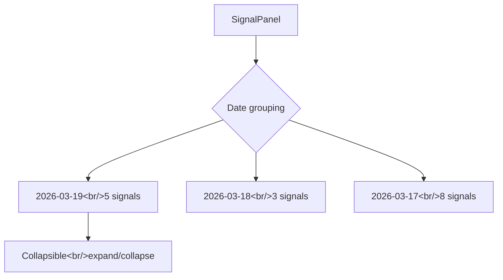

## Overview

This dev log focuses on backend stabilization work for trading-agent. We added year fallback and PBR calculation logic to the DART financial data client, fixed a bug where `current_price` was missing from the market scanner pipeline, resolved an `async/sync` mixing issue in FastMCP middleware, and on the frontend improved SignalPanel with date-based grouping and upgraded the DAG workflow visualization.

[Previous post: #4](/posts/2026-03-17-trading-agent-dev4/)

<!--more-->

## DART Client Improvements

### Background

Fetching financial data from the DART (Electronic Disclosure System) API had two problems:

1. **Missing year data**: When the latest year's financial statements hadn't been disclosed yet, the API returned an empty response. Without fallback logic to try a prior year, the analysis agent had to make decisions with no financial data.
2. **PBR not calculated**: PER is provided directly by the API, but PBR (Price-to-Book Ratio) is not. Even though market cap and net asset data was available, PBR wasn't being calculated.
3. **Industry-specific field differences**: Financial statement line item names differ between the financial sector and general companies, causing parse errors for certain industries.

### Implementation

Improvements made to `backend/app/services/dart_client.py`:

**Year Fallback Logic:**
```python
# Try from current year, find a year with available data
for year in range(current_year, current_year - 3, -1):
    result = await self._fetch_financial_data(corp_code, year)
    if result and result.get("list"):
        break
```

**Auto PBR Calculation:**
```python
# Calculate PBR from net equity (total capital) and market cap
if total_equity and total_equity > 0:
    pbr = market_cap / total_equity
```

**Industry-specific Field Mapping:**

Financial sector companies (banks, insurance, securities) use `Operating Revenue` instead of `Operating Income`, and reference `Interest Income` etc. instead of `Revenue` — branching logic was added for this.

## Market Scanner Pipeline Fix

### Background

After the market scanner scans stocks and passes them to each specialist agent (technical analysis, fundamental analysis, etc.), the `current_price` field was missing. The scanner fetches price data but wasn't passing it along when calling downstream experts.

### Implementation


Updated `backend/app/agents/market_scanner.py` to explicitly pass `current_price` when calling experts:

```python
# Before: price info missing from expert call
expert_result = await expert.analyze(stock_code, stock_name)

# After: current_price passed through entire pipeline
expert_result = await expert.analyze(stock_code, stock_name, current_price=price)
```

Also simplified the chief analyst's debate logic in `market_scanner_experts.py`. The old approach had all expert opinions debating sequentially — reducing unnecessary rounds improved response time.

## FastMCP Middleware async/sync Bug Fix

### Problem

A method accessing `context.state` in MCP server middleware was a synchronous function being called with `await`:

```python
# Bug: await on sync function
state = await ctx.get_state("trading_mode")  # TypeError!
```

FastMCP's context state methods are synchronous functions. `await`-ing them either causes a `TypeError` when called on a non-coroutine, or in some Python versions silently returns `None`.

### Fix

Removed `await` from `open-trading-api/MCP/Kis Trading MCP/module/middleware.py` and `tools/base.py`:

```python
# Fix: sync method called directly without await
state = ctx.get_state("trading_mode")
```

## Scheduled Tasks Activated

Updated scheduler-related settings in `backend/app/models/database.py`:

- Activated scheduled tasks that were previously disabled
- Adjusted cron timings to match Korean market hours (pre-market scan, intraday monitoring, post-market report)

## Frontend Improvements

### SignalPanel Date Grouping

Added date-based collapsible sections to `frontend/src/components/dashboard/SignalPanel.tsx`. Previously, all signals were listed chronologically, making it difficult to find signals from a specific date.



### Daily Chart Data Extended

Extended the daily chart data fetch period in `backend/app/services/market_service.py` from 30 days to 90 days. This was needed to have sufficient data for moving average calculations (60-day, 90-day) in technical analysis.

### DAG Workflow Styling

Updated the agent pipeline DAG visualization layout and expert chip styling in `frontend/src/components/AgentWorkflow.css` and `AgentWorkflow.tsx`. Adjusted node spacing, connector label positions, and overall container alignment for improved readability.

## Commit Log

| Message | Change |
|---------|--------|
| feat: improve DART client with year fallback, PBR calculation, and industry-variant fields | `dart_client.py` |
| fix: pass current_price through scanner pipeline and simplify chief debate | `market_scanner.py`, `market_scanner_experts.py` |
| fix: remove await from sync FastMCP context state methods | `middleware.py`, `tools/base.py` |
| feat: enable scheduled tasks and adjust cron timings | `database.py` |
| feat: extend daily chart data from 30 to 90 days | `market_service.py` |
| feat: add date-grouped collapsible sections to SignalPanel | `SignalPanel.tsx`, `App.css` |
| style: improve DAG workflow layout and expert chip styling | `AgentWorkflow.css`, `index.css` |

## Takeaways

- **async/sync mixing creates silent bugs.** In Python, `await`-ing a sync function can return `None` instead of raising an error in some runtimes. When using libraries like FastMCP where sync and async coexist, you must verify each method's signature.
- **Missing data in pipelines is a common mistake.** The scanner fetching price but not passing it to experts happened because each stage was tested independently. A reminder of the need for end-to-end tests.
- **Financial data APIs require industry-specific handling.** Financial sector financial statements are fundamentally structured differently from general companies. If you don't pre-map these variations when wrapping the DART API, `KeyError` will hit you at runtime.
- **Chart data range and analysis indicators must be designed together.** Calculating a 90-day moving average requires at least 90 days of data — we were only fetching 30 days. Whenever adding technical analysis indicators, the data source's range needs to be checked at the same time.
