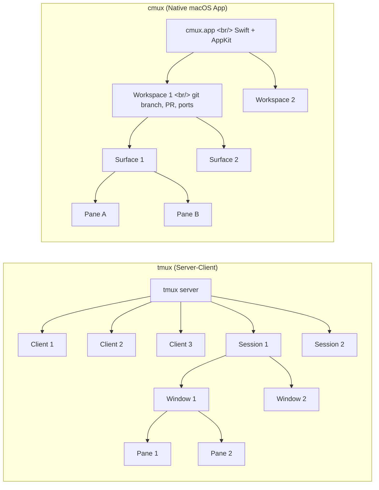
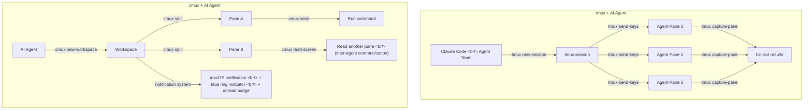

## Overview

tmux, born in 2007, has been a cornerstone of server management and development environments for 19 years. Claude Code's Agent Team feature recently put it back in the spotlight by spawning parallel agents on top of tmux sessions. Meanwhile, cmux — built by Manaflow AI — arrived with the concept of "a terminal built for AI agents." It's a native macOS app based on Ghostty's rendering engine (libghostty).

This post compares the two tools' architectures, core concepts, and AI agent support models, and suggests how to combine them effectively in practice.

<!--more-->

## Architecture Comparison

The two tools have fundamentally different design philosophies.



| Item | tmux | cmux |
|------|------|------|
| Type | Terminal multiplexer | AI agent terminal |
| Architecture | Server-client | Native macOS app |
| OS support | Cross-platform (Linux, macOS, BSD, Solaris) | macOS 14.0+ only |
| UI | TUI (text-based) | GUI (native AppKit) |
| Rendering | Custom TUI | Ghostty engine (libghostty) |
| License | ISC | AGPL |

tmux uses a server process that manages all sessions while clients connect to view them. Sessions persist even if the terminal is closed, as long as the server is alive. cmux is a native macOS app that displays workspace metadata — git branch, PR status, open ports, notifications — visually in a sidebar.

## Core Concept Mapping

The two tools' hierarchies have a clear correspondence.

| tmux | cmux | Description |
|------|------|-------------|
| Session | Workspace | Top-level work unit |
| Window | Surface | Tab within a session/workspace |
| Pane | Pane | Split screen area |

### How Navigation Differs

tmux uses a **prefix key** approach. Press `Ctrl+b` first, then enter a command key. The learning curve is steep, but everything can be controlled with just a keyboard.

cmux uses **native macOS shortcuts**. No prefix required — actions fire immediately.

| Action | tmux | cmux |
|--------|------|------|
| New session/workspace | `tmux new -s name` | `Cmd+N` |
| Horizontal split | `Ctrl+b %` | `Cmd+D` |
| Vertical split | `Ctrl+b "` | `Cmd+Shift+D` |
| New window/surface | `Ctrl+b c` | `Cmd+T` |
| Session list | `Ctrl+b s` | Always visible in sidebar |

## AI Agent Support

This is where the two tools differ most significantly.



### tmux's AI Agent Usage

tmux wasn't originally designed for AI. But its programmable API lets AI tools leverage it.

- **Claude Code**: Creates tmux sessions to run parallel agents in Agent Team mode
- **Codex, Gemini CLI**: Use tmux in a similar way
- `tmux send-keys` sends commands; `tmux capture-pane` collects output

### cmux's Native AI Support

cmux was designed for AI agents from the ground up.

- **Notification system**: Blue ring on panes waiting for input, unread badges on workspace tabs, macOS desktop notifications. `Cmd+Shift+U` jumps to the most recent notification.
- **read-screen**: One pane can read another pane's content. This is the core feature for inter-agent communication.
- **send**: Programmatically send commands to another pane.
- **Environment variables**: `CMUX_WORKSPACE_ID`, `CMUX_SURFACE_ID`, `CMUX_SOCKET_PATH` — agents automatically know their own context.
- **Built-in browser**: Open web pages inside the terminal.

### CLI Automation Comparison

```bash
# tmux — programmatic control
tmux new-session -d -s work
tmux split-window -h
tmux send-keys -t work:0.1 "npm run dev" Enter
tmux capture-pane -t work:0.0 -p

# cmux — AI agent-dedicated CLI
cmux new-workspace
cmux split --direction right
cmux send --pane-id $CMUX_PANE_ID "npm run dev"
cmux read-screen --pane-id $TARGET_PANE_ID
```

## "Primitive, Not Solution" Philosophy

cmux's core design philosophy is **"Primitive, Not Solution."** Rather than providing a finished workflow, it offers low-level building blocks — `read-screen`, `send`, notifications. It leaves AI agents to combine these elements and compose their own workflows.

This approach increases compatibility with diverse AI tools and maximizes agent autonomy.

## The Competitive Landscape

The AI agent terminal space is growing quickly.

| Tool | Characteristics |
|------|-----------------|
| **cmux** | Native macOS, Ghostty-based, read-screen |
| **Claude Squad** | GitHub-based agent orchestration |
| **Pane** | Terminal for AI agents |
| **Amux** | AI-centric multiplexer |
| **Calyx** | Emerging competitor |

## Recommended Combination: tmux + cmux

In conclusion, tmux and cmux are not substitutes — they're **complements**.

- **tmux**: Session persistence (server-based), cross-platform support, remote server work
- **cmux**: GUI visualization, AI agent notifications, inter-agent communication (read-screen)

For local macOS development with AI agents, cmux works well as the primary tool, with tmux alongside for remote server work or when session persistence is required. That combination is currently the most effective terminal setup.

## Installation

```bash
# tmux
brew install tmux

# cmux
brew tap manaflow-ai/cmux && brew install --cask cmux
```

## Quick Links

- [tmux GitHub](https://github.com/tmux/tmux) — 43,430 stars, C-based open source
- [cmux official site](https://cmux.com) — Manaflow AI
- [cmux: Terminal for Coding Agents — Dale Seo](https://daleseo.com/cmux/) — practical guide
- [tmux vs cmux comparison — goddaehee](https://goddaehee.tistory.com/557) — from installation to competitive tools
- [TMUX Masterclass — YouTube](https://www.youtube.com/watch?v=vlg8X0N8z08)

## Takeaways

tmux's strength is 19 years of proven stability and cross-platform support. It remains the top choice for every scenario involving remote servers, CI/CD, and session persistence. cmux is designed for the AI agent era, with its notification system and read-screen feature optimized for multi-agent workflows. The two are not substitutes — they're complements. If tmux is "infrastructure where sessions never die," cmux is "the interface where agents talk to each other." AI coding tools spawning agents on top of tmux, with cmux visually managing those agents' state, is currently the most powerful terminal environment you can build.
