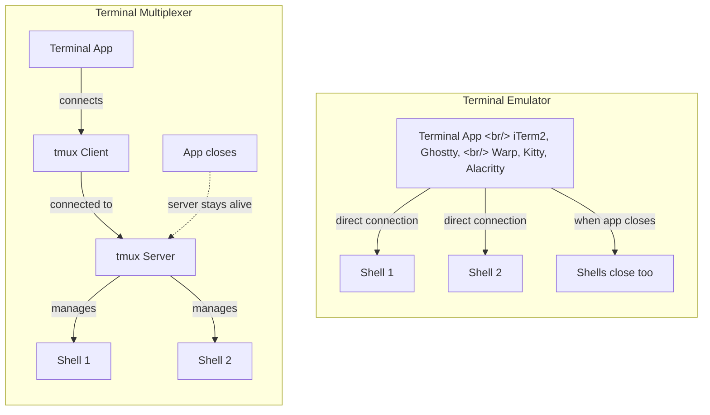
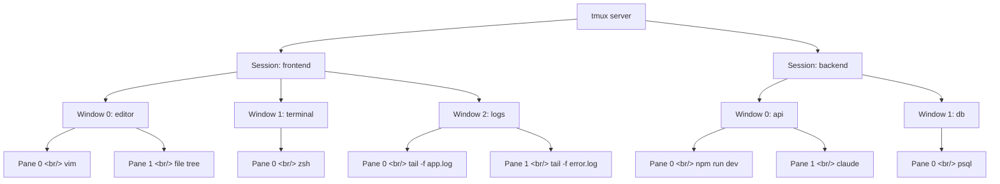

## Overview

tmux, created by Nicolas Marriott in 2007, remains core terminal infrastructure 19 years later. Claude Code's Agent Team feature recently put it back in the spotlight by spawning parallel agents on top of tmux sessions. Codex, Gemini CLI, OpenCode, and other terminal-based coding agents all make heavy use of tmux's programmable API.

This post covers everything in one place: tmux's architecture, session/window/pane management, customization, the plugin ecosystem, and integration with AI agents. For the tmux vs cmux comparison, see the [separate post](/posts/2026-03-23-tmux-cmux/) — this one focuses on a deep dive into tmux itself.

<!--more-->

## Terminal Emulator vs Terminal Multiplexer

Understanding tmux requires first grasping the fundamental difference between a terminal emulator and a terminal multiplexer.



A **terminal emulator** is an app that draws the screen. iTerm2, Ghostty, Warp, Kitty, and Alacritty all fall here. They connect directly to a shell, so closing the app terminates any running processes and sessions.

A **terminal multiplexer** is a server that manages sessions. tmux and screen are the main examples. Running on top of terminal emulators, their server-client structure means sessions persist even when you close the terminal app.

> A terminal emulator "draws the screen"; a terminal multiplexer "manages sessions." With a multiplexer, tab management, screen splitting, and session management all become the multiplexer's responsibility rather than the terminal app's.

This structural difference means that when using tmux, the most important criterion for a terminal emulator is **how lightweight and fast it is**. Since tmux handles tabs and splits, the terminal app itself can focus purely on fast rendering.

## tmux Architecture

tmux operates on a server-client model. This structure is the foundation of all tmux's strengths — session persistence, multiple client connections, and programmable control.

### Server-Client Model

```
┌─────────────────────────────────────────────────┐
│                  tmux server                     │
│  (background process, manages all sessions)     │
│                                                  │
│  ┌──────────┐  ┌──────────┐  ┌──────────┐       │
│  │ Session 0│  │ Session 1│  │ Session 2│       │
│  │ frontend │  │ backend  │  │ devops   │       │
│  └──────────┘  └──────────┘  └──────────┘       │
└─────────────┬──────────┬──────────┬─────────────┘
              │          │          │
       ┌──────┘    ┌─────┘    ┌────┘
       ▼           ▼          ▼
   Client A    Client B   Client C
   (iTerm2)    (Ghostty)  (SSH)
```

- **tmux server**: When you first run `tmux`, a server process starts in the background. This server manages all sessions, windows, and panes.
- **tmux client**: What the user sees. Connects to the server and displays a specific session's content.
- **Socket communication**: Client and server communicate via Unix socket (`/tmp/tmux-{uid}/default`).

### Session Persistence

The key advantage of this structure is **session persistence**.

1. Open tmux in Ghostty and launch Claude Code and a dev server
2. Completely close Ghostty
3. Reopen Ghostty and type `tmux attach`
4. Claude Code and the dev server are still alive

The terminal emulator disappeared, but the tmux server was keeping all processes running in the background. Whether your SSH connection drops, you close and reopen a laptop lid — tmux sessions persist.

## Installation and Initial Setup

### Installation

```bash
# macOS
brew install tmux

# Ubuntu/Debian
sudo apt install tmux

# Fedora
sudo dnf install tmux

# Check version
tmux -V
```

### First Run

```bash
# Start a new session (auto-named: 0, 1, 2...)
tmux

# Start a session with a name
tmux new-session -s work

# Shorthand
tmux new -s work
```

### Config File Basics

tmux configuration lives in `~/.tmux.conf`. Start with just the essentials.

```bash
# ~/.tmux.conf — minimal required settings

# Expand scrollback history (default 2,000 → 50,000 lines)
set -g history-limit 50000

# Enable mouse support
set -g mouse on

# Start window/pane indices at 1 (0 is awkward at the far left of the keyboard)
set -g base-index 1
setw -g pane-base-index 1
```

To reload the config after editing:

```bash
# From inside tmux
tmux source-file ~/.tmux.conf

# Or enter command mode with prefix + : and type:
source-file ~/.tmux.conf
```

## Core Concepts: Session, Window, Pane

tmux has a 3-tier structure.



| Tier | Description | Analogy |
|------|-------------|---------|
| **Session** | Top-level work unit. An independent project or work context | Virtual desktop |
| **Window** | Tab within a session. A full screen | Browser tab |
| **Pane** | Split area within a window. Each runs an independent shell | IDE split panel |

You can have multiple windows in one session, and multiple panes within one window. The current session name and window list are shown in tmux's bottom status bar.

## The Prefix Key System

All tmux shortcuts work by pressing the **prefix key** first, then a command key. The default prefix is `Ctrl+b`.

> The Ctrl+B combo is a bit awkward. Since pressing Ctrl+B is uncomfortable, many developers remap it to Ctrl+Space and use that instead.

Press `Ctrl+b`, release, then press the command key. They're not pressed simultaneously.

### Complete Shortcut Reference

#### Session Commands

| Shortcut | Action |
|----------|--------|
| `Prefix + d` | Detach from current session |
| `Prefix + s` | Show session list |
| `Prefix + $` | Rename current session |
| `Prefix + (` | Switch to previous session |
| `Prefix + )` | Switch to next session |
| `Prefix + : new` | Create new session (from inside tmux) |

#### Window Commands

| Shortcut | Action |
|----------|--------|
| `Prefix + c` | Create new window |
| `Prefix + w` | Show window list (includes sessions, tree view) |
| `Prefix + ,` | Rename current window |
| `Prefix + n` | Move to next window |
| `Prefix + p` | Move to previous window |
| `Prefix + 0~9` | Jump directly to that numbered window |
| `Prefix + &` | Close current window (with confirmation) |
| `Prefix + l` | Toggle to last used window |

#### Pane Commands

| Shortcut | Action |
|----------|--------|
| `Prefix + %` | Horizontal split (left/right) |
| `Prefix + "` | Vertical split (top/bottom) |
| `Prefix + arrow` | Move to pane in that direction |
| `Prefix + o` | Cycle through panes |
| `Prefix + z` | Toggle current pane zoom (fullscreen ↔ normal) |
| `Prefix + x` | Close current pane (with confirmation) |
| `Prefix + q` | Show pane numbers (press number to jump) |
| `Prefix + {` | Swap current pane with previous |
| `Prefix + }` | Swap current pane with next |
| `Prefix + Space` | Cycle through pane layouts |
| `Prefix + !` | Break current pane into new window |

#### Other

| Shortcut | Action |
|----------|--------|
| `Prefix + :` | Enter command mode |
| `Prefix + ?` | Show all key bindings |
| `Prefix + t` | Show clock |
| `Prefix + [` | Enter copy mode (enables scrolling) |

## Session Management

### Creating Sessions

```bash
# Create new sessions from terminal
tmux new -s frontend
tmux new -s backend
tmux new -s devops

# Create session + name the first window
tmux new -s work -n editor

# Create session without attaching (background)
tmux new -d -s background-job
```

To create a new session from inside tmux:

```
Prefix + : → new -s session-name
```

### Listing Sessions

```bash
# From terminal
tmux ls
tmux list-sessions

# From inside tmux
Prefix + s    # Session list (navigate with arrow keys)
Prefix + w    # Full list including windows in tree form
```

`Prefix + w` is more practical than `Prefix + s` — it shows not just sessions but the windows within them in tree form. Typing a number from the list jumps there immediately.

### Switching Sessions (Attach/Detach)

```bash
# Exit session (session stays alive)
Prefix + d

# Reconnect to a specific session
tmux attach -t frontend
tmux a -t frontend    # shorthand
tmux a               # attach to last session

# When there's only one session
tmux a
```

### Renaming and Killing Sessions

```bash
# Rename current session from inside tmux
Prefix + $

# Kill session from terminal
tmux kill-session -t old-session

# Kill all sessions
tmux kill-server
```

## Window Management

Windows are the "tabs" within a session. The window list is shown in the bottom status bar.

### Creating and Switching Windows

```bash
# Create new window
Prefix + c

# Switch between windows
Prefix + n          # next window
Prefix + p          # previous window
Prefix + 0          # jump directly to window 0
Prefix + 1          # jump directly to window 1
Prefix + l          # toggle to last used window

# Rename window
Prefix + ,
```

### Searching and Moving Windows

```bash
# Find window (search by name)
Prefix + f

# Move window to another session
Prefix + : → move-window -t target-session

# Reorder windows
Prefix + : → swap-window -t 0
```

## Pane Management

Panes are the split areas within a window. Each pane runs an independent shell.

### Splitting Panes

```bash
# Horizontal split (left/right)
Prefix + %

# Vertical split (top/bottom)
Prefix + "
```

### Moving Between Panes

```bash
# Navigate with arrow keys
Prefix + ↑↓←→

# Cycle through panes
Prefix + o

# Jump to pane by number
Prefix + q → press number
```

### Resizing Panes

```bash
# Fine adjustment with arrow keys
Prefix + Ctrl+↑     # expand up 1 unit
Prefix + Ctrl+↓     # expand down 1 unit
Prefix + Ctrl+←     # expand left 1 unit
Prefix + Ctrl+→     # expand right 1 unit

# Drag with mouse (requires mouse on setting)
# Drag pane borders

# Cycle through preset layouts
Prefix + Space
```

### Pane Zoom (Fullscreen Toggle)

```bash
# Expand/collapse current pane to full window size
Prefix + z
```

Useful when you need to closely read a pane's output. Press `Prefix + z` again to return to the split layout.

### Swapping Panes and Layouts

```bash
# Swap pane positions
Prefix + {       # swap with previous pane
Prefix + }       # swap with next pane

# Break current pane into new window
Prefix + !

# Cycle through preset layouts (even-horizontal, even-vertical, main-horizontal, main-vertical, tiled)
Prefix + Space
```

## Customization (.tmux.conf)

### Recommended Config

```bash
# ~/.tmux.conf — production settings

# ──────────────────────────────────────
# Base Settings
# ──────────────────────────────────────

# Change prefix: Ctrl+b → Ctrl+Space
set -g prefix C-Space
unbind C-b
bind C-Space send-prefix

# Scrollback history (default 2,000 → 50,000)
set -g history-limit 50000

# Mouse support
set -g mouse on

# Start window/pane indices at 1
set -g base-index 1
setw -g pane-base-index 1

# Renumber windows on close
set -g renumber-windows on

# Remove ESC delay (essential for Vim/Neovim)
set -sg escape-time 0

# 256 color support
set -g default-terminal "tmux-256color"
set -ga terminal-overrides ",xterm-256color:Tc"

# ──────────────────────────────────────
# More Intuitive Pane Split Keys
# ──────────────────────────────────────

# | for horizontal split, - for vertical split
bind | split-window -h -c "#{pane_current_path}"
bind - split-window -v -c "#{pane_current_path}"

# New windows also open in current path
bind c new-window -c "#{pane_current_path}"

# ──────────────────────────────────────
# Vi-style Pane Navigation
# ──────────────────────────────────────

bind h select-pane -L
bind j select-pane -D
bind k select-pane -U
bind l select-pane -R

# Alt + hjkl for pane navigation (no prefix needed)
bind -n M-h select-pane -L
bind -n M-j select-pane -D
bind -n M-k select-pane -U
bind -n M-l select-pane -R

# ──────────────────────────────────────
# Pane Resize
# ──────────────────────────────────────

bind -r H resize-pane -L 5
bind -r J resize-pane -D 5
bind -r K resize-pane -U 5
bind -r L resize-pane -R 5

# ──────────────────────────────────────
# Copy Mode (Vi style)
# ──────────────────────────────────────

setw -g mode-keys vi
bind -T copy-mode-vi v send-keys -X begin-selection
bind -T copy-mode-vi y send-keys -X copy-pipe-and-cancel "pbcopy"

# ──────────────────────────────────────
# Status Bar Customization
# ──────────────────────────────────────

set -g status-style "bg=#1e1e2e,fg=#cdd6f4"
set -g status-left "#[fg=#89b4fa,bold] #S "
set -g status-right "#[fg=#a6adc8] %Y-%m-%d %H:%M "
set -g status-left-length 30

# Highlight active window
setw -g window-status-current-style "fg=#89b4fa,bold"

# ──────────────────────────────────────
# Config Reload Shortcut
# ──────────────────────────────────────

bind r source-file ~/.tmux.conf \; display-message "Config reloaded!"
```

### Key Customization Points

**Prefix key change**: The default `Ctrl+b` conflicts with Vim's Page Up and is ergonomically awkward. Many developers switch to `Ctrl+Space` or `Ctrl+a` (screen-compatible).

**history-limit**: The default 2,000 lines is nowhere near enough for watching dev server logs. Setting 50,000+ is recommended.

**mouse on**: Enables pane switching by clicking, resize by dragging borders, and scrolling. Essential for tmux beginners.

**pane_current_path**: Maintains the current working directory when splitting or opening new windows. Without this, every new split starts in the home directory, requiring repeated `cd` commands.

## Plugin Ecosystem (TPM)

### Installing TPM (Tmux Plugin Manager)

```bash
git clone https://github.com/tmux-plugins/tpm ~/.tmux/plugins/tpm
```

Add to `~/.tmux.conf`:

```bash
# Plugin list
set -g @plugin 'tmux-plugins/tpm'
set -g @plugin 'tmux-plugins/tmux-sensible'
set -g @plugin 'tmux-plugins/tmux-resurrect'
set -g @plugin 'tmux-plugins/tmux-continuum'
set -g @plugin 'tmux-plugins/tmux-yank'
set -g @plugin 'catppuccin/tmux'

# TPM initialization (must be at the bottom of the config file)
run '~/.tmux/plugins/tpm/tpm'
```

Install plugins: `Prefix + I` (capital I)

### Recommended Plugins

| Plugin | Description |
|--------|-------------|
| **tmux-sensible** | Collection of sensible default settings (history-limit, escape-time, etc.) |
| **tmux-resurrect** | Save/restore session state. Recover sessions after reboot |
| **tmux-continuum** | Automatically saves resurrect state periodically. Auto-restores on tmux start |
| **tmux-yank** | System clipboard integration for copying |
| **tmux-open** | Open URLs from copy mode in browser |
| **catppuccin/tmux** | Catppuccin theme (status bar beautification) |
| **tmux-fzf** | fzf-powered session/window/pane search |

### tmux-resurrect + tmux-continuum

This combination takes tmux's session persistence a step further. Session structure can be restored even if the tmux server itself is stopped or the system reboots.

```bash
# tmux-resurrect settings
set -g @resurrect-capture-pane-contents 'on'
set -g @resurrect-strategy-nvim 'session'

# tmux-continuum settings
set -g @continuum-restore 'on'        # auto-restore on tmux start
set -g @continuum-save-interval '15'  # auto-save every 15 minutes
```

## Recommended Terminal Emulators

tmux works with any terminal emulator, but when using tmux, the terminal app's raw performance matters. Since tmux handles tabs and splits, the terminal app can focus entirely on fast rendering.

### Ghostty

The top recommendation for pairing with tmux right now is **Ghostty**.

- **GPU-accelerated rendering**: Handles heavy output quickly
- **Low resource usage**: Very low CPU and memory footprint
- **Native UI**: Works like a native app on macOS
- **Proven rendering engine**: cmux (Manaflow AI) is also based on Ghostty's libghostty

Install Ghostty:

```bash
brew install --cask ghostty
```

### Other Terminal Emulator Compatibility

| Terminal | tmux Compatibility | Notes |
|----------|-------------------|-------|
| Ghostty | Excellent | GPU accelerated, lightweight |
| iTerm2 | Excellent | Native tmux integration mode |
| Alacritty | Excellent | GPU accelerated, config file-based |
| Kitty | Excellent | GPU accelerated, built-in splits |
| WezTerm | Excellent | Lua scripting |
| Warp | Decent | Built-in AI features, prefers native splits |

## AI Coding Agents and tmux

### Why AI Agents Use tmux

The core reason tmux is in the spotlight again in the AI agent era is **programmable terminal control**. tmux CLI commands automate session creation, command sending, and output collection.

Claude Code's Agent Team uses tmux when spawning parallel agents. Each agent runs in a separate pane, commands are sent via `send-keys`, and results are collected via `capture-pane`.

### The Core API: send-keys and capture-pane

```bash
# 1. Create a background session
tmux new-session -d -s agents

# 2. Split into multiple panes
tmux split-window -h -t agents
tmux split-window -v -t agents:0.1

# 3. Send commands to each pane
tmux send-keys -t agents:0.0 "cd ~/project && claude 'Fix the login bug'" Enter
tmux send-keys -t agents:0.1 "cd ~/project && claude 'Write unit tests'" Enter
tmux send-keys -t agents:0.2 "cd ~/project && npm run dev" Enter

# 4. Collect output from a specific pane
tmux capture-pane -t agents:0.0 -p          # print to stdout
tmux capture-pane -t agents:0.0 -p -S -100  # last 100 lines
tmux capture-pane -t agents:0.0 -b temp     # save to buffer
```

### Target Specification Syntax

tmux's target specification syntax is `session:window.pane`:

```
agents:0.0    → pane 0 of window 0 in "agents" session
agents:0.1    → pane 1 of window 0 in "agents" session
work:editor.0 → pane 0 of "editor" window in "work" session
```

### Practical AI Agent Workspace Script

```bash
#!/bin/bash
# ai-workspace.sh — Configure parallel AI agent work environment

PROJECT_DIR="$1"
SESSION="ai-work"

# Kill existing session if present
tmux kill-session -t "$SESSION" 2>/dev/null

# Create main session
tmux new-session -d -s "$SESSION" -c "$PROJECT_DIR" -n "agents"

# Split panes: 3 agent areas
tmux split-window -h -t "$SESSION:agents" -c "$PROJECT_DIR"
tmux split-window -v -t "$SESSION:agents.1" -c "$PROJECT_DIR"

# Create monitoring window
tmux new-window -t "$SESSION" -n "monitor" -c "$PROJECT_DIR"
tmux split-window -v -t "$SESSION:monitor" -c "$PROJECT_DIR"

# Dev server + logs in monitoring window
tmux send-keys -t "$SESSION:monitor.0" "npm run dev" Enter
tmux send-keys -t "$SESSION:monitor.1" "tail -f logs/app.log" Enter

# Return to agents window
tmux select-window -t "$SESSION:agents"

# Attach
tmux attach -t "$SESSION"
```

### Agent Output Monitoring Script

```bash
#!/bin/bash
# monitor-agents.sh — Periodically collect output from all panes

SESSION="ai-work"
OUTPUT_DIR="/tmp/agent-outputs"
mkdir -p "$OUTPUT_DIR"

while true; do
    # Collect recent output from all panes
    for pane in $(tmux list-panes -t "$SESSION" -F '#{pane_id}'); do
        tmux capture-pane -t "$pane" -p -S -50 > "$OUTPUT_DIR/${pane}.txt"
    done

    # Detect specific keywords (errors, completion, etc.)
    if grep -q "Error\|FAIL\|Complete\|Done" "$OUTPUT_DIR"/*.txt 2>/dev/null; then
        echo "[$(date)] Agent activity detected"
    fi

    sleep 10
done
```

### Claude Code Agent Team and tmux

Claude Code's Agent Team uses tmux internally in this flow:

1. `tmux new-session -d` creates a background session
2. `tmux split-window` creates panes for each agent
3. `tmux send-keys` sends tasks to each agent
4. `tmux capture-pane` collects each agent's output
5. Results are synthesized to produce the final response

All of this is possible thanks to tmux's programmable API. Without tmux, it would be much harder for AI agents to programmatically control multiple terminal sessions.

## Practical Tips

### Copy Mode (Scrolling and Copying)

To scroll or copy text in tmux, you need to enter **Copy Mode**.

```bash
# Enter Copy Mode
Prefix + [

# Movement in Copy Mode (with vi mode settings)
h/j/k/l        # directional movement
Ctrl+u/d        # page up/down
g/G             # beginning/end
/search-term    # text search
n/N             # next/previous search result

# Select and copy text (vi mode)
Space           # start selection
Enter           # copy selected text + exit Copy Mode
q               # exit Copy Mode (without copying)

# Paste copied text
Prefix + ]
```

With mouse mode (`set -g mouse on`) enabled, mouse scrolling also auto-enters Copy Mode.

### Pane Synchronization

Useful when you need to send the same command to multiple servers simultaneously.

```bash
# Enable sync: send identical input to all panes in current window
Prefix + : → setw synchronize-panes on

# Disable sync
Prefix + : → setw synchronize-panes off

# Add toggle shortcut to .tmux.conf
bind S setw synchronize-panes \; display-message "Sync #{?synchronize-panes,ON,OFF}"
```

### Preset Layouts

```bash
# Cycle through layouts
Prefix + Space

# Set a specific layout directly
Prefix + : → select-layout even-horizontal    # equal horizontal split
Prefix + : → select-layout even-vertical      # equal vertical split
Prefix + : → select-layout main-horizontal    # main top + bottom split
Prefix + : → select-layout main-vertical      # main left + right split
Prefix + : → select-layout tiled              # tiled layout
```

### Command Mode

Command mode (entered with `Prefix + :`) lets you type any tmux command directly.

```bash
# Common command mode commands
new -s session-name           # new session
move-window -t other-session  # move window to another session
swap-pane -U                  # move pane position up
swap-pane -D                  # move pane position down
resize-pane -D 10             # expand down 10 units
resize-pane -R 20             # expand right 20 units
```

### Building the Vi Navigation Habit

> To keep hands as still as possible — not moving them down to arrow keys — it's worth learning Vi-style navigation with HJKL. You'll use these constantly not just locally, but also when working on remote servers via SSH.

```
H = ← (left)
J = ↓ (down)
K = ↑ (up)
L = → (right)
```

## Quick Links

- [tmux GitHub](https://github.com/tmux/tmux) — C-based open source, ISC license
- [tmux Wiki](https://github.com/tmux/tmux/wiki) — official documentation
- [TPM (Tmux Plugin Manager)](https://github.com/tmux-plugins/tpm) — plugin manager
- [tmux-resurrect](https://github.com/tmux-plugins/tmux-resurrect) — session save/restore
- [Ghostty](https://ghostty.org) — GPU-accelerated terminal emulator
- [TMUX Masterclass — YouTube](https://www.youtube.com/watch?v=vlg8X0N8z08) — primary reference for this post
- [tmux basic usage — hyde1004](https://hyde1004.tistory.com/) — Korean tmux guide

## Takeaways

tmux is terminal infrastructure with the overwhelming strengths of 19 years of proven stability and cross-platform support. The server-client architecture guarantees session persistence, and the programmable CLI API has made it a core tool again in the AI coding agent era.

There's a perception that the learning curve is steep, but in practice the essential shortcuts number about ten. `Prefix + c` (new window), `Prefix + %/"` (split), `Prefix + arrow` (navigation), `Prefix + d` (detach), `Prefix + w` (window list) — that's enough for everyday work. Add Vi navigation and intuitive split keys via `.tmux.conf` customization and productivity goes up another level.

tmux's real value shows in combination with AI agents. Just two commands — `send-keys` and `capture-pane` — complete the "send command → collect output" cycle, and this is the foundation of Claude Code Agent Team's parallel agent architecture. If tmux is "infrastructure where sessions never die," AI agents are workers that operate autonomously on top of that infrastructure. In 2026, not knowing tmux while trying to use terminal-based AI coding tools is like entering a marathon without basic fitness.
