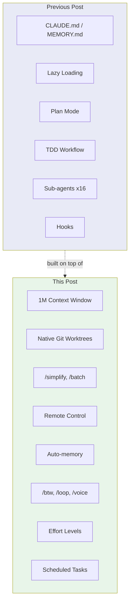
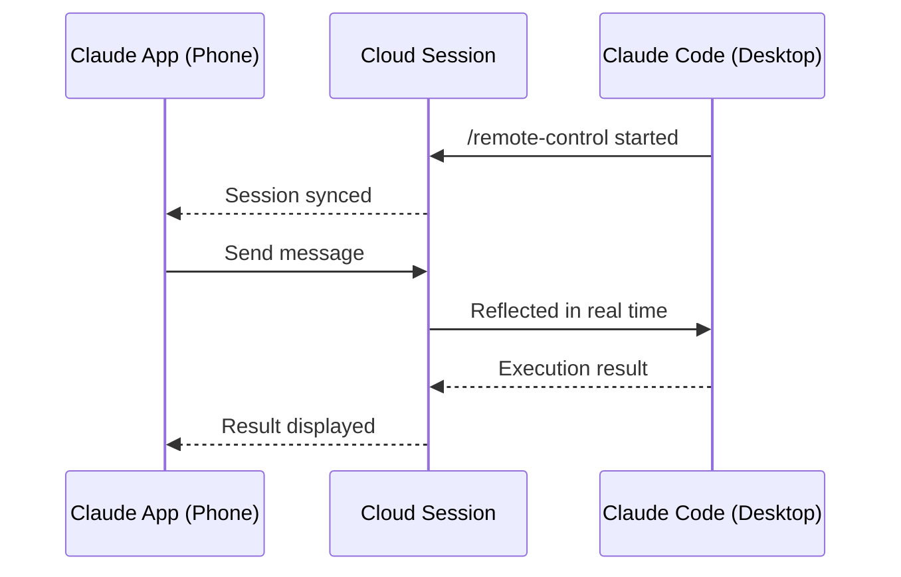

## Overview

[Previous post: Claude Code Practical Guide — Context Management and Workflows](/posts/2026-03-19-claude-code-practical-guide/) covered the core strategies: CLAUDE.md, Lazy Loading, TDD workflows, and sub-agents. Just five days later, here's a follow-up — because the volume of new features Claude Code has shipped in the past two months is overwhelming. Based on Cole Medin's video [You're Hardly Using What Claude Code Has to Offer, it's Insane](https://www.youtube.com/watch?v=uegyRTOrXSU), this post covers 9 key new features not addressed in the previous guide.

<!--more-->



## 1M Context Window — But 250K Is the Real Limit

Both Sonnet and Opus now have GA (Generally Available) 1M token context windows — room for roughly 750,000 words in short-term memory. In theory, you could load an entire codebase at once.

**In practice, the limit is much lower.** From Cole Medin's repeated testing: **hallucinations increase sharply beyond 250K–300K tokens**. Use `/context` regularly to check your token usage, and when approaching 250K, either compact memory or write a handoff prompt and start a fresh session.

> The previous post said "Context is milk — it goes bad over time." That principle holds even with a 1M window. **A fresh 200K beats a bloated 500K.**

## Native Git Worktree Support

The previous post covered manually running `git worktree` commands. Now **Claude Code manages worktrees natively**.

```bash
# Before: manually create worktree, then run claude in each one
git worktree add ../project-feature-a feature-a
cd ../project-feature-a && claude

# Now: create directly within Claude Code
# Auto-managed under .claude/worktrees/
```

The key change is that worktrees are automatically managed under `.claude/worktrees/`. You can create and switch between worktrees without any separate git commands, and work independently in each. Since real development always involves juggling multiple feature branches and PRs simultaneously, this significantly lowers the barrier to parallel work.

## /simplify — Fighting Over-Engineering

One of the most common problems with LLM-generated code is **over-engineering** — unnecessary abstractions, excessive error handling, pointless utility functions creeping in. `/simplify` is a built-in command Anthropic developed internally and recently made public.

Run `/simplify` right after completing an implementation, and Claude will review the code and remove unnecessary complexity. It replaces manually typing "this is getting too complicated, can you simplify it?" every single time.

## /batch — Parallel Processing for Large Refactors

`/batch` handles large-scale changes in parallel by splitting the work across multiple sub-agents internally.

```
/batch replace all console.log calls with structured logger from utils/logger
```

That single line gets Claude to:
1. Scan the codebase for all `console.log` calls
2. Distribute the work across sub-agents
3. Each agent runs transformations in parallel
4. Aggregate results and create a PR

This is ideal for large-scale migrations, linting rule changes, or API version upgrades — anything that's "simple but affects many files."

## Remote Control — Controlling Your Desktop from Your Phone

One of the most impressive new features. Run `/remote-control` in a Claude Code session and a cloud session is created. You can then **connect to that session from the Claude mobile app**.



Messages sent from your phone are reflected in real time in the desktop Claude Code session. You can check build status on the go, or issue simple correction instructions — development doesn't stop just because you're away from your desk.

## Auto-memory — Claude's Self-Accumulating Memory

The previous post covered separating `CLAUDE.md` (shared team rules) from `MEMORY.md` (personal learnings). Auto-memory goes a step further — **Claude accumulates knowledge across sessions on its own**.

| | CLAUDE.md | Auto-memory |
|------|-----------|-------------|
| Managed by | User (manual) | Claude (automatic) |
| Storage location | Project root | `~/.claude/memory/` |
| Content | Team rules, conventions | Error patterns, project insights |
| Determinism | High (we control it) | Low (Claude decides) |
| Disableable | N/A | Yes |

Enabled by default, can be turned off. Cole Medin's advice:
- Want **maximum control** → use CLAUDE.md only
- Want to **give Claude autonomy** → use CLAUDE.md + Auto-memory together

In practice, running both in parallel is recommended. Periodically review what Auto-memory has accumulated, and promote useful items to CLAUDE.md.

## /btw — Quick Questions Without Polluting Context

When you're mid-task and a quick question pops up — "what does this library function actually do?" — asking in the main session unnecessarily inflates the context. `/btw` opens a **sidecar conversation** so you can ask without touching the main context.

```
/btw What does CRUD stand for?
→ (read the answer)
→ Press Escape to close
→ Main session remains unchanged
```

**Note:** Claude cannot use tools in `/btw` mode. For questions that need codebase exploration, use a sub-agent. Reserve `/btw` for simple knowledge questions only.

## /loop — Scheduled Repeated Tasks

Runs a specific prompt on a recurring interval.

```bash
# Check deployment status every 5 minutes
/loop 5m check if the deployment finished and give me a status update

# Run tests every 30 minutes
/loop 30m run all tests and alert if any are failing
```

Useful for CI/CD pipeline monitoring, periodic test runs, and polling external sites. A particularly powerful pattern: working in another Claude Code instance while `/loop` runs quality gates in the background.

## /voice — Native Voice Input

`/voice` activates voice input. It's significantly faster than typing when doing a brain dump in Plan mode.

Cole Medin notes that external tools like Aqua Voice, WhisperFlow, and Whispering (open source) are still slightly more accurate than the native option — but the zero-friction, no-install experience makes `/voice` the easy default.

## Effort Levels — Controlling Token Usage

You can tune the model's reasoning depth. Adjust with `/effort` or the left/right arrow keys at session start.

| Level | Best for | Token usage |
|------|------------|------------|
| **Low** | Simple fixes, formatting | Minimal |
| **Medium** (default) | General coding, bug fixes | Moderate |
| **High** | Complex problem solving | High |
| **Max** (Opus only) | Extremely hard debugging | Maximum |

To avoid hitting the 5-hour or weekly token limit, aggressively use Low for simple tasks and reserve High/Max for genuinely difficult problems.

## Scheduled Tasks & Cron Jobs

Where `/loop` repeats within a session, Scheduled Tasks operate **outside** of any session.

- **One-time reminders**: "Remind me to push the release branch at 3pm"
- **Cron Jobs**: Schedule recurring tasks — generate a daily morning code quality report, check a specific API's status every hour, and so on.

## Insights

The previous post said "Claude Code isn't a tool — it's a system." These new features expand that system **across both time and space**.

**Spatial expansion:** Remote Control extends beyond the desktop, Git Worktrees beyond a single branch, `/batch` beyond a single file.

**Temporal expansion:** Auto-memory enables learning across sessions; `/loop` and Scheduled Tasks keep work going even when you step away.

**Reduced cognitive load:** `/simplify` fights over-engineering, `/btw` prevents context pollution, Effort Levels reduce token waste.

If the features from the previous post — CLAUDE.md, Plan mode, TDD, sub-agents — are **physical fitness**, the features in this post are **equipment upgrades**. Great gear without the fundamentals won't help, but with a solid foundation, these tools genuinely push productivity to the next level.

---

*Source: [You're Hardly Using What Claude Code Has to Offer, it's Insane](https://www.youtube.com/watch?v=uegyRTOrXSU) — Cole Medin*
