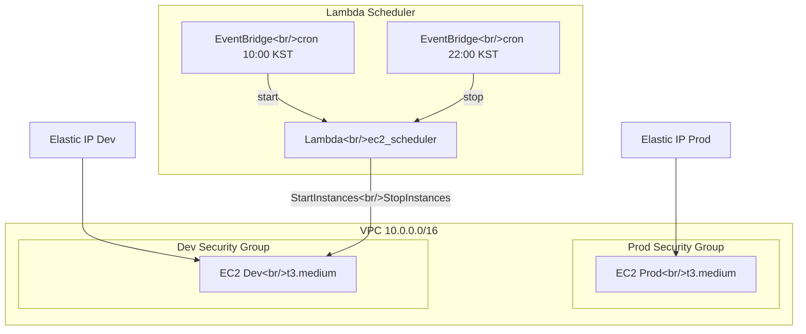
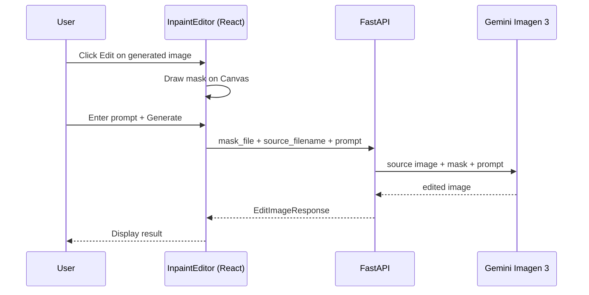

## Overview

[Previous post: #3 — Search Pipeline Improvements and Generated Image Comparison Mode](/posts/2026-03-20-hybrid-search-dev3/)

This #4 entry covers 23 commits across three major workstreams:

1. **main.py router extraction** — splitting a bloated single file into 5 route modules
2. **Terraform dev server** — a cost-efficient dev environment on AWS EC2 + Lambda Scheduler
3. **Inpaint editor** — from Figma design through Canvas-based mask editor, API, and DB migration

<!--more-->

## main.py Router Extraction

### Why Extract

During code review, it became clear that `main.py` was handling app initialization, global state, and route handlers all in one file. This caused frequent merge conflicts and made navigation painful. Generation, search, and image-related endpoints were all mixed together, so every new feature (like Inpaint) bloated the diff.

### How It Was Done

Using FastAPI's `APIRouter`, I extracted the file sequentially into 5 modules:

```
backend/src/routes/
├── meta.py        # health, API info, frontend serving
├── images.py      # GET /images, upload, selection logging
├── search.py      # POST /search, hybrid/simple
├── history.py     # GET /api/history/generations
├── generation.py  # POST /api/generate-image
├── edit.py        # POST /api/edit-image (added later)
└── auth.py        # Google OAuth (existing)
```

Each route module accesses global state (`images_data`, `hybrid_pipeline`, etc.) by importing `from backend.src import main as app_module` inside function bodies. This avoids circular imports while keeping things lean without a separate DI container.

After extraction, `main.py` shrunk to roughly 140 lines — just app creation, lifespan, CORS, and router registration.

### Refactoring Principles

- **Extract one module at a time**: meta → images → search → history → generation, with a working commit after each
- **No URL path changes**: `prefix` settings preserve the API contract
- **Consistent import pattern**: all route modules access global state the same way


## Terraform Dev Server

### Background

Local development was slow for ML model loading and image processing, and there were environment differences across team members. The goal was to spin up a dev server on AWS that automatically shuts down during off-hours to cut costs.

### Architecture Decision

We debated creating a new VPC versus sharing the existing prod VPC. The decision was **Option B: share the VPC, separate Security Groups**. For a small project, managing two VPCs is overhead, and Security Group isolation is sufficient.



### Key Resources

| Resource | Purpose |
|---|---|
| `aws_security_group.dev_sg` | SSH(22), HTTP(80), Backend(8000), Vite(5173) |
| `aws_instance.dev_server` | Ubuntu 24.04 LTS, t3.medium, gp3 40GB |
| `aws_eip.dev_eip` | Static IP (persists across restarts) |
| `aws_key_pair.dev_key` | Dev-only SSH key pair |
| `aws_lambda_function` | EC2 start/stop execution |
| `aws_scheduler_schedule` (start) | Daily start at 10:00 KST |
| `aws_scheduler_schedule` (stop) | Daily stop at 22:00 KST |

### Lambda Scheduler Design

EventBridge Scheduler passes `action` and `instance_id` as a JSON payload when invoking Lambda. The Lambda simply calls `start_instances` or `stop_instances` via `boto3`.

IAM follows least-privilege: the Lambda Role allows only `ec2:StartInstances`, `ec2:StopInstances`, and `ec2:DescribeInstances` on that specific instance, and the EventBridge Scheduler Role can only invoke that specific Lambda function.

Running 12 hours a day (10:00–22:00) achieves roughly **50% cost savings** compared to 24/7.


## Inpaint Editor Implementation

### Design Process

After reviewing the InpaintFullPage design in Figma, I wrote a design spec and implementation plan first. The overall flow:



### Backend Changes

**DB Migration**: Added an `is_inpaint` Boolean column to `generation_logs` to distinguish inpaint generations from regular ones.

**Schemas**: Defined `EditImageRequest` and `EditImageResponse`. Request takes `source_filename`, `prompt`, `swap_filename`, `parent_generation_id`, and `image_count` — with mask sent as a separate multipart `File`.

Since JSON data and a file need to be sent together, the JSON payload is received as a `Form` string field and parsed. This is a workaround for FastAPI's limitation that `File` and `Body` (JSON) cannot be used simultaneously.

**Service**: Added a `generate_edit_image` helper that mirrors the structure of the existing `generate_single_image` but includes source image + mask image + (optional) swap image in the Gemini API contents.

### Frontend: InpaintEditor Component

Implemented a Canvas-based mask editing component. Key features:

- Draw brush masks as a Canvas overlay on top of the source image
- Adjustable brush size
- Undo/Clear support
- Export mask area as white PNG and send to the API

Added `editingImage` state to `App.tsx`, wired to display InpaintEditor when the Edit button is clicked on a generated image.


## Commit Log

| # | Commit message | Summary |
|---|---|---|
| 1 | refactor: extract routes/meta.py with APIRouter | meta route extracted |
| 2 | refactor: extract routes/images.py with APIRouter | images route extracted |
| 3 | refactor: extract routes/search.py with APIRouter | search route extracted |
| 4 | refactor: extract routes/history.py with APIRouter | history route extracted |
| 5 | refactor: extract routes/generation.py with APIRouter | generation route extracted |
| 6 | docs: add dev server Terraform design spec | Terraform design doc |
| 7 | docs: add dev server Terraform implementation plan | Terraform implementation plan |
| 8 | chore: add SSH key pair public keys | Public key files |
| 9 | feat: manage SSH key pairs via Terraform aws_key_pair | SSH key pair in Terraform |
| 10 | feat: add dev security group | Dev-only Security Group |
| 11 | feat: add dev EC2 instance and Elastic IP | dev EC2 t3.medium + EIP |
| 12 | feat: add dev Lambda scheduler with IAM role and policy | Lambda + IAM |
| 13 | feat: add dev EventBridge scheduler (10:00-22:00 KST) | EventBridge cron |
| 14 | docs: add inpaint & swap feature design spec | Feature design doc |
| 15 | docs: add inpaint & swap implementation plan | Implementation plan |
| 16 | feat: add is_inpaint column to generation_logs | Alembic migration |
| 17 | feat: add EditImageRequest/Response schemas | Pydantic schemas |
| 18 | feat: add generate_edit_image service helper | Gemini API helper |
| 19 | feat: add POST /api/edit-image endpoint | edit.py route module |
| 20 | feat: add editImage API function and is_inpaint types | frontend api.ts |
| 21 | feat: add InpaintEditor component | Canvas mask editor |
| 22 | feat: integrate InpaintEditor with edit button and app state | App.tsx integration |
| 23 | fix: correct image_count field name and add Form annotation | Field name fix |


## Insights

**Refactor before adding features.** Extracting the main.py routers first meant that adding `edit.py` for the Inpaint editor required no changes to existing code — just registering a new module. Without the refactor, main.py would have grown by another 150 lines.

**Terraform can manage prod and dev in a single file.** Without separate workspaces or directories, I declared both prod and dev resources in one `main.tf`. At this project scale, having everything in one file makes the whole infrastructure readable at a glance.

**File + JSON in the same request is tricky in FastAPI.** Since `File` and `Body` can't be used simultaneously, the workaround is to receive the JSON payload as a `Form` string and parse it. This is a fundamental multipart form data constraint.

**Lambda Scheduler is ideal for small dev servers.** Rather than heavy solutions like AWS Instance Scheduler, a Lambda + EventBridge combo costs nearly nothing and is easy to manage with Terraform.
