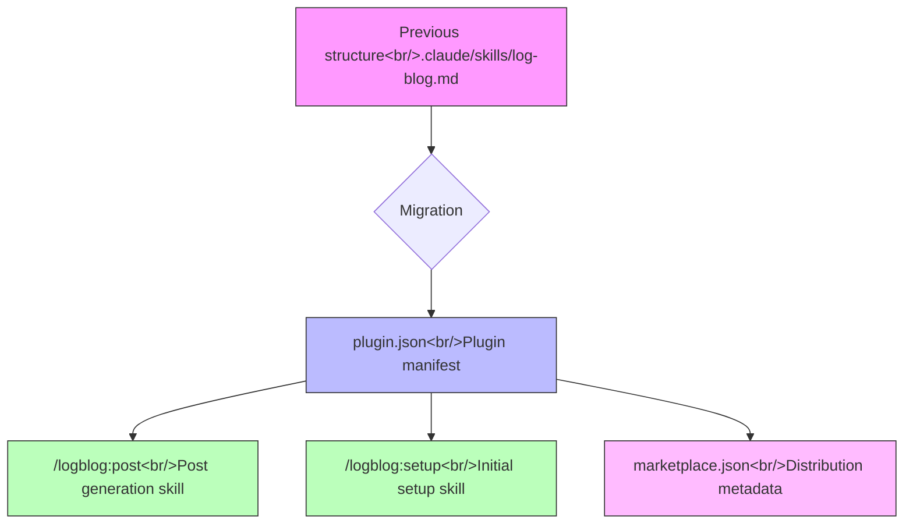

## Overview

[Previous post: #2 — Unified Skill Flow and --since-last-run Tracking](/posts/2026-03-20-log-blog-dev2/)

This entry covers two major threads. First, feature improvements including YouTube oEmbed metadata and series continuity detection. Second, migrating the standalone skill living in `.claude/skills/` to Claude Code's plugin structure. This spans 9 commits across 7 sessions.

<!--more-->

## YouTube oEmbed Metadata Improvements

Previously, when a YouTube link was included in a blog post, only the title was fetched. Two things improved here.

**oEmbed API integration.** Calls to YouTube's oEmbed endpoint now automatically collect metadata including thumbnail, author, and video title. This data is made available for use in Hugo shortcodes.

**transcript-api v1.x migration.** The `youtube-transcript-api` library shipped a major v1.x update with a breaking API change. Migrated from the old `YouTubeTranscriptApi.get_transcript()` call pattern to the new interface. This is a straightforward dependency update, but since transcript-based summarization is central to blog post generation, quick action was necessary.

## Series Continuity Detection

One of Log-Blog's core features is managing series posts — when writing `#1`, `#2`, `#3` about the same project, only commits since the previous post should be included.

The previous approach filtered commits by date. The problem: dates are imprecise. The publication date of a post can differ from the last working day, and timezone issues add further ambiguity.

The solution was simple: add a `last_commit` field to Hugo frontmatter, and have the `sessions` command read that SHA to collect only changes after that commit. The ambiguity of date parsing disappears, and each new post picks up exactly where the previous one left off.

## Plugin Migration

The biggest undertaking in this development cycle — roughly 7 hours in the seventh session.

### Why a Plugin

Placing skill files directly in `.claude/skills/` works, but has deployment and update limitations. Users have to manually copy files, and there's no version management. Claude Code's plugin system enables automated installation and updates.

### Structural Design

### plugin.json Manifest

This is the plugin entry point. The `author` field was initially a string, which failed schema validation — it needs to be an object (`{ "name": "...", "url": "..." }`). A minor detail, but it's the kind of thing that eats an entire commit.

### Skill Migration

Renamed the existing `/log-blog` skill to `/logblog:post`. The colon (`:`) separator is Claude Code's plugin namespace convention — the plugin name becomes the prefix, and the skill name follows the colon. The skill's internal logic was preserved; only path references and invocation style were updated to match the plugin structure.

### /logblog:setup Skill

A new addition. It automates end-to-end configuration for new users setting up a blog:

- Verify Hugo project structure
- Generate config files
- Create required directory structure
- Verify Git integration

In the fifth session, calling `/logblog:post` failed because the plugin wasn't installed yet — an expected outcome, but it confirmed the need for a setup skill.

## Marketplace Distribution

`marketplace.json` is the metadata file for registering with the Claude Code plugin registry. It includes the plugin name, description, version, repository URL, and list of supported skills. Since the official marketplace isn't active yet, direct installation via the GitHub repository URL is used for now. When the marketplace opens, this file is ready to go.

## Commit Log

| # | Commit message | Notes |
|:---:|--------|------|
| 1 | feat: add YouTube oEmbed metadata and migrate to transcript-api v1.x | Feature improvement |
| 2 | feat: detect series updates via last_commit SHA in sessions command | Series continuity |
| 3 | docs: add logblog plugin design spec | Design doc |
| 4 | docs: add logblog plugin implementation plan | Implementation plan |
| 5 | feat: add logblog Claude Code plugin manifest | plugin.json |
| 6 | feat: migrate /log-blog skill to /logblog:post in plugin structure | Skill migration |
| 7 | feat: add /logblog:setup skill for end-to-end blog setup | Setup skill |
| 8 | fix: plugin.json author field must be object, not string | Schema fix |
| 9 | feat: add marketplace.json for plugin distribution | Marketplace |

## Insights

**Write docs first, code second.** In the seventh session, design docs and an implementation plan were written before touching code. It was a long session at 412 minutes, but direction never wavered. This ordering is especially important when venturing into unfamiliar territory like plugin structure.

**Validate the schema, don't guess.** The wrong `author` field type in `plugin.json` is the textbook example. When working with new formats, check the examples or schema definition first.

**Failed calls create features.** The failed invocation in session five became the motivation for building `/logblog:setup`. Experiencing firsthand what a first-time user would encounter is the most accurate form of requirements gathering.

**Follow ecosystem naming conventions.** The change from `/log-blog` to `/logblog:post` isn't just a rename. It's adopting the namespace convention of the plugin ecosystem. Following community conventions over idiosyncratic naming pays off long-term.
