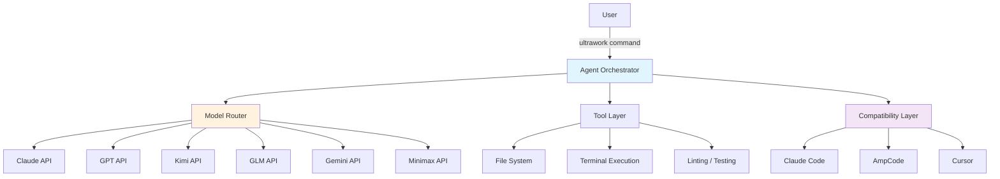
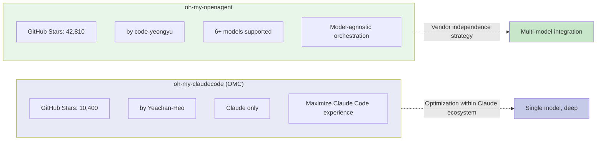

## Overview

[oh-my-openagent](https://github.com/code-yeongyu/oh-my-openagent) (formerly oh-my-opencode) is a **model-agnostic agent orchestrator** — not tied to any single LLM. With 42,810 GitHub stars, it has grown into a TypeScript-based project spanning 6M+ lines of code.

If [oh-my-claudecode (OMC)](/posts/2026-03-20-oh-my-claudecode/) — covered in a previous post — is a Claude Code-specific extension, oh-my-openagent takes a fundamentally different approach. The goal is to unify Claude, GPT, Kimi, GLM, Gemini, Minimax, and **any other model** behind a single interface.

<!--more-->

## Core Philosophy — Rejecting Vendor Lock-in

oh-my-openagent's philosophy can be summed up in one line:

> "Anthropic wants you locked in. Claude Code's a nice prison, but it's still a prison."

Claude Code is a great tool. But it also traps users inside the Anthropic ecosystem. In fact, Anthropic has previously blocked API access for this project (then called OpenCode) — which paradoxically validated oh-my-openagent's reason for existing. Depend on a single vendor, and the door can close at any time.

The project adopts the **SUL-1.0 license**, and Sisyphus Labs is building a commercial version.

### Subscription Cost Comparison

The practical benefits of model-agnosticism show up in cost optimization:

| Service | Monthly cost | Notes |
|--------|---------|------|
| ChatGPT | $20 | GPT-4o based |
| Kimi Code | $0.99 | Best value |
| GLM | $10 | Mid-range |
| Claude Pro | $20 | Includes Claude Code |

Being able to move between all of these models with a single tool is the point.

## Architecture

oh-my-openagent's killer feature is the `ultrawork` command. A single command triggers the agent to automatically run code analysis, modification, testing, and linting across the full workflow.

### Key Components

1. **Agent Orchestrator** — analyzes the task and determines the best combination of model and tools
2. **Model Router** — routes to Claude, GPT, Kimi, etc. based on the nature of the task
3. **Tool Layer** — handles actual work: file system access, terminal execution, linting/testing
4. **Compatibility Layer** — integrates with existing tools like Claude Code, AmpCode, and Cursor

A recent commit improved stale timeout handling for background agents, increasing stability for long-running agent tasks.

## Comparison with OMC

oh-my-claudecode (OMC) and oh-my-openagent share a similar name but have entirely different philosophies and scope.

| | oh-my-claudecode (OMC) | oh-my-openagent |
|------|----------------------|-----------------|
| **GitHub Stars** | 10,400 | 42,810 |
| **Models supported** | Claude only | Claude, GPT, Kimi, GLM, Gemini, Minimax |
| **Philosophy** | Make Claude Code better | Don't be locked into any model |
| **Killer feature** | Claude-optimized prompts/workflows | `ultrawork` unified command |
| **Language** | TypeScript | TypeScript |
| **Approach** | Single model, depth | Multi-model, breadth |
| **License** | MIT | SUL-1.0 |
| **Commercialization** | Community-driven | Sisyphus Labs in progress |

**OMC assumes Claude is the best model** and maximizes the Claude Code experience. **oh-my-openagent assumes no single model is best for every task** and returns model choice to the user. These aren't competing projects — they're answers to different questions.

## Community Response

42,810 stars speak for themselves. Some highlights from real user reviews:

- **"Cancelled my Cursor subscription"** — oh-my-openagent alone is enough, no separate IDE subscription needed
- **"Cleared 8,000 ESLint warnings in a single day"** — showcasing `ultrawork`'s automation capabilities
- **"Converted a 45,000-line Tauri app to SaaS overnight"** — productivity at scale with large refactors

The common thread across these reviews is **the breadth of automation**. Not just code completion — performing project-wide work with a single command is what sets it apart from conventional tools.

## Insights — A Fork in the AI Coding Ecosystem

oh-my-openagent's rise is sending an important signal to the AI coding tool ecosystem.

### 1. Fatigue with vendor lock-in

Anthropic's blocking of OpenCode sent a wake-up call to the developer community. No matter how good the tool, platform holders can cut off access with a word. oh-my-openagent's 42K+ stars are the market's answer to that anxiety.

### 2. There is no "best model"

GPT excels at certain tasks. Claude at others. Kimi is cost-effective for specific work. Model-agnosticism accepts this reality and gives users the ability to pick the right tool for each job.

### 3. CLI agents are converging

Claude Code, Cursor, AmpCode — diverse tools are converging on the same form: terminal-based agent + tool use. oh-my-openagent anticipated this convergence and built a meta-layer that unifies all of these tools behind a single interface.

### 4. OMC and oh-my-openagent can coexist

Single-model depth (OMC) and multi-model integration (oh-my-openagent) are not mutually exclusive. A developer who primarily uses Claude can optimize the Claude experience with OMC while using oh-my-openagent to leverage other models for supplementary tasks. As the ecosystem matures, this layered approach is likely to become the standard.

---

The competition among AI coding tools is shifting from "which model is best" to "how do you combine models effectively." oh-my-openagent is standing at that inflection point.
