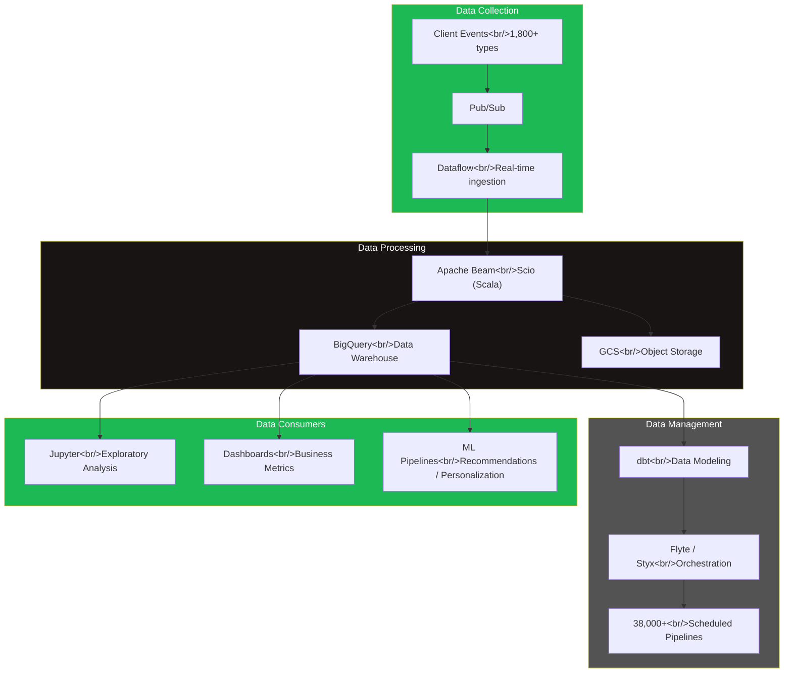
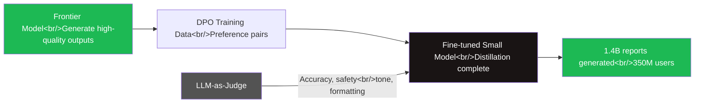
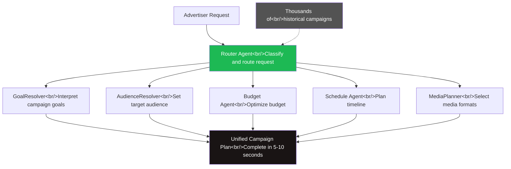

## Overview

In September 2024, a Spotify data engineer shared their career transition story and real-world experience at an Inflearn online meetup. They had spent 4.5 years doing Spring backend development at Naver before pivoting to Spotify as a data engineer on the strength of their Scala + Spark background. A year later, the Spotify engineering blog tells the story of a platform processing 1.4 trillion data points per day, AI model distillation pipelines, and multi-agent advertising systems — the scope of data engineering has expanded dramatically. Reading the practitioner's on-the-ground voice from the meetup alongside the technical details in the official blog paints a sharper picture of where the data engineer role is heading.

<!--more-->

## Meetup Highlights

### The Reality of Domain Switching

The presenter was candid about how their mental model shifted when moving from backend to data engineering. Data engineering conjures images of Spark pipelines, but in practice a significant portion of the work centers on **SQL-based product development**, **data modeling**, and **dashboard design**.

> "The connector between data producers and data consumers"

That was the presenter's definition of what a data engineer fundamentally is.

### Engineering vs Science

A key distinction from the meetup:

| | Data Engineering | Data Science |
|------|-----------------|--------------|
| **Core activity** | Automation, optimization | Hypothesis validation |
| **Primary output** | Pipelines, data models | Analysis reports, metric design |
| **Tools** | SQL, Scala, dbt | Python, Jupyter, statistical models |

### Org Structure

- **Platform Org**: backend infrastructure, large-scale ingestion, Schema Evolution, Data Warehouse
- **Business Org**: domain-specific data collection, data modeling, quality monitoring
- **Data Scientists**: analysis, metric design, dashboards

### What the Practitioner Emphasized

1. **SQL fluency is core** — the ability to write precise SQL matters more in practice than mastery of complex frameworks
2. **Nitpicking matters** — data quality comes from doggedly chasing down small inconsistencies
3. **Everyone accesses data** — through BigQuery and Jupyter, non-engineers also explore data directly
4. **AI can't replace human understanding and validation** — no matter how much automation advances, the work of understanding and validating data remains with people

## Spotify's Data Platform in 2026

The platform scale revealed in Spotify's April 2024 engineering blog puts concrete numbers on what the meetup described.

### Scale

- **1.4 trillion data points processed per day**
- **1,800+ event types** ingested
- **38,000+ active scheduled pipelines** running
- **100+ engineers** dedicated to the data platform
- The ~120 billion daily user interaction logs mentioned at the meetup are a subset of this 1.4 trillion

### Platform Architecture

The Platform Org / Business Org split the presenter described maps onto three formal domains in the blog: **Data Collection / Data Processing / Data Management**.

- **Data Collection**: client event ingestion, Schema Evolution, real-time streaming
- **Data Processing**: batch and streaming pipelines, large-scale transformation
- **Data Management**: metadata management, data catalog, quality monitoring

## Wrapped 2025's Data Pipeline

The Wrapped 2025 technical post published in March 2026 shows exactly where data engineering and AI intersect.

### Scale and Constraints

- **1.4 billion personalized reports** generated for **350 million users**
- LLMs generate natural language summaries based on each user's listening data

### AI Model Distillation Pipeline

The Wrapped team took an interesting approach: **Model Distillation** — using a frontier model's outputs as training data to fine-tune a smaller, faster model.

Key design decisions:

1. **DPO (Direct Preference Optimization)**: pairs good and bad frontier model outputs to train preference-based learning
2. **LLM-as-Judge evaluation**: quality validated across four dimensions — accuracy, safety, tone, and formatting
3. **Column-oriented storage design**: storage architecture to prevent race conditions under simultaneous access from 350 million users

> "At this scale, the LLM call is the easy part."

That one sentence cuts to the heart of data engineering. Calling the LLM API is trivial. Building the pipeline to generate 1.4 billion outputs reliably, accurately, and safely — and deliver them — that's the real engineering.

## Multi-Agent Advertising Architecture

A multi-agent advertising system published in February 2026 shows the frontier of data engineering expanding into AI agent infrastructure.

### The Problem

Planning an ad campaign requires complex decisions: target audience selection, budget allocation, scheduling, media format choices. Previously this was **15–30 minutes of manual work**.

### The Solution: 6 Specialized Agents

### Tech Stack

| Component | Technology |
|-----------|------|
| Agent Framework | Google ADK 0.2.0 |
| LLM | Vertex AI (Gemini 2.5 Pro) |
| Communication | gRPC |
| Training data | Thousands of historical campaigns |

**15–30 minutes → 5–10 seconds.** From a data engineering perspective, the more interesting story isn't the agents themselves but the data pipeline behind them: cleaning thousands of historical campaign records, structuring them in a form agents can reference, and serving them in real time — that's the data engineer's domain.

## Data Engineer Skill Tree 2026

Cross-referencing the tech stack from the meetup with 2026 job postings gives a clear picture of what Spotify data engineers are expected to know today.

### 2024 Meetup vs. 2026 Hiring

| Area | 2024 Meetup | 2026 Job Requirements |
|------|---------------|---------------|
| **Languages** | SQL, Scala, Python | SQL, Python, Scala (note the order shift) |
| **Processing engines** | Spark | Spark, Apache Beam, Scio, Flink |
| **Cloud** | GCP, BigQuery, GCS | GCP, BigQuery, Dataflow, GCS |
| **Orchestration** | Not mentioned | Flyte, Styx |
| **AI/ML** | Indirect mention | LLM pipelines, Model Distillation |
| **Agents** | None | Multi-Agent infrastructure |

In just one year, **Apache Beam / Scio / Flink** rose alongside Spark as requirements, and **LLM pipelines and agent infrastructure** entered the data engineer's domain.

## Insights: A Year of Change

### The Meetup's Prediction Held Up

The presenter's emphasis that "AI can't replace human understanding and validation" was confirmed precisely by the Wrapped 2025 case. LLM-as-Judge was introduced, but designing the evaluation criteria (accuracy, safety, tone, formatting) and integrating it into the pipeline was ultimately the engineers' work.

### The Expanding Scope of the Data Engineer

At the 2024 meetup, the data engineer was "the connector between data producers and data consumers." By 2026, **AI agents** have been added to the list of consumers. Serving data to agents, validating agent outputs, and building the data pipelines for agent systems — these have become new job responsibilities.

### What Hasn't Changed

Scale grew by 10x from 120 billion to 1.4 trillion, and AI agents and LLM pipelines appeared — but the three things the presenter emphasized remain as valid as ever:

1. **SQL fluency** — BigQuery is still central, dbt is the standard for data modeling
2. **Nitpicking** — not a single error can be tolerated across 1.4 billion Wrapped reports
3. **Identity as a connector** — between producers and consumers, now extended to between producers and agents

Overlaying the practitioner's voice from the meetup with the official technical blog a year later, data engineering is clearly evolving from simply building pipelines to **designing data infrastructure for the AI era**. And at the center of that, still, is a person who understands data precisely and validates it relentlessly.
