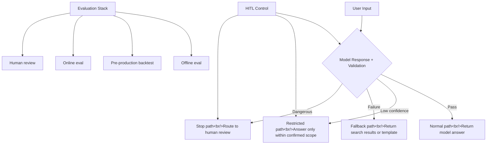

## Overview

I analyzed TILNOTE's article "What Really Matters in AI Apps." The core message is clear: **the real problem isn't when the model gets it right — it's how the system behaves when the model is subtly wrong.** This post covers three patterns — Deterministic Fallback, HITL, and Evaluation Stack — from a production design perspective. Related post: [Vibe Coding Security Checklist](/posts/2026-03-25-ai-code-security/)

<!--more-->

---

## Why These Three Patterns

The article opens with a concrete scenario. A customer support AI is explaining a refund policy:

> User: "Can I get a refund on last month's charge? Please process it as a card cancellation."
> Model: "Yes, charges within the last 30 days are eligible for automatic refunds. I'll process it now."

The problem: the actual policy has a clause that "digital products with usage history are not eligible for refunds," and automatic refunds require agent approval. The real failure isn't "the model gave a wrong answer" — it's that **"the system wasn't designed to stop when it was wrong."**

NIST AI 600-1 notes that generative AI requires separate risk management, measurement, and operational controls. Both Anthropic and OpenAI advise defining success criteria and designing evaluation first.

---

## 1. Deterministic Fallback — When in Doubt, Take the Safe Path

Many developers expect lowering temperature and refining prompts to produce stable outputs. That's partially true, but it reduces output variance — it doesn't make the system deterministic.

What you actually need in production is **a structure that degrades to a predefined path when the model fails**:

| Stage | Path | Behavior |
|------|------|------|
| 1 | Normal | Model answer + validation passed |
| 2 | Restricted | Answer only within confirmed-evidence scope |
| 3 | Fallback | Return only search results, policy documents, or templates |
| 4 | Stop | Route to human review |

The key is **replacing "leaving failure to the model's judgment" with state transitions defined in code**.

A safe flow for a customer support bot:
1. Search FAQ/policy documents first
2. Only answer when there's sufficient supporting evidence
3. Route to a human agent when evidence is weak
4. Never auto-execute actions like refunds

The same applies to code generation tools. The unsafe structure is "apply code directly"; the realistic structure is "propose patch → test → review → human merges." Anthropic's Tool Use documentation explains this well — the model doesn't execute tools directly; it **proposes** calls, and the app is responsible for execution.

---

## 2. HITL — Humans as Control Mechanisms, Not Approval Buttons

Understanding HITL (Human-in-the-Loop) as "a human takes one last look at the end" is incomplete. The important HITL in practice is one where **humans can stop the system flow, make corrections, and resume** — a control mechanism rather than a checkpoint.

The distinction the article emphasizes:

| Passive HITL | Active HITL |
|------------|-----------|
| Only handles final approval | Intervenes mid-flow |
| Confirms results | Corrects causes |
| Batch review | Real-time control |

Active HITL is especially critical in agentic workflows. When an agent is executing a 10-step task and takes a wrong turn at step 3, the right design doesn't wait until step 10 for approval — it stops at step 3 and corrects direction.

---

## 3. Evaluation Stack — Evaluation as Regression Prevention

OpenAI's eval guide explains: "Generative AI has inherent variability, so traditional software testing alone isn't sufficient."

A four-stage evaluation framework:

1. **Offline eval**: measure model performance on a fixed dataset. Fastest and cheapest.
2. **Pre-production backtest**: simulate a new version against real traffic logs
3. **Online eval**: A/B testing, canary deployments — gradual exposure to real users
4. **Human review**: humans inspect outputs directly. Most expensive but most trustworthy.

The critical framing: evaluation is a **regression prevention mechanism, not a leaderboard** (benchmark competition). The goal is to confirm that new prompts or model changes don't break things that were working before.

---

## A Practical Adoption Order

The article's recommended sequence:

1. **Structure outputs** — structured formats like JSON rather than free text
2. **Demote dangerous actions** — direct execution → proposal
3. **Define fallback conditions in code** — confidence-based branching
4. **Collect failure cases into an eval set** — start small
5. **Preserve human review logs** — as future eval data

---

## Common Mistakes

- "Just write better prompts" → prompts reduce output variance; they're separate from system safety
- "Just add guardrails" → input filtering is only part of it; output path design is the core
- "A human can check at the end" → passive HITL breaks at scale
- "Good benchmarks mean good production" → eval prevents regressions; it doesn't guarantee performance

---

## Insights

What makes this article valuable is its focus not on "making the model smarter" but on "designing the product so it doesn't shake when the model does." It draws on official guidance from NIST, Anthropic, and OpenAI while laying out a concrete, practical adoption order. For the trading-agent and hybrid-search projects I'm currently working on — especially for "hard-to-reverse actions" like automatic trading or image generation — the Deterministic Fallback pattern applies directly.
