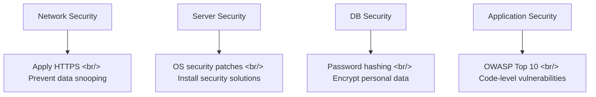
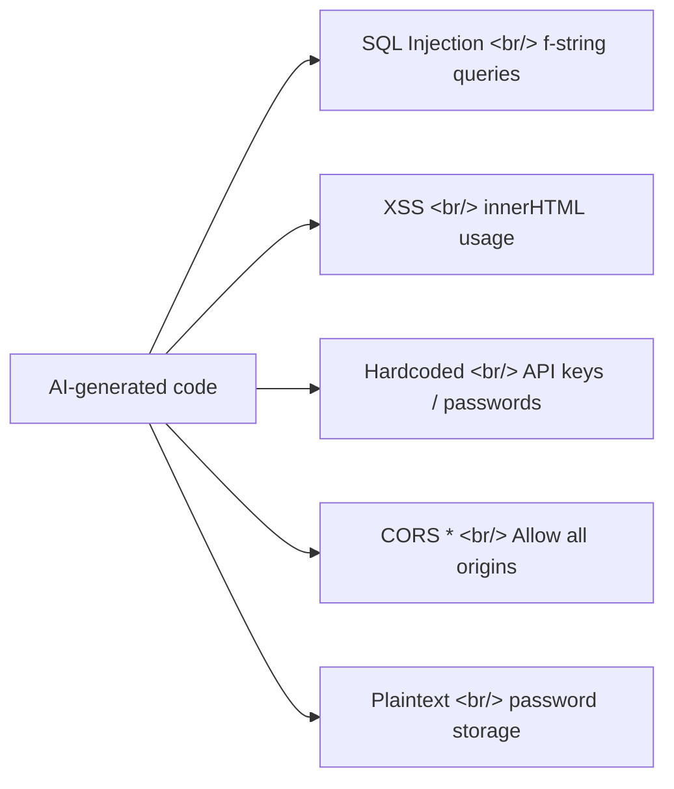

## Overview

Building websites with vibe coding has never been easier — but security is still on you. Based on Techroute Alex's video [AI-Generated Code Shipped Directly Will Get You Hacked](https://www.youtube.com/watch?v=kNqOW6G5sh8), this post covers a systematic approach to checking AI-generated code for security vulnerabilities and the automated scanning tools that help.

<!--more-->

---

## The 4 Layers of Web Security

Web application security broadly spans four zones:

If you're just deploying a simple static page (HTML/CSS/JS), network/server/DB security is relatively straightforward. But **application security** — vulnerabilities hiding inside your code — requires deliberate attention regardless.

---

## OWASP Top 10 — The Web Security Threats You Must Know

[OWASP (Open Worldwide Application Security Project)](https://owasp.org/www-project-top-ten/) publishes the major web application security threats annually.

### 1. Broken Access Control
Users without proper authorization can access other users' data or functionality. Occurs when authorization checks are missing from API calls.

### 2. Cryptographic Failures
Storing passwords in plain text, or using weak hashing algorithms.

### 3. Injection
Injecting malicious code into SQL queries, OS commands, or LDAP queries to force execution. One of the most frequently found vulnerabilities in AI-generated code.

### 4. Insecure Design
Focusing exclusively on feature implementation while ignoring security architecture.

### 5. Security Misconfiguration
Unchanged default passwords, unnecessary features left enabled, error messages leaking sensitive information.

### 6. Vulnerable and Outdated Components
Using libraries or packages with known vulnerabilities.

### 7. Identification and Authentication Failures
Poor session management, weak password policies, no protection against brute-force attacks.

### 8. Software and Data Integrity Failures
Not verifying the integrity of code or dependencies in CI/CD pipelines.

### 9. Security Logging and Monitoring Failures
Systems unable to detect attack attempts.

### 10. Server-Side Request Forgery (SSRF)
Manipulating a server into making requests to attacker-controlled URLs.

---

## Security Mistakes AI Commonly Makes

Patterns to watch out for especially in vibe coding:

- **SQL Injection**: `f"SELECT * FROM users WHERE id = {user_id}"` — no parameter binding
- **XSS**: `element.innerHTML = userInput` — user input directly injected as HTML
- **Hardcoded secrets**: `API_KEY = "sk-abc123..."` — environment variables not used
- **Wildcard CORS**: `Access-Control-Allow-Origin: *` — all origins allowed
- **Plaintext storage**: passwords stored directly in the DB without hashing

---

## Automated Security Scanning Tools

As shown in the video, tools that automatically scan for security issues given a URL are available and practical.

### Static Analysis (SAST)
Analyze code directly for vulnerabilities:
- **Semgrep**: pattern-matching based security scanner
- **Bandit**: Python-specific security analyzer
- **ESLint Security Plugin**: JavaScript security rules

### Dynamic Analysis (DAST)
Scan a running application:
- **OWASP ZAP**: free web application security scanner
- **Nikto**: web server vulnerability scanner

### Dependency Vulnerability Scanning
Check known vulnerabilities in libraries you're using:
- `npm audit` / `pip audit` / `safety check`
- **Snyk**: SCA (Software Composition Analysis) tool

---

## Integrating Security Checks into Claude Code

Ways to strengthen security when writing code with Claude Code:

1. **Specify security rules in CLAUDE.md**: "Always use parameter binding for SQL queries," "Always sanitize user input"
2. **Add security perspective to code reviews**: request OWASP Top 10 analysis when running `/review`
3. **Automate pre-deploy scanning**: integrate Semgrep or Bandit into the CI/CD pipeline
4. **Separate environment variables**: add `.env` to `.gitignore`, access secrets only through environment variables

---

## Insights

It's easy to get swept up in vibe coding's convenience and overlook security. AI-generated code can be functionally correct while still containing OWASP Top 10 vulnerabilities. SQL injection, XSS, and hardcoded secrets are the mistakes AI makes most often. Running a single automated scan with Semgrep or OWASP ZAP before deployment catches most basic vulnerabilities. Security isn't a step you add after writing code — it's a baseline concern that should be factored in from the moment you write the prompt.
