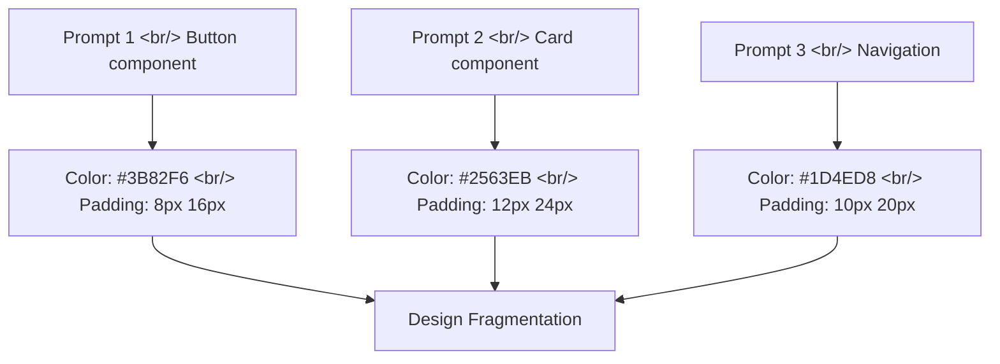
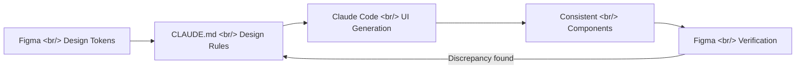

## Overview

One of the biggest challenges in vibe coding is design consistency. AI-generated UI works functionally, but colors, spacing, and typography tend to drift from screen to screen. This post analyzes the [Claude Code & Figma for Consistent Design](https://www.figma.com/community/file/1618087083451142362) Figma community file and [Figmapedia](https://figmapedia.com/) resources introduced in Pitube's weekly live stream, and outlines a practical workflow.

<!--more-->

---

## The Problem: Design Fragmentation in Vibe Coding

When generating UI with Claude Code, each prompt independently determines its own styles. Component A uses `#3B82F6` blue; Component B uses `#2563EB` blue — subtly different colors accumulate and the result feels unpolished overall.



---

## The Solution: Figma Design Tokens → Claude Code Context

### Step 1: Define Your Design System in Figma

The approach proposed in the Figma community file is to systematically define design tokens:

- **Color Tokens**: Primary, Secondary, Neutral, Semantic (Success/Warning/Error)
- **Spacing Scale**: 4px units (4, 8, 12, 16, 24, 32, 48, 64)
- **Typography Scale**: Heading 1–6, Body, Caption, Label
- **Border Radius**: 4px, 8px, 12px, 16px, Full
- **Shadow Scale**: sm, md, lg, xl

### Step 2: Declare Design Rules in CLAUDE.md

```markdown
# Design System

## Colors
- Primary: #3B82F6 (Blue 500)
- Primary Hover: #2563EB (Blue 600)
- Background: #FFFFFF
- Surface: #F8FAFC (Slate 50)
- Text Primary: #0F172A (Slate 900)

## Spacing
- Base unit: 4px
- Component padding: 8px 16px (sm), 12px 24px (md), 16px 32px (lg)

## Typography
- Font: Inter
- Heading: 600 weight, 1.25 line-height
- Body: 400 weight, 1.5 line-height
```

With these rules in CLAUDE.md, Claude Code references the same design tokens for every UI it generates.

### Step 3: Component-Level Prompting



---

## Figmapedia — Getting Design Terminology Right

[Figmapedia](https://figmapedia.com/) is a design terminology dictionary and resource platform. It organizes practical design information that "doesn't surface well even in AI searches" — and it helps when writing design-related prompts for Claude Code, ensuring you're using precise terminology.

Key categories:
- **Figma Terms & Info**: explanations of Figma-specific features and terminology
- **Prompt-pedia**: a collection of design prompts useful for AI coding
- **Button inner/outer spacing**: padding vs. margin rules that get confused often in practice

When prompting Claude Code to "reduce the button's inner spacing," you need a clear understanding of the difference between padding and margin to get the result you want. Figmapedia bridges that gap.

---

## Practical Tips: Claude Code + Figma Workflow

### Screenshot-Based Prompting

Once you finish a design in Figma, pass a screenshot to Claude Code for visually-grounded code generation:

```
Implement this Figma design as a React component.
Follow the Design System section in CLAUDE.md for design tokens.
```

### Tailwind CSS Token Mapping

Converting Figma design tokens into `tailwind.config.js` means Claude Code's generated code automatically applies consistent styles.

### Validation Loop

1. Generate component with Claude Code
2. Check rendering in the browser
3. Visual comparison against the Figma original
4. If there's a discrepancy, provide feedback → regenerate

---

## Insights

The "design quality problem" in vibe coding is not a technical limitation — it's a context deficit. Give Claude Code clear design tokens and rules, and it will produce consistent UI. Build the pipeline of Figma design system → CLAUDE.md rules → Claude Code generation, and you can maintain production-level UI consistency without a dedicated designer. Resources like Figmapedia help developers acquire precise design vocabulary, which directly translates into giving AI more accurate instructions.
