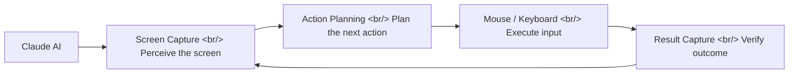
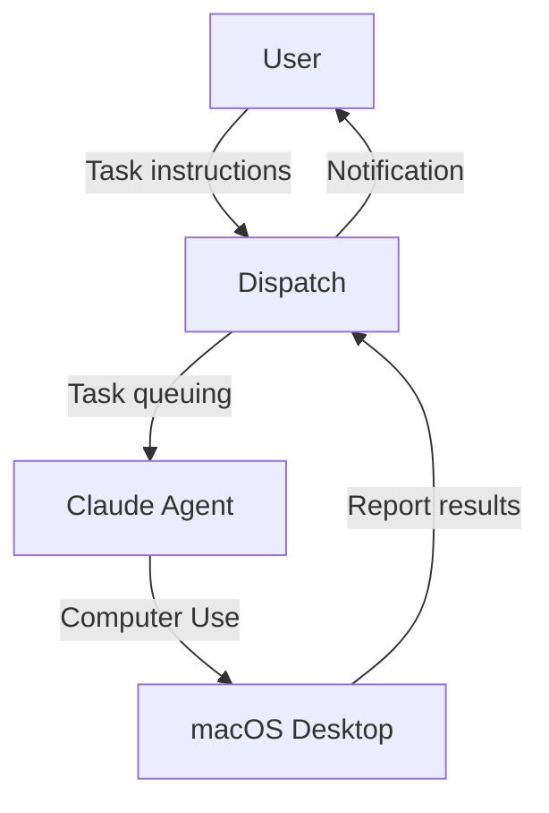

## Overview

Anthropic has officially launched the ability for Claude to directly control a computer's mouse, keyboard, and screen. Integrated with Claude Code Desktop and Cowork, Claude can now operate real GUIs — and combined with Dispatch, it can perform work remotely even when you step away. macOS launched first; Windows support is coming within weeks.

<!--more-->

---

## What Is Computer Use

Classic Claude Code operated by running CLI commands inside a terminal. Computer Use extends that scope to the entire GUI. Claude can perceive the screen through screenshots and execute actions like mouse clicks, keyboard input, and drag operations.

Key constraint: Computer Use is still early-stage. Claude operates **much more slowly and deliberately than a human**. This is intentional — safety is prioritized.

---

## Claude Code Desktop & Cowork Integration

Enabling Computer Use in Claude Code Desktop lets Claude directly manipulate IDEs or browsers during coding work. For example:

- **Legacy app automation**: automate repetitive tasks in GUI-only apps with no API
- **Native app debugging**: run builds and tests directly in Xcode, Android Studio, etc.
- **Browser testing**: test UI interactions in a real browser

In Cowork mode, Claude works on the same screen alongside the user simultaneously, letting you observe and intervene in Claude's actions in real time.

---

## Dispatch — Remote Asynchronous Work

Computer Use's true potential surfaces when combined with [Dispatch](https://docs.anthropic.com/en/docs/agents-and-tools/computer-use).

You can instruct Claude to operate the computer even when you're not there. Complex multi-app tasks — like "clean up the data in this spreadsheet and send it as an email" — are handled asynchronously.

---

## Relationship with Claude Code Remote Control

Claude Code already had a Remote Control feature. Here's how it differs from Computer Use:

| Feature | Remote Control | Computer Use |
|------|---------------|-------------|
| Scope | Terminal CLI commands | Entire GUI (mouse/keyboard) |
| Target | File system, shell | Any desktop app |
| Speed | Immediate execution | Slow and deliberate |
| Safety | Within sandbox | Full screen access |
| Use case | Coding, builds, testing | Legacy automation, GUI testing |

The two features are complementary. Remote Control is more efficient for work that can be handled via CLI; Computer Use is recommended only when a GUI is truly necessary.

---

## Real-World Use Cases

### Legacy App Automation

Automate repetitive tasks in enterprise software (ERP, CRM, etc.) that has no API. Delegate daily GUI work — data entry, report generation, approval processes — to Claude.

### Cross-App Workflows

Execute multi-app workflows with a single command. For example, automate the full sequence: capture a design in Figma → modify code in VS Code → verify results in the browser.

### QA Testing

Test user experience in actual UI. Unlike automation tools like Playwright or Selenium, Computer Use visually perceives the screen — making tests resilient to CSS selector changes.

---

## Current Limitations

- **Speed**: much slower than a human — each step requires analyzing a screenshot and planning, so expect wait time
- **Accuracy**: risk of clicking the wrong element in complex UIs
- **Platform**: macOS first, Windows not yet supported
- **Security**: full screen access requires care when sensitive information is visible on screen

---

## Insights

Claude Computer Use is a significant turning point in AI agents evolving from "code generators" to "digital workers." Moving AI out of the terminal sandbox into the full GUI dramatically expands the range of automatable work. Still early-stage with speed and accuracy limitations, but the combination with Dispatch — enabling asynchronous remote work — can bring real changes to developer workflows. Combining Remote Control and Computer Use in particular, for legacy system automation and cross-app workflows, we're approaching an era where nearly any computer task can be delegated to AI.
