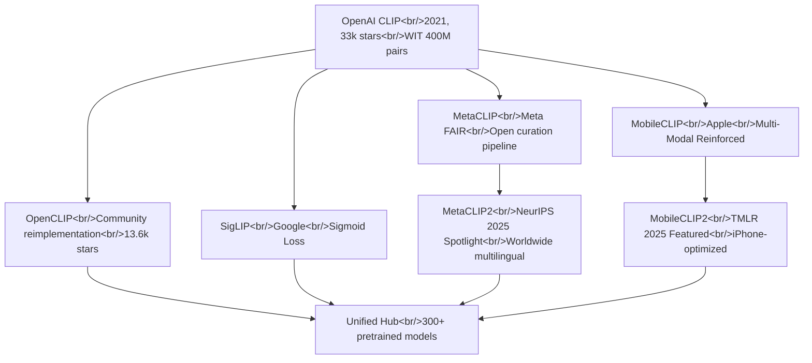

## Overview

I did a deep dive into the CLIP model ecosystem — the backbone of image-text embedding. This covers everything from OpenAI's original CLIP to Meta's MetaCLIP2 (NeurIPS 2025 Spotlight), Apple's MobileCLIP2 (TMLR 2025 Featured), the community-driven OpenCLIP, and Google's SigLIP. The goal: pick the right embedding model for my hybrid-image-search project. Related series: [Hybrid Image Search Dev Log #5](/posts/2026-03-25-hybrid-search-dev5/)

<!--more-->



---

## OpenAI CLIP — Where It All Started

[openai/CLIP](https://github.com/openai/CLIP) (33k stars) introduced Contrastive Language-Image Pre-Training in 2021. It popularized the idea of mapping images and text into a shared embedding space, and every CLIP variant since has built on top of it.

The core idea is elegantly simple: train on 400 million (image, text) pairs with contrastive learning, and you get zero-shot image classification without needing ImageNet's 1.28M labeled examples. The API is intuitive:

```python
import clip
model, preprocess = clip.load("ViT-B/32", device=device)

image_features = model.encode_image(image)
text_features = model.encode_text(text)

logits_per_image, logits_per_text = model(image, text)
probs = logits_per_image.softmax(dim=-1).cpu().numpy()
# prints: [[0.9927937  0.00421068 0.00299572]]
```

You pull vectors with `encode_image()` and `encode_text()`, then compute cosine similarity. `clip.available_models()` lists available checkpoints; `clip.load(name)` loads the model and preprocessing function.

**Limitations**: The training dataset WIT (WebImageText) is proprietary, and the largest model tops out at ViT-L/14. These two gaps drove most of the follow-on research.

---

## OpenCLIP — The De Facto CLIP Hub

[mlfoundations/open_clip](https://github.com/mlfoundations/open_clip) (13.6k stars) is an open-source reimplementation of CLIP that has become the ecosystem's central hub. It provides **300+ pretrained models** trained on public large-scale datasets like LAION-2B and DataComp-1B.

Performance comparison:

| Model | Training Data | Resolution | Samples Seen | ImageNet Zero-Shot |
|-------|--------------|------------|-------------|-------------------|
| ViT-B-16 | DataComp-1B | 224px | 13B | 73.5% |
| ViT-L-14 | DataComp-1B | 224px | 13B | **79.2%** |
| ViT-H-14 | LAION-2B | 224px | 32B | 78.0% |
| ViT-bigG-14 | LAION-2B | 224px | 34B | **80.1%** |
| ViT-L-14 (OpenAI original) | WIT | 224px | 13B | 75.5% |

OpenCLIP's ViT-L-14 beats the original OpenAI model with the same architecture by **3.7 percentage points**. Same architecture, different data — that delta is a clear demonstration of how much data curation matters.

MetaCLIP, SigLIP, and MobileCLIP variants are all loadable through OpenCLIP's unified `open_clip.create_model_and_transforms()` interface, meaning you can swap models in benchmarking experiments without changing any code.

---

## MetaCLIP2 — Multilingual Scaling and NeurIPS 2025 Spotlight

[facebookresearch/metaclip](https://github.com/facebookresearch/metaclip) (1.8k stars) is a Meta FAIR project whose primary contribution is making CLIP's data curation pipeline reproducible. The latest MetaCLIP2 ("worldwide") earned a NeurIPS 2025 Spotlight.

MetaCLIP2's most important finding: **English and non-English data mutually reinforce each other**. Previous multilingual CLIP models suffered from the "curse of multilinguality" — adding more languages degraded English performance. MetaCLIP2 sidesteps this by designing the curation pipeline to be multilingual from the ground up.

Academic recognition:
- ICLR 2024 Spotlight (MetaCLIP 1.0)
- CVPR 2024, EMNLP 2024 (Altogether synthetic captions)
- **NeurIPS 2025 Spotlight** (MetaCLIP2 Worldwide)

Distillation models, training code, and evaluation code are all publicly available. The model is directly usable via HuggingFace and OpenCLIP. For a Korean-language image search project, the finding that multilingual CLIP outperforms English-only models is directly actionable for model selection.

---

## MobileCLIP2 — State of the Art on Device

[apple/ml-mobileclip](https://github.com/apple/ml-mobileclip) (1.5k stars) is Apple's lightweight CLIP model built on Multi-Modal Reinforced Training. MobileCLIP2 earned TMLR 2025 Featured Certification.

The benchmarks are strong:

> **MobileCLIP2-S4** matches SigLIP-SO400M/14 accuracy with **2x fewer parameters**, and delivers **2.5x lower latency** than DFN ViT-L/14 on iPhone 12 Pro Max.

What sets it apart from other CLIP variants: it ships with an **iOS app demo (`ios_app/`)** that runs real-time zero-shot image classification in Swift directly on device. The training code is OpenCLIP-based, using DFNDR and DataCompDR datasets.

The core technique — Multi-Modal Reinforced Training — distills knowledge from a large teacher model into a lightweight student while applying reinforcement simultaneously on both image and text modalities. The large-scale data generation code lives in a separate repo ([ml-mobileclip-dr](https://github.com/apple/ml-mobileclip-dr)).

---

## SigLIP and the HuggingFace Embedding Ecosystem

Google's **SigLIP** (Sigmoid Loss for Language-Image Pre-Training) replaces CLIP's softmax contrastive loss with sigmoid loss. `google/siglip-so400m-patch14-384` is the flagship model, available in a 10-model HuggingFace collection.

SigLIP's advantage: less sensitivity to batch size. The original CLIP benefits from very large batches because the softmax is computed across all pairs. Sigmoid loss treats each pair independently, reducing batch size dependence.

### Navigating the HuggingFace Model Hub

Three hubs worth exploring:

- **Image Feature Extraction Models** — CLIP-family models dominate the trending list. Filter by `pipeline_tag=image-feature-extraction` to find actively maintained models
- **Zero-Shot Image Classification Models** — label-free image classifiers, predominantly CLIP-based
- **MTEB Leaderboard** — Massive Text Embedding Benchmark evaluating text embedding performance across 38 datasets. Not directly comparable to image embeddings, but useful for gauging the text-side performance of multimodal models

---

## Model Selection Criteria

Putting the research together for the hybrid-search project:

| Criteria | Best Model | Reason |
|----------|-----------|--------|
| Accuracy first | OpenCLIP ViT-bigG-14 | 80.1% ImageNet |
| Multilingual (Korean) | MetaCLIP2 | SoTA multilingual performance |
| Mobile deployment | MobileCLIP2-S4 | SigLIP-equivalent, 2x lighter |
| General-purpose + ecosystem | OpenCLIP ViT-L-14 | 79.2%, broadest support |

---

## Quick Links

- [HuggingFace Image Feature Extraction Models](https://huggingface.co/models?pipeline_tag=image-feature-extraction&sort=trending&search=clip)
- [HuggingFace Zero-Shot Classification Models](https://huggingface.co/models?pipeline_tag=zero-shot-image-classification&sort=trending)
- [MTEB Leaderboard](https://huggingface.co/spaces/mteb/leaderboard)

---

## Key Takeaways

Four years after OpenAI CLIP, the ecosystem has matured remarkably. OpenCLIP serves as the unified hub, and research from Meta, Apple, and Google has converged onto a single interface. Model selection is no longer "which CLIP?" but "which axis are you optimizing?" — accuracy, multilingual coverage, mobile efficiency, and trainability each point to a different winner. MetaCLIP2's mutual reinforcement finding between languages is directly applicable to Korean image search, and MobileCLIP2's mobile optimization is worth revisiting when the project moves toward app deployment.
