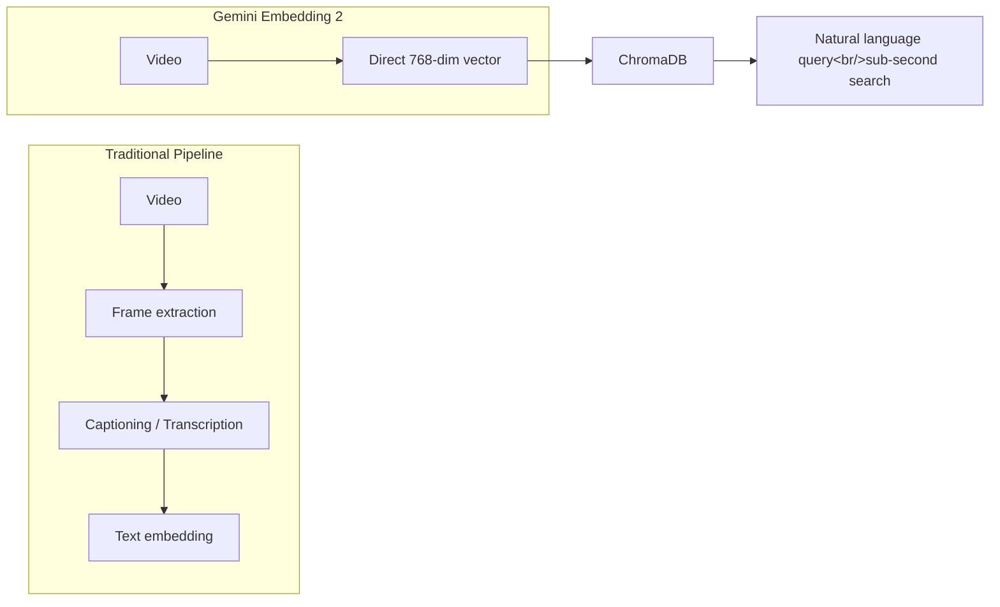

## Overview

A project that scored 434 points and 108 comments on Hacker News caught my attention. Gemini Embedding 2 can now embed video directly into 768-dimensional vectors, making the old transcription → text embedding pipeline obsolete. This post covers both the technical architecture of the resulting sub-second video search CLI and the heated panopticon debate that erupted in the HN comments. It continues the embedding series from [The CLIP Ecosystem](/posts/2026-03-25-clip-ecosystem/).

<!--more-->

---

## What Direct Video Embedding Actually Means

The bottleneck in traditional video search was clear: to extract meaning from video, you had to caption frames or transcribe audio, then embed the resulting text. This pipeline loses visual context, adds complexity, and cannot answer visually grounded queries like "green car cutting me off" from a transcription-only approach.

Gemini Embedding 2 eliminates the intermediate step entirely. A 30-second video clip gets converted into a **768-dimensional vector that can be directly compared against text queries**. No transcription, no frame captioning, no intermediate text. Video and text are natively projected into the same vector space.

---

## Implementation: The CLI Video Search Tool

The architecture of the CLI tool built by sohamrj:

1. **Indexing**: Split long footage into chunks → embed each chunk with Gemini Embedding 2 → store in ChromaDB
2. **Search**: Embed a natural language query with the same model → vector similarity search in ChromaDB
3. **Output**: Return automatically trimmed clips matching the query

**Cost**: roughly **$2.50 per hour of footage**. Still-frame detection skips idle segments, so security camera footage or Tesla Sentry Mode recordings cost significantly less.

This is essentially what CLIP-based image embedding did for static images, now applied to dynamic video by Gemini. It's a natural extension of the image-text embedding concepts covered in [the CLIP ecosystem post](/posts/2026-03-25-clip-ecosystem/).

---

## HN Community Discussion: The Surveillance Debate

Of the 108 comments, the social implications drew more heat than the technical implementation.

### The Core Concern: Panopticon

The top comment from macNchz cut to the heart of it:

> "We live in a world full of cameras, but we retain a degree of semi-anonymity because no one can actually watch all the footage. This technology changes that premise."

The concern: once camera owners, manufacturers, and governments can set up natural-language alerts for specific people or activities — starting with plausible use cases like crime detection or reporting pet waste violations — it becomes a path to an unregulated panopticon.

### Already Live: The Fusus Platform

citruscomputing shared a real-world example from a city council meeting about ALPR (Automatic License Plate Recognition) camera contracts. The camera vendor's **Fusus** platform:
- A dashboard that aggregates feeds from heterogeneous camera systems
- **Natural language querying across live video feeds**
- Plans to **integrate privately deployed cameras**

The city budget covered only 50 ALPR units, but the implication is clear: a future where a neighbor's camera feeds directly into a police AI system is not far off.

### Technical Discussion

On the technical side:
- **Cost efficiency**: $2.50/hr is still expensive at mass surveillance scale, but the price trajectory makes it a matter of time
- **Accuracy**: The key value is improved accuracy for visual queries over text-based search
- **ChromaDB vs. alternatives**: Active debate on vector database choices

---

## Embedding Technology Comparison

| | CLIP (Images) | Gemini Embedding 2 (Video) |
|--|-------------|---------------------------|
| Input | Static images | Dynamic video (30s chunks) |
| Dimensions | 512–1024 (model-dependent) | 768 |
| Intermediate steps | None (direct embedding) | None (direct embedding) |
| Cost | Free (local execution) | ~$2.50/hr (API) |
| Open source | OpenCLIP and others | Proprietary (API only) |

---

## Key Takeaways

Direct video embedding is a technically clean advance — it removes the text intermediary and brings video into the same semantic space as text queries. But as the HN discussion shows, the social implications reach far beyond the elegance of the engineering. A world where all footage can be indexed and searched by natural language is no longer a question of "can we?" but "should we?" The fact that platforms like Fusus are already deployed to law enforcement signals that the regulatory conversation is lagging badly behind technical capability. For the hybrid-image-search project, any future expansion into video search should be accompanied by explicit consideration of these ethical dimensions.
