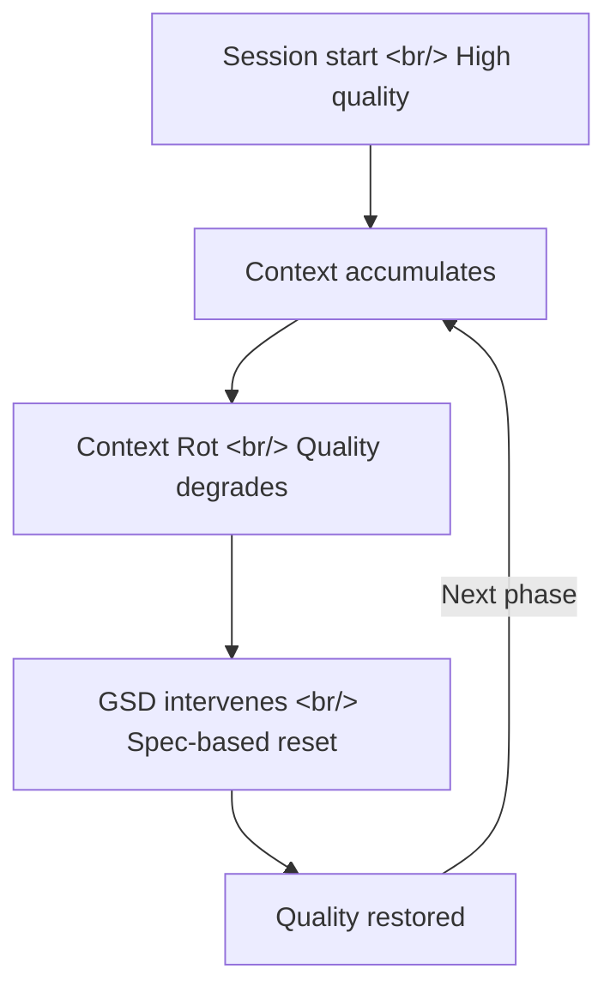
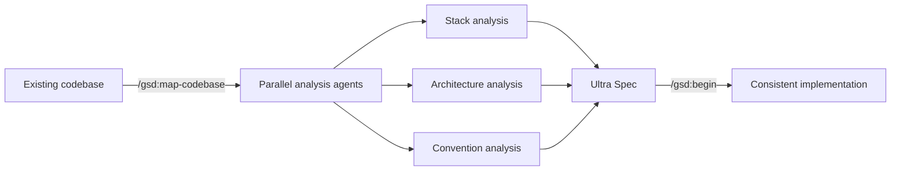

## Overview

[Get Shit Done (GSD)](https://github.com/gsd-build/get-shit-done) is a meta-prompting system that works across Claude Code, Gemini CLI, OpenCode, Codex, Copilot, and Antigravity. With 40,799 GitHub stars, it directly addresses "context rot" — the quality degradation that happens as a context window fills up. Engineers at Amazon, Google, Shopify, and Webflow reportedly use it in production.

<!--more-->

---

## What Is Context Rot?

The longer you work with an AI coding agent in a single session, the worse the output gets. As the context window fills with prior conversation, the AI that was sharp at the start begins repeating mistakes and generating inconsistent code.

GSD's core claim: this is not a fundamental LLM limitation — it's a **context engineering problem**.

---

## How GSD Works

### Spec-Driven Development

GSD's workflow has three stages:

1. **`/gsd:new-project`** — Initialize the project
   - Asks about goals, constraints, and technology preferences
   - Once it has enough information, generates an "Ultra Spec" document
   - Auto-generates a phase-by-phase implementation plan

2. **`/gsd:begin`** — Start implementation
   - Executes work step by step, based on the spec
   - Creates checkpoints after each phase completes
   - When context rot hits, recovers context from the spec

3. **`/gsd:continue`** — Resume after interruption
   - Reads previous state from the spec to restore context
   - Maintains consistency across new sessions

### Existing Codebase Support

The `/gsd:map-codebase` command analyzes an existing project using parallel agents to understand the stack, architecture, conventions, and concerns — and feeds that analysis into the subsequent `/gsd:new-project` flow.

---

## Multi-Runtime Support

GSD's distinguishing characteristic is that it's not locked to any single AI coding tool:

| Runtime | Install Location | Command Format |
|---------|----------------|---------------|
| Claude Code | `~/.claude/` | `/gsd:help` |
| Gemini CLI | `~/.gemini/` | `/gsd:help` |
| OpenCode | `~/.config/opencode/` | `/gsd-help` |
| Codex | `~/.codex/` (skills) | `$gsd-help` |
| Copilot | `~/.github/` | `/gsd:help` |
| Antigravity | `~/.gemini/antigravity/` | `/gsd:help` |

Installation is a single command: `npx get-shit-done-cc@latest`, followed by an interactive prompt to select runtime and install location.

---

## Comparison with Similar Tools

GSD's creator TÂCHES says he built it after trying BMAD, Speckit, and Taskmaster firsthand and finding them frustrating.

| | GSD | BMAD / Speckit |
|--|-----|---------------|
| Philosophy | Minimal workflow | Enterprise process |
| Complexity | 3 core commands | Sprints, story points, retrospectives |
| Target audience | Solo devs / small teams | Teams / organizations |
| Context rot | Auto-recovery via spec | No explicit solution |

The slogan "The complexity is in the system, not in your workflow" summarizes the difference. The user-facing workflow is minimal, but underneath it there's XML prompt formatting, sub-agent orchestration, and state management running the show.

---

## Key Takeaways

GSD is a practical answer to vibe coding's fundamental problem — context rot. Rather than advising "write better prompts," it takes a structural approach: maintain a permanent spec document and periodically reset the context from it. The 40K star count signals how universal this frustration is. Claude Code's CLAUDE.md, Plan mode, and Memory system address the same problem, but GSD packages it into a unified workflow. The runtime-agnostic design is a real-world benefit: you can use the same spec whether you switch from Claude Code to Gemini CLI mid-project.
