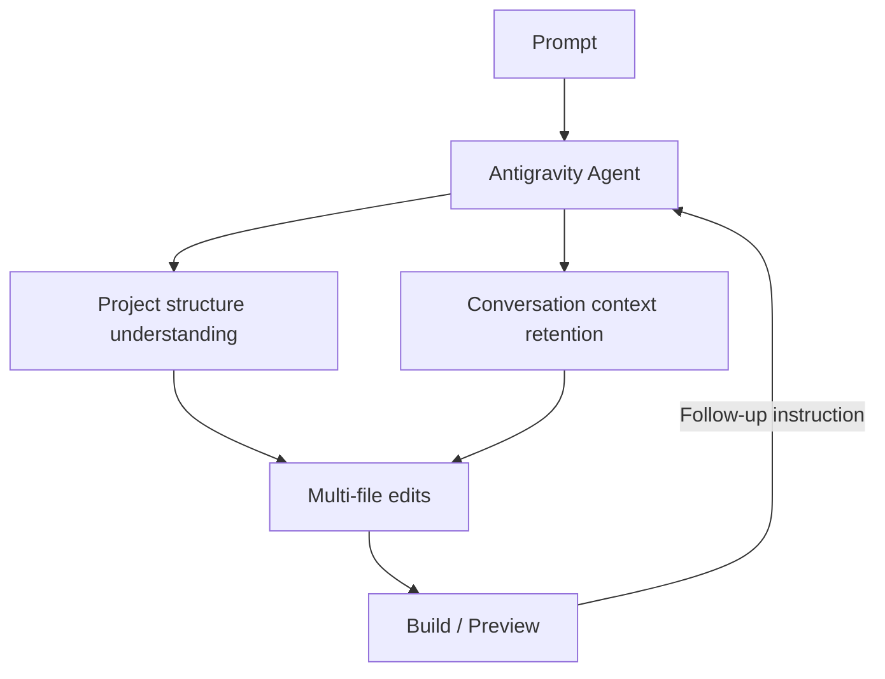
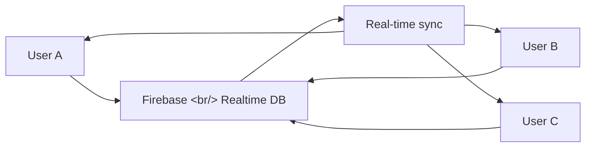

## Overview

Google AI Studio has dramatically upgraded its "vibe coding" experience — building production-ready full-stack apps from nothing but a prompt. The centerpiece is the **Antigravity coding agent** and deep **Firebase integration** covering real-time multiplayer, databases, authentication, external API connections, secrets management, and session storage, all in one flow. Based on [this TILNOTE summary](https://tilnote.io/pages/69bcbbd106e26362da15f629), here's a breakdown of the key features and how to use them effectively.

<!--more-->

---

## The Antigravity Agent: Longer Memory, Bigger Edits

Antigravity is a coding agent built directly into Google AI Studio. Unlike standard AI Studio code generation, it maintains a deeper understanding of project structure and conversation context across a session.

A short instruction like "add this feature" triggers accurate, multi-file edits and chained changes. The agent works as an editor who understands the whole app — not someone patching code piecemeal — so the iteration speed is meaningfully faster.

---

## Firebase Built In

The agent detects the moment an app needs to persist data or support user accounts. With user approval, it connects Firebase and configures the backend automatically.

### Available Services

| Service | Purpose |
|---------|---------|
| Cloud Firestore | Data storage (NoSQL) |
| Firebase Authentication | Login (Google OAuth, etc.) |
| Realtime Database | Live synchronization |

The key point: the agent handles the steps a developer normally does manually — creating a Firebase project in the console, wiring in the SDK — automatically.

---

## Real-Time Multiplayer and Collaboration

The headline capability of this update is making apps that require concurrent users and real-time sync straightforward to build.

Official example apps:
- Real-time multiplayer laser tag
- 3D particle-based collaborative workspace
- Physics-based 3D game (claw machine)
- Google Maps-integrated utility app
- Recipe creation and family/friends collaboration app

The common thread: these aren't just plausible-looking UIs. Each involves at least one of synchronization, data persistence, external integration, or authentication — actual apps, not demos.

---

## External Service Integration and Secrets Manager

Connecting to maps, payments, or external databases requires API keys. Antigravity detects when a key is needed and guides you to store it securely in the **Secrets Manager** in the Settings tab.

This structurally prevents the common mistake of hardcoding API keys in source code, and keeps the integration closer to how you'd handle credentials in a real production environment.

---

## Framework Support

React and Angular are joined by **Next.js as a first-class option**, selectable from the Settings panel. This makes it natural to build apps that take advantage of routing, server rendering, and full-stack patterns.

Framework selection guide:
- **React**: Fast UI experiments, client-heavy apps
- **Angular**: Large-scale enterprise apps, structured projects
- **Next.js**: Apps where SEO, server capabilities, or full-stack patterns matter

---

## Comparison with Claude Code

| | Google AI Studio + Antigravity | Claude Code |
|--|-------------------------------|-------------|
| Environment | Web browser | Terminal CLI |
| Backend integration | Firebase auto-configured | Manual setup |
| Deployment | Firebase Hosting one-click | Manual or scripted |
| Multiplayer | Realtime DB built in | Implement yourself |
| Code access | Web editor | Full filesystem |
| Flexibility | Limited to supported frameworks | Any stack |
| Depth | Prototype-level | Production-level |

---

## Usage Strategy

To get the most out of this update:

1. **Include production conditions in the prompt**: "Multiple users will use this simultaneously, data saves after login, it connects to an external service"
2. **Approve Firebase integration early**: Locking in the structure upfront reduces backtracking
3. **Use Secrets Manager by default**: Prevents API key hardcoding from the start
4. **Choose the right framework**: SEO or server features → Next.js; fast experimentation → React

---

## Key Takeaways

This update moves Google AI Studio further along the "prompt to production" axis. Firebase integration removes the friction of backend setup, and Antigravity's longer context retention speeds up iterative refinement. If Claude Code is a tool for professional developers, AI Studio is positioning itself for the "I have an app idea but infrastructure setup is the barrier" user. The two tools complement each other well: prototype quickly in AI Studio, then refine to production quality in Claude Code.
