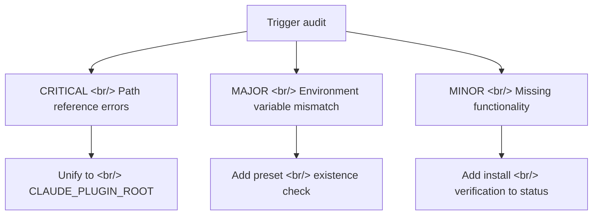

## Overview

[Previous: #2 — Marketplace-First Pivot and v2a/v2b Design and Implementation](/posts/2026-03-20-harnesskit-dev2/)

This sprint (#3) covered two major tracks across 12 commits. First, a full audit of plugin triggering correctness, resulting in 5 fixes. Second, a redesign of the marketplace plugin recommendation system from live search to a validated, pre-curated list, plus an upgrade of the tool sequence to a 3-step sliding window.

<!--more-->

---

## Full Plugin Trigger Audit

### Diagnosing the Problems

A comprehensive review of `plugin.json` skill definitions, hooks execution paths, and internal skill logic uncovered 5 triggering issues.



### Fix 1: Unify to CLAUDE_PLUGIN_ROOT

Skills and hooks were referencing the plugin directory in inconsistent ways: `claude plugin path` calls, hardcoded paths, and relative paths all coexisted. Everything is now unified to a `CLAUDE_PLUGIN_ROOT` environment variable with a `dirname`-based fallback.

```bash
# Before: mixed reference approaches
PLUGIN_DIR="$(claude plugin path harnesskit)"
PLUGIN_DIR="/Users/lsr/.claude/plugins/cache/harnesskit/..."

# After: unified reference
PLUGIN_DIR="${CLAUDE_PLUGIN_ROOT:-$(cd "$(dirname "$0")/.." && pwd)}"
```

### Fix 2: Add Preset Check to post-edit Hooks

`post-edit-lint.sh` and `post-edit-typecheck.sh` were executing before a preset was configured, causing errors. Added a preset existence check; they now skip gracefully if no preset is set.

---

## Marketplace Validated Recommendation System

### The Original Problem

`/harnesskit:init` was relying on live search to recommend marketplace plugins, which was unstable and produced inconsistent results.

### The Fix: Pre-Validated Recommendation List

Switched to maintaining a `marketplace-recommendations.json` file populated by an `update-recommendations.sh` script that periodically crawls and updates the list.


`/harnesskit:insights` also now references `recommendations.json` when suggesting improvements, so it only recommends validated plugins.

---

## 3-Step Sliding Window Tool Sequence

Upgraded the tool usage pattern analysis from a simple count approach to a 3-step sliding window for better precision. Tool usage is now recorded in `tool:summary` format, with pattern detection triggering improvement suggestions.

---

## Plugin Installation Verification

Added installation state verification to the `/harnesskit:status` skill. It now reports skill file presence, hooks execution permissions, and configuration file integrity in a single view.

---

## Commit Log

| Message | Area |
|---------|------|
| feat: add plugin installation verification to status | skills |
| feat: upgrade tool sequence to 3-step sliding window | skills |
| feat: add recommendations.json reference to insights | skills |
| feat: rewrite init marketplace discovery with verified recs | skills |
| feat: add update-recommendations.sh for marketplace crawling | scripts |
| feat: add verified marketplace-recommendations.json | templates |
| refactor: migrate skills from 'claude plugin path' to CLAUDE_PLUGIN_ROOT | skills |
| refactor: unify PLUGIN_DIR to CLAUDE_PLUGIN_ROOT with fallback | hooks |
| fix: add preset check to post-edit hooks + CLAUDE_PLUGIN_ROOT fallback | hooks |
| docs: add implementation plan for plugin trigger fixes | docs |
| docs: address spec review — fix CRITICAL and MAJOR issues | docs |
| docs: add spec for plugin trigger review — 5 fixes | docs |

---

## Key Takeaways

In plugin development, "it works" and "it triggers correctly" are different problems. In a local development environment, paths are fixed and everything looks fine. In another user's environment, the plugin cache path, environment variables, and preset state are all different. Unifying everything to `CLAUDE_PLUGIN_ROOT` is a small change that fundamentally improves portability. Switching marketplace recommendations from live search to a pre-validated list is driven by the same instinct — reduce uncertainty and guarantee a consistent experience.
