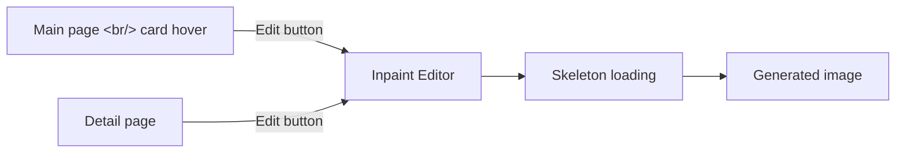

## Overview

[Previous: #4 — Router Separation, Terraform Dev Server, Inpaint Editor](/posts/2026-03-24-hybrid-search-dev4/)

This sprint (#5) covered three work streams across 13 commits. First, UX improvements to the Inpaint editor with direct access from the main page. Second, Google OAuth integration on the EC2 dev server and fixing image loading. Third, hardening overall stability: duplicate generation prevention, modal behavior, and aspect ratio handling.

<!--more-->

---

## Inpaint Editor UX

### Inpaint Access from Card Hover

Previously, the Inpaint editor was only reachable from the image detail page. Now the main page cards show an "Edit" button on hover, and clicking it opens the Inpaint editor directly.

### Skeleton Loading Cards

During Inpaint generation, skeleton loading cards appear on the main page so the user gets visual feedback on progress.

### Undo History Fix

The `saveHistory()` call in the Inpaint editor was moved to run before a stroke begins rather than after it completes. The previous behavior caused undo to restore the current state instead of the previous one.

---

## EC2 Dev Server

### Google OAuth Integration

Login was failing on first access to the dev server. Two root causes:

1. **`VITE_GOOGLE_CLIENT_ID` not set** — Vite environment variables are inlined at build time, so they must be present in `.env` during the EC2 build
2. **EC2 URL not in GCP authorized origins** — The EC2 URL (`http://ec2-xxx.compute.amazonaws.com:5173`) needed to be added to the authorized JavaScript origins in the GCP console

### Image Display Issues

Search and reranking worked correctly on the server, but images returned 404. The cause: the README's "data preparation" step had been skipped — image files are stored as split zips and needed to be extracted first.

Additionally: `fix: add recursive image search for nested directory structures` — images are now found even in nested directories.

---

## Generation Stability

### Duplicate Generation Prevention

Rapidly pressing Enter was triggering two image generations. Fixed by adding a guard that returns immediately from `handleGenerate` if `generatingCount > 0`. Later replaced the lock with a 500ms debounce for a more natural UX feel.

### ESC Key to Close Modals

Added ESC key event handling to all modal and popup components.

### Tone/Angle Reference Prompt Hardening

Fixed an issue where tone/angle metadata was unintentionally influencing generation results through the auto-injection system. The reference prompt is now strict about treating tone/angle as pure metadata.

### aspect_ratio Validation

Added validation of `aspect_ratio` values before passing them to the Gemini edit API, and ensured both `aspect_ratio` and `resolution` are preserved correctly across regeneration and inpaint flows.

---

## Clipboard Fallback

The prompt copy button on the detail page was failing in some environments. Added a `execCommand('copy')` fallback when `navigator.clipboard.writeText()` fails.

---

## ML Model Background Loading

The login page was unresponsive until ML model loading completed at server startup. Moved model loading to a background task so the login page is immediately available when the server starts.

---

## Commit Log

| Message | Area |
|---------|------|
| fix: add clipboard fallback for prompt copy button | FE |
| fix: strengthen tone/angle reference prompt | BE |
| fix: validate aspect_ratio before Gemini edit API | BE |
| fix: preserve aspect_ratio and resolution across regen/inpaint | BE+FE |
| feat: show skeleton loading cards during inpaint generation | FE |
| feat: add inpaint edit button to card hover | FE |
| fix: replace generation lock with 500ms debounce | FE |
| fix: load ML models in background so login works during startup | BE |
| feat: add ESC key to close all modal/popup components | FE |
| fix: prevent duplicate image generation on rapid Enter | FE |
| fix: add recursive image search for nested directories | BE |
| add allowed host | BE |
| fix: save undo history before stroke begins in InpaintEditor | FE |

---

## Key Takeaways

This sprint was fundamentally about making things that worked locally work correctly in a real deployment. Deploying the Inpaint editor to EC2 surfaced a string of unexpected issues: OAuth, image paths, environment variables. The Vite build-time environment variable gotcha (`import.meta.env.*` must be set before the build runs) is worth remembering for any server deployment. Replacing the duplicate generation lock with a debounce was the more UX-natural solution.
