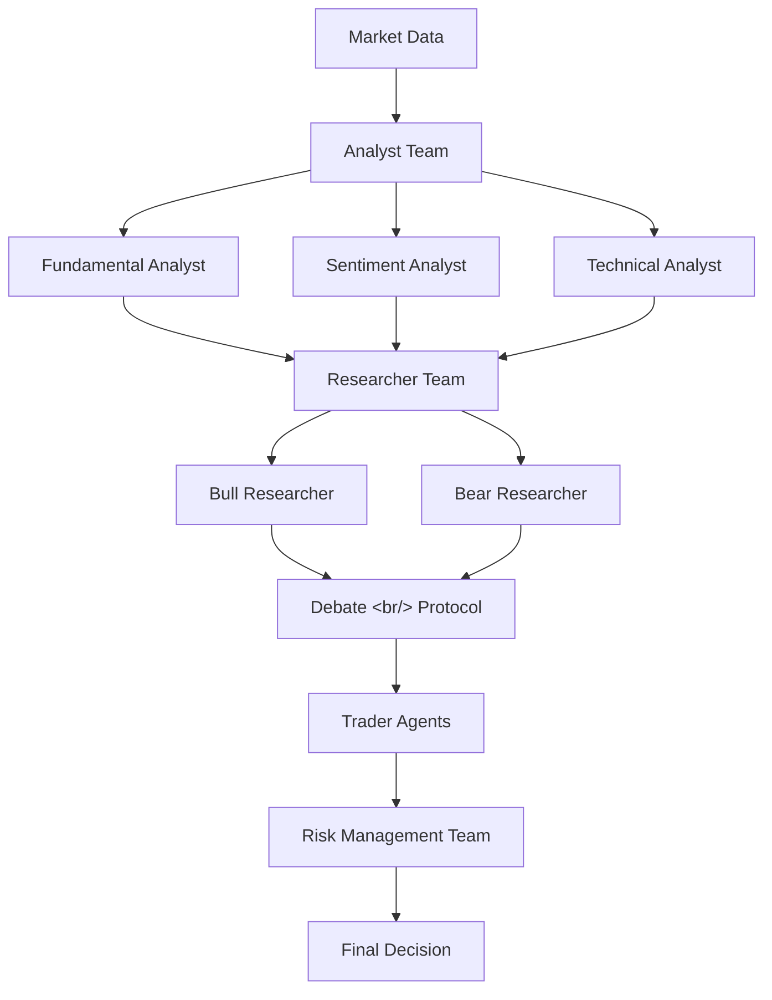
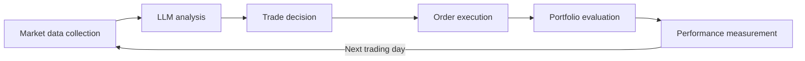
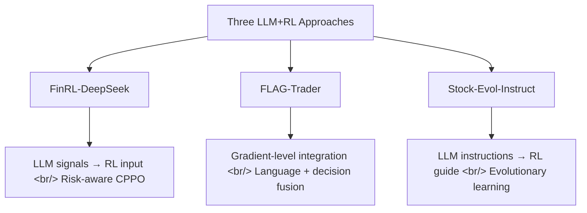

## Overview

LLM-based stock trading agents have exploded in 2025–2026. The field has moved well past simple sentiment analysis: multi-agent architectures now simulate entire trading firms, and hybrid LLM+RL systems handle real-time risk management. This post analyzes four major open-source frameworks and three academic papers, distilling the insights most relevant to building a practical trading agent.

<!--more-->

---

## TradingAgents — Simulating a Trading Firm with LLMs

[TradingAgents](https://github.com/TauricResearch/TradingAgents) is a multi-agent trading framework from UCLA and MIT researchers with 40,795 GitHub stars — the largest community in the LLM trading space.

### Architecture: Replicating Trading Firm Org Structure

The central idea is to implement the division of labor in a real trading firm using LLM agents.

- **Analyst Team**: Dedicated agents for fundamental, sentiment, and technical analysis
- **Researcher Team**: Bull and Bear perspectives debate market conditions
- **Trader Agents**: Agents with varying risk appetites
- **Risk Management Team**: Monitors position exposure and ratifies final decisions

### Backtest Results

Backtesting shows meaningful improvements over baselines across cumulative returns, Sharpe ratio, and maximum drawdown. The Bull/Bear debate protocol consistently produces more balanced judgments than single-opinion agents.

### Technical Details

229K lines of Python, currently at v0.2.2. Recent commits include 5-tier rating system standardization, portfolio manager refactoring, and exchange formula ticker preservation.

---

## PrimoAgent — Multi-Agent Stock Analysis

[PrimoAgent](https://github.com/ivebotunac/PrimoAgent) applies the multi-agent architecture specifically to the analysis pipeline rather than execution. Whereas TradingAgents covers the full cycle through trade execution, PrimoAgent focuses on generating the research.

Each agent handles a different analytical domain (financial statements, news sentiment, technical indicators) and the results are combined into a unified research report. This fits small teams or individual investors looking to automate institutional-grade research processes.

---

## AlpacaTradingAgent — LLM Financial Trading Agent

[AlpacaTradingAgent](https://github.com/huygiatrng/AlpacaTradingAgent) combines the Alpaca Markets API with LLM-driven decision making to execute actual trades — distinguishing it from academic frameworks that stay in backtesting. The Alpaca paper trading API lets you validate strategies against live market data without risk, with a clear path to live trading.

---

## stock-analysis-agent — Korean Market Research Automation

[stock-analysis-agent](https://github.com/kipeum86/stock-analysis-agent) uses Claude Code to automate institutional-grade research for Korean and US stocks. Its key differentiator is native support for Korean market data sources (DART electronic disclosure, Naver Finance, etc.).

As covered in a [previous analysis](/posts/2026-03-16-stock-analysis-agent/), this project addresses Korean stock market data accessibility through an LLM + MCP architecture.

---

## StockBench — Can LLM Agents Actually Make Money?

Tsinghua University's [StockBench](https://arxiv.org/html/2510.02209v1) benchmark confronts the question directly: "Can LLM agents trade profitably in real markets?"

### Benchmark Design

StockBench constructs a backtesting environment on real market data with a standardized agent workflow.

### Key Findings

- **Universe size matters**: LLM agent performance tends to degrade as the number of stocks increases
- **Workflow error analysis**: Classification of error types in the decision process
- **Data source contribution**: Ablation study on which data sources have the largest impact on returns

StockBench matters because it rigorously evaluates real-world applicability rather than treating "LLMs can trade profitably" as a given. It's a scientific validation tool for the field's claims.

---

## LLM + Reinforcement Learning: Three 2025 Papers

From the [AI for Life blog](https://www.slavanesterov.com/2025/05/3-llmrl-advances-in-equity-trading-2025.html), three major 2025 LLM+RL trading papers:

### 1. FinRL-DeepSeek: Risk-Aware RL with LLM Signals

A hybrid trading agent combining deep RL with LLM news analysis signals. Extends CVaR-Proximal Policy Optimization (CPPO) by injecting daily LLM-generated investment recommendations and risk assessment scores into the RL agent.

The key: instead of simple sentiment, it prompts LLMs (DeepSeek V3, Qwen-2.5, Llama 3.3) to extract nuanced risk/reward insights from news. Backtesting on the Nasdaq-100 from 1999–2023 shows significantly improved risk management performance.

### 2. FLAG-Trader: Gradient-Level LLM and RL Integration

Integrates LLM language understanding and RL sequential decision-making at the gradient level. The LLM processes market text data; the RL agent learns to trade on top of those representations.

### 3. Stock-Evol-Instruct: LLM-Guided RL Trading

Guides RL agent training with evolutionary instructions generated by an LLM. Uses natural language feedback from the LLM to sidestep the reward design difficulties that plague traditional RL.

---

## Connecting to My Own Project

Comparing these frameworks against the [trading-agent](/posts/2026-03-20-trading-agent-dev5/) project I'm building:

| | TradingAgents | My trading-agent |
|--|--------------|-----------------|
| Market | US equities | Korean equities (KIS API) |
| Agents | 10+ (analysis + trading + risk) | 6 (including news/macro) |
| Data sources | Yahoo Finance, Reddit | DART, Naver, KIS |
| Execution | Backtesting-focused | Live trading supported (MCP) |
| UI | CLI | React dashboard |

TradingAgents' Bull/Bear debate protocol and StockBench's benchmarking methodology are both worth adopting. In particular, the risk management team agent pattern and the DCF/PER valuation comparison directly connect to features currently in development.

---

## Key Takeaways

The LLM trading agent ecosystem has converged on a clear pattern: multi-agent = trading firm simulation. Single LLM making all decisions is passé; specialized agents debating and reaching consensus consistently outperform. On the research side, LLM+RL hybrid approaches are becoming mainstream — combining LLM text understanding with RL sequential decision-making produces better risk-adjusted returns than either alone.

StockBench's emergence signals the field is maturing from demo-level to scientifically verifiable. For my own trading agent, TradingAgents' organizational structure patterns, StockBench's evaluation framework, and FinRL-DeepSeek's risk management methodology are all directly transferable to the Korean market context.
