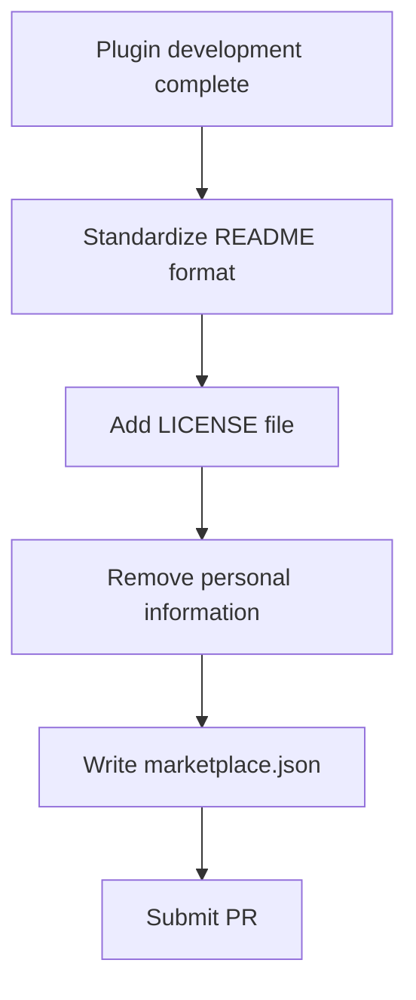

## Overview

[Previous: #3 — From Skill to Plugin](/posts/2026-03-24-log-blog-dev3/)

This sprint (#4) focused on preparing the log-blog plugin for submission to the official Claude Code marketplace (`anthropics/claude-plugins-official`) across 2 commits. The work involved rewriting the README to match official plugin format, adding a LICENSE file, and removing personal information.

<!--more-->

---

## Official Marketplace Requirements

Submitting a plugin to the Claude Code official marketplace requires meeting a few criteria.

### README Rewrite

The previous README read more like a development journal than documentation. Rewrote it to match the official plugin README structure:

- **Overview**: One-sentence description of what the plugin does
- **Skills**: List of available skills with descriptions
- **Installation**: How to install
- **CLI Usage**: CLI command guide
- **Requirements**: Required dependencies
- **Troubleshooting**: Common issues and solutions

### LICENSE File

Added MIT License. Marketplace submissions require an explicit license.

### Personal Information Removal

Cleaned up personal email and other identifying information from the `author` field in `plugin.json` and other configuration. No unnecessary personal details exposed in a public distribution.

---

## Commit Log

| Message | Area |
|---------|------|
| docs: rewrite README to match official Claude Code plugin format | docs |
| fix: add LICENSE file, unify author, remove personal info for marketplace review | config |

---

## Key Takeaways

The last mile of plugin development is packaging, not code. A perfectly functional plugin that has an unfriendly README or no license won't pass marketplace review. This work is small in scope, but it marks the final step in the journey from a local skill in `.claude/skills/` to a plugin eligible for the official marketplace.
