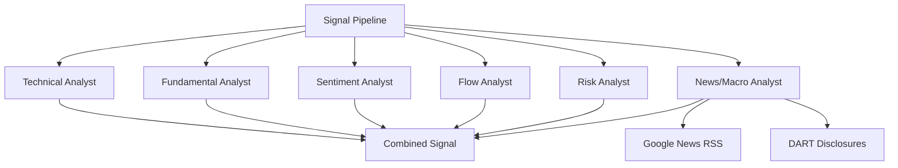

## Overview

[Previous: #5 — Backend Stabilization and Data Pipeline Improvements](/posts/2026-03-20-trading-agent-dev5/)

This sprint (#6) ran three major work streams across 35 commits. First, a sixth expert (news/macro analyst) was added to the signal pipeline and DART-based analysis was significantly expanded. Second, advanced analysis features — DCF valuation, portfolio risk, signal history — were implemented. Third, the frontend received a large-scale expansion: ScheduleManager, SignalDetailModal, and investment memo export.

<!--more-->

---

## Signal Pipeline Expansion

### News/Macro Analyst — The Sixth Expert

Added a **news/macro analyst** to the existing five-expert lineup (technical, fundamental, sentiment, flow, risk). Uses Google News RSS as a fallback to improve news collection reliability.



### Major DART Data Expansion

Significantly expanded the data pulled from the DART electronic disclosure system:

- **Insider trading data** (`feat: add DART insider trading data`) — executive buy/sell trends
- **Foreign/institutional investor trends** (`feat: add foreign/institutional investor trend`) — fund flow analysis
- **Catalyst calendar** (`feat: add catalyst calendar with DART disclosures`) — earnings announcements and disclosure schedules visualized as a timeline UI
- **Peer comparison** (`feat: add peer comparison with sector-based DART valuation`) — sector-level valuation benchmarking

### 8 New Database Tables

Added 8 tables, an ANALYST role, and metadata initialization in a single migration to support the new analysis features.

---

## Advanced Analysis Features

### DCF Valuation

Implemented a Discounted Cash Flow valuation module with sensitivity tables and heatmaps that visualize the fair value range across WACC and growth rate combinations.

```python
# DCF sensitivity heatmap core logic
for wacc in wacc_range:
    for growth in growth_range:
        intrinsic_value = calculate_dcf(fcf, wacc, growth, terminal_growth)
        heatmap[wacc][growth] = intrinsic_value
```

### Portfolio Risk Analysis

Calculates VaR (Value at Risk), beta, and sector concentration from real portfolio data. Renders a correlation matrix heatmap for cross-position correlation analysis.

- **VaR**: Historical simulation approach, 95%/99% confidence intervals for maximum loss estimation
- **Beta**: Portfolio beta relative to KOSPI200
- **Sector concentration**: Collects KOSPI200 sector data from Naver Finance for sector distribution analysis

### Signal History Snapshots

Added point-in-time signal storage and a timeline feature for comparing against historical signals.

---

## Frontend Expansion

### ScheduleManager

Implemented a schedule management component with cron editing and a run-now button. Includes agent name display, friendly task labels, and sorting by cron time (hour:minute).

### SignalDetailModal

Added a detail modal that lets users drill down from a signal into associated order history. Includes expert opinion expansion, risk_notes display, and compact/expanded view toggle.

### Investment Memo Export

Added investment memo generation in HTML and DOCX formats based on signal data. Uses `python-docx` for Word document export.

### Other UI Improvements

| Component | Change |
|-----------|--------|
| OrderHistory | Show fill_price, order_type, signal link |
| PositionsTable | Add market_value column |
| ReportViewer | Trade PnL column, rr_score color coding |
| DashboardView | Handle report.generated event |
| Settings | initial_capital, min_rr_score configuration |

---

## MCP Middleware Fix

Discovered that `ctx.set_state()` and `ctx.get_state()` are async methods but were being called without `await` in Session 1, causing repeated "MCP tool call failed" errors in server logs.

```python
# Before
ctx.set_state(factory.CONTEXT_STARTED_AT, started_dt.strftime("%Y-%m-%d %H:%M:%S"))

# After
await ctx.set_state(factory.CONTEXT_STARTED_AT, started_dt.strftime("%Y-%m-%d %H:%M:%S"))
```

Also added auto-reconnect logic so MCP connection failures recover automatically.

---

## Unit Tests

Added unit tests for the DCF valuation and portfolio risk services.

---

## Commit Log

| Message | Area |
|---------|------|
| feat: sort schedule tasks by cron time ascending | UI |
| feat: show agent name and friendly task labels in ScheduleManager | UI |
| style: align new components with existing design system | UI |
| fix: use import type for ScheduledTask (Vite ESM) | FE |
| feat: add Google News RSS fallback for news stability | BE |
| feat: add compact/expanded view toggle to SignalCard | UI |
| feat: add DOCX investment memo export | BE |
| feat: add real portfolio beta and correlation heatmap | BE |
| feat: add DCF sensitivity heatmap table | UI |
| test: add unit tests for DCF and portfolio risk | TEST |
| feat: populate kospi200 sector data from NAVER | BE |
| fix: await async MCP context methods + auto-reconnect | BE |
| fix: replace explicit any types | FE |
| feat: add investment memo HTML export | BE |
| feat: add VaR, beta, sector concentration risk | BE |
| feat: add DCF valuation with sensitivity table | BE |
| feat: add signal history snapshots and timeline | BE+FE |
| feat: add peer comparison with DART valuation | BE |
| feat: add news/macro analyst as 6th expert | BE |
| feat: add catalyst calendar with DART disclosures | BE+FE |
| feat: add DART insider trading data | BE |
| feat: add foreign/institutional investor trend | BE |
| feat: add 8 new DB tables, ANALYST role, metadata init | BE |
| fix: resolve lint errors in DashboardView/SignalCard | FE |
| feat: add report.generated event handling | FE |
| feat: add initial_capital and min_rr_score to settings | BE+FE |
| feat: add ScheduleManager with cron editing | FE |
| feat: add trade PnL column and rr_score color coding | FE |
| feat: add SignalDetailModal with orders drilldown | FE |
| feat: add expert opinion expansion and risk_notes | FE |
| feat: use correct performance endpoint with selector | FE |
| feat: add market_value to PositionsTable | FE |
| feat: show fill_price, order_type, signal link | FE |
| feat: add missing type fields | FE |
| feat: add missing API service functions | FE |

---

## Key Takeaways

This sprint was a large-scale expansion that simultaneously deepened the analysis layer and raised the frontend polish. Adding the sixth expert rounds out the signal pipeline for more balanced decision-making. DCF valuation, VaR, and beta give the system institutional-grade analytical tools — it's evolving from a signal generator into a comprehensive investment analysis platform. Expanding DART data coverage to insider trading, fund flows, and disclosure calendars sharpens the differentiation of this agent for the Korean equity market.
