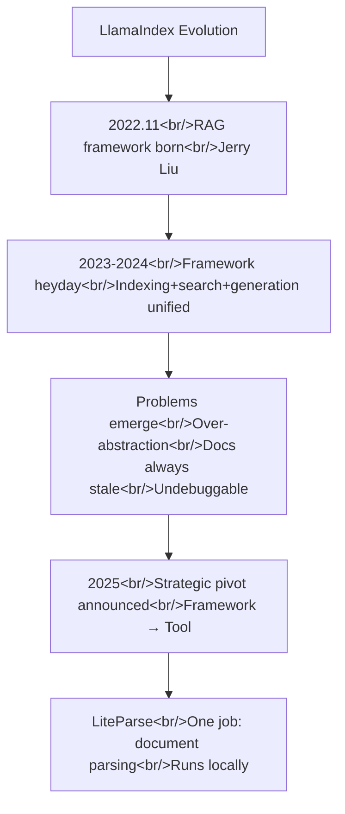

## Overview

I analyzed the YouTube video [LiteParse - The Local Document Parser](https://www.youtube.com/watch?v=_lpYx03VVBM). LiteParse itself is an interesting tool, but the more significant story is what it represents: the team that pioneered RAG frameworks publicly declaring **"the framework era is over"** and pivoting to a single focused tool. Related post: [Context7 deep dive](/posts//2026-03-20-context7/)

<!--more-->

---

## LlamaIndex: History and Pivot

### Pioneering the RAG Framework

Jerry Liu's November 2022 LlamaIndex was **the first serious RAG framework**. It abstracted document indexing, vector search, and answer generation into a unified system, making RAG pipelines fast to build. As RAG emerged as the dominant pattern for LLM applications, LlamaIndex became the category's defining framework.

### The Fundamental Problems of the Framework Era

The video names the core problems:

**Abstraction layers can't keep pace** — AI models and techniques change monthly. Framework abstractions lag behind. Documentation is always behind, and a six-month-old tutorial often simply doesn't work anymore.

**Debugging is nearly impossible** — Complexity hidden inside the framework makes it hard to trace root causes when something goes wrong. In an "indexing → retrieval → generation" pipeline, the problem can be anywhere behind the abstraction layer.

**Abstraction becomes a constraint** — As AI models themselves improve rapidly, the framework's prescribed approach is increasingly not the best approach. When you're writing more code to work around the framework than with it, the framework has lost its reason to exist.

The critical point: LlamaIndex's own team admitted this and changed direction. **The pioneers of the framework era declared its limits themselves.**

---

## LiteParse — One Problem, Done Well

### The Problem It Solves

Coding agents can write thousands of lines of Python without breaking a sweat, but hand them a PDF and useful context vanishes:

- **Tables get flattened** — Row/column structure is lost, distorting the meaning of the data
- **Charts disappear** — Visual data is completely ignored
- **Numbers hallucinate** — OCR errors pass wrong figures to the model
- **PyPDF workarounds are janky** — You get basic text extraction and nothing more

Fixing this previously required bolting on a separate OCR model or wiring together multiple libraries into a fragile pipeline.

### LiteParse's Approach

LiteParse is a **locally executed document parser** that does exactly one thing: extract tables, charts, and code blocks from PDFs and DOCX files **accurately**.

Core characteristics:
- **Local execution** — No external API dependency, privacy preserved
- **Structure preservation** — Table rows/columns and chart data points are maintained
- **Single purpose** — A standalone tool, not part of a RAG pipeline
- **Pipeline-agnostic** — Connect it to any workflow; no LlamaIndex dependency

---

## Framework vs. Tool — A Paradigm Comparison

| | Framework (LlamaIndex RAG) | Tool (LiteParse) |
|--|---------------------------|-----------------|
| Scope | Full RAG pipeline | Document parsing only |
| Abstraction | High (index, retrieval, generation) | Low (input → parsed output) |
| Flexibility | Locked to the framework's approach | Connects to any pipeline |
| Debugging | Hidden behind abstractions | Clear inputs and outputs |
| Maintenance | Frequent breaking changes | Stable interface |
| Learning curve | Must understand the whole framework | Understand just the one feature |

---

## The Structural Shift in AI Developer Tooling

LlamaIndex's pivot is not an isolated event. The same pattern is repeating across the AI developer ecosystem:

- **Context7** — Succeeded as an MCP tool specialized in "one thing": injecting up-to-date documentation into LLM context ([Context7 deep dive](/posts/2026-03-20-context7/))
- **MCP (Model Context Protocol)** — A standardized protocol between tools, not a framework
- **Claude Code Marketplace** — An ecosystem of plugins each specialized for a specific function ([Marketplace comparison](/posts/2026-03-20-claude-code-marketplaces/))

If 2022–2024 was the age of "frameworks that wrap everything," 2025 onwards is the age of **"tools that do one thing well."** HarnessKit and log-blog were deliberately designed in this spirit — not frameworks, but plugins that solve a specific problem cleanly.

---

## Key Takeaways

LlamaIndex's pivot is significant precisely because the framework's limitations were declared by the framework's own creators — not by outside critics. That's a strong signal about the direction of AI developer tooling. In the agentic era, agents handle orchestration themselves. What developers need isn't "a framework that ties everything together" but "good tools the agent can call." Just as LiteParse owns document parsing, Context7 owns documentation injection, and MCP owns the tool protocol — the combination of well-built, focused tools is replacing the framework.
