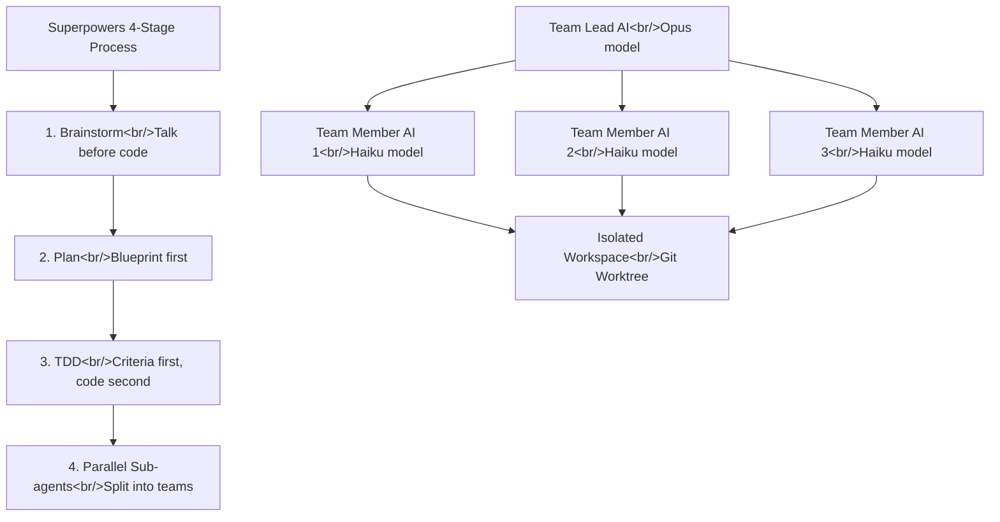

## Overview

I analyzed the YouTube video [AI Plugin with 110k Stars — One Line of Code Does It All](https://www.youtube.com/watch?v=jw23empkqGg). The plugin in question is **Superpowers** — the Claude Code plugin I covered in depth in [The Complete Superpowers Guide](/posts/2026-03-04-claude-code-superpowers/). It had 69k stars when I first wrote about it; five months later it crossed 110k. This post focuses on the practical critique and key insights from a Korean developer's perspective. Related posts: [The Complete Superpowers Guide](/posts/2026-03-04-claude-code-superpowers/), [HarnessKit Dev Log #3](/posts/2026-03-25-harnesskit-dev3/)

<!--more-->



---

## What Is Superpowers?

When you tell an AI coding tool (Claude Code, Cursor, Codex, etc.) "build me an app," it dives straight into writing code. The video's analogy is spot-on:

> It's like telling a contractor "make it feel like a café" — and instead of asking how many seats you need or what your budget is, they immediately start knocking down walls.

Superpowers solves this problem. It injects a **manual (skill files) that enforces a working order** on the AI — conversation → planning → testing → implementation, in that sequence. It hit 110k GitHub stars in five months. Creator Jesse Vincent is a seasoned open-source developer with a long track record.

Installation is simple:
```bash
# For Claude Code users
/plugin install superpowers

# For Cursor users
/plugin superpowers
```

---

## Core 1: Brainstorming — Talk Before You Code

With a typical AI coding tool, saying "add a login feature" triggers immediate code generation. With Superpowers installed, the AI asks questions first:

- What login method do you want? Email? Social login?
- Do you need password recovery?
- How should sessions be managed?

It suggests two or three approaches, explains the tradeoffs, and only starts building after you say "let's go with this." The contractor who used to knock down walls first now shows you the blueprints.

The skill file explicitly forbids the AI from skipping this phase:

> "This is not optional. You must follow this."

It even includes a counter-script for when the AI tries to wriggle out by saying "this is too simple to bother with."

---

## Core 2: TDD — Define Success Before Writing Code

The video's analogy: when making kimchi jjigae, you normally follow the recipe and taste at the end. TDD means **deciding what it should taste like before you start**. "This level of saltiness, this much chili" — you define the standard first, then cook to meet it.

In Superpowers this is written as a hard rule:

> "No building without criteria. If you started without criteria, delete it and start over."

You write the test (the criterion for how a feature should behave) first, then write code that passes it. No more "why isn't this working?" debugging sessions after the fact.

---

## Core 3: Sub-Agent Teams — AI Works in Parallel

This is the most impressive design choice. Instead of one AI doing everything, **the work is split across a team**.

### Model Separation Strategy

| Role | Model | Why |
|------|-------|-----|
| Team Lead (planning) | Opus (advanced) | Whole-system design requires deep thinking |
| Team Members (coding) | Haiku (lightweight) | Once the plan is done, execute fast |

It's like architecture — the 30-year veteran designs the building, but the bricklaying is done by skilled tradespeople.

### Context Isolation

Each team member AI focuses only on its own task. The AI that reads code, the AI that writes code, and the AI that reviews code are all separate. Just as a person's brain melts when multitasking three meetings, an AI that's given too many things at once starts making mistakes.

### Isolated Workspaces (Git Worktree)

When multiple AIs touch the same project at once, conflicts arise. Superpowers **gives each AI its own copy of the project** using Git Worktrees. AI 1 builds the login feature, AI 2 builds the payment feature — each in their own workspace — and the results are merged at the end.

---

## Where Superpowers Falls Short

The video is honest about the limitations:

- **No formal benchmarks** — there's not enough comparative data to prove effectiveness with hard numbers
- **Shallow brainstorming questions** — the design of *which* questions to ask still needs more work
- **Weak QA phase** — real validation requires E2E (end-to-end) testing, and the current QA step doesn't go that far

---

## Superpowers vs. HarnessKit

Superpowers and [HarnessKit](/posts/2026-03-25-harnesskit-dev3/) solve the same problem from different angles:

| | Superpowers | HarnessKit |
|-|-------------|------------|
| Approach | Enforce workflow (skills) | Guardrails + monitoring (harness) |
| Focus | AI's task order | AI's output quality |
| Method | Process injection | Environment control |
| Install | `plugin install` one line | Marketplace install |

They're not competing — they're complementary. Use Superpowers to enforce the right order, use HarnessKit to manage quality, and you have a two-layer safety structure.

---

## Insight

Superpowers didn't hit 110k stars in five months because of some technical breakthrough. It implemented a simple principle as a system: **give AI a process to follow and the results change**. The video's core message is accurate — **how you use AI matters more than how smart the AI is**. The same Claude Code produces completely different outcomes depending on whether Superpowers is installed. This principle applies to all AI usage, not just coding. HarnessKit — the project we're building now — is a product of the same philosophy: designing the AI's working environment, not just the AI's capabilities.
