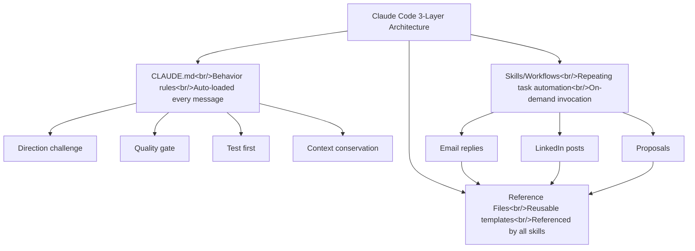

## Overview

I analyzed the YouTube video [27 Claude Code Tips That Make You 10x Faster](https://www.youtube.com/watch?v=-IozMG9x0dI). The 27 tips are drawn from 500+ hours of hands-on Claude Code experience. I've re-categorized them into beginner / intermediate / advanced and analyzed them from a practical standpoint. This continues the previous series:
- [Claude Code Practical Guide 1 — Context Management to Workflows](/posts/2026-03-19-claude-code-practical-guide/)
- [Claude Code Practical Guide 2 — New Features from the Last 2 Months](/posts/2026-03-24-claude-code-new-features/)

<!--more-->

---

## Beginner: Getting Started

### Environment Setup

**Integrate with VS Code or Antigravity** — Rather than running Claude Code standalone, integrating it into your IDE puts your code editor and AI conversation on the same screen, eliminating context-switching overhead. One install from the plugin marketplace is all it takes.

**Enable auto-save** — This one matters a lot. If VS Code's autosave is off, files Claude edits won't be saved and you'll waste time wondering why changes aren't appearing. Search `autosave` in settings and check the box.

**Use dictation** — On Mac, press Fn twice to enable voice input. You can get prompts in faster than typing.

### Setting Direction

The hardest part of starting with Claude Code is "not knowing what to ask." The video suggests this opening:

> "I'm building a website from scratch. What questions should I be asking you?"

Claude will then ask back: "What's the purpose of the site?", "What does success look like?", "Who are the target users?" — following that chain naturally produces a solid requirements doc.

---

## Intermediate: Maximizing Productivity

### Multi-Tab Parallel Work

The creator describes this as "embarrassingly late to discover." You can **open multiple tabs and run different tasks simultaneously**. Split-screen two projects side by side for parallel work. You can also split horizontally to monitor multiple conversations at once.

One caveat: to prevent coming back 20 minutes later to find everything frozen waiting for permission approval, enable **bypass permissions mode**. Search `bypass permissions` in settings and toggle it on.

### CLAUDE.md — Two Essential Files

Every project should have these two files:

1. **CLAUDE.md** — How Claude should behave. Think of it as "hiring and onboarding an employee."
2. **project_specs** — What you're building. Think of it as "explaining what the company does to a new hire."

Both should be living documents that evolve alongside the project.

### 5 Rules to Put in CLAUDE.md

| Rule | Purpose |
|------|---------|
| Challenge my direction | Prevents yes-man behavior, drives better outcomes |
| Quality gate | Honest quality scores (3/10 → here's how to reach 9/10) |
| Test before delivery | Stops broken deliverables from reaching you to debug |
| Context awareness | Saves context window, avoids wasteful token use |
| Upgrade suggestion | Improvement suggestions each response, catches blind spots |

### Structuring Responses

On complex projects, unstructured Claude responses are overwhelming. The video suggests a 5-part response format:

1. **What was done** — Summary of the work
2. **What I need from you** — Actions required from you
3. **Why it matters** — Explained as if to a 15-year-old
4. **Next steps** — Where things go from here
5. **Errors and context** — Any issues that came up, plus background needed to understand them

### Message Queuing

You don't have to wait for a message to finish before sending the next. **Send multiple messages in a row and they queue up for sequential processing.**

---

## Advanced: System Design

### The 3-Layer Architecture

The video proposes structuring Claude Code projects in three layers:

1. **CLAUDE.md** — Behavior rules. Auto-read on every message.
2. **Skills/Workflows** — Repeating task automation. Called on-demand with `/skill-name`.
3. **Reference Files** — Reusable templates. Referenced by all skills.

Example: if three skills (email replies, LinkedIn posts, proposals) all reference one "my tone" file, updating your tone once propagates to all three skills. Set it up once, reuse forever, and keep improving.

### Using Sub-Agents

Building a 5-page website sequentially is slow. **Sub-agents let you generate each page in parallel:**

- Homepage → Sub-agent 1
- About page → Sub-agent 2
- Contact page → Sub-agent 3

Each agent specializes in one thing with an isolated context — the results are faster and better.

### Design Tips

**Dribbble cloning** — Get inspiration from Dribbble, paste a screenshot into Claude Code, and it can reproduce it pixel-for-pixel. Attach a URL and it analyzes and replicates the site.

**Spline 3D** — Add free 3D graphics to your website. Interactive elements like cubes and balls that follow the cursor make a site look like it cost $10,000.

### Other Advanced Tips

- **Escape + Rewind** — When a task goes in the wrong direction, press Escape to stop it and use the Rewind button to restore a previous state
- **Compacting** — When context usage hits 83%+, compact manually and add a reminder with key information you can't afford to lose
- **Memory** — A persistent secret memory file across projects. Managed with `/memory`. Stores your name, preferences, etc.
- **Insights** — Type `insights` to see a full usage stats and feedback report
- **Plugins** — Use `/plugin` to download pre-built solutions (e.g. frontend-design)

---

## Quick Links

- Free CLAUDE.md template — linked in the video description
- [Dribbble](https://dribbble.com) — Design inspiration
- [Spline](https://spline.design) — Free 3D graphics

---

## Insight

The thread running through all 27 tips is that "Claude Code is a system, not just a tool." Defining behavior in CLAUDE.md, automating workflows with Skills, maintaining consistency through Reference Files — the 3-layer architecture is a design pattern, not a list of tricks. Combined with Practical Guide 1 and 2, the series flows naturally: context management (#1) → new features (#2) → system design (#3). The sub-agent and 3-layer patterns in particular are already being applied in the HarnessKit and log-blog projects.
