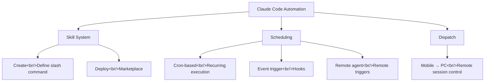

## Overview

I analyzed three YouTube videos on Claude Code's automation capabilities. The skill system (creation to deployment), scheduling as an alternative to n8n, and remote control via Dispatch — these three pillars are what transform Claude Code from a coding tool into a workflow automation platform. Related posts: [Claude Computer Use](/posts/2026-03-25-claude-computer-use/), [HarnessKit Dev Log](/posts/2026-03-25-harnesskit-dev3/)

<!--more-->



---

## Skill System — Encapsulating Repetition

The video [Automating with Claude Skills — From Creation to Deployment](https://www.youtube.com/watch?v=txa_8i-3cIs) covers the full lifecycle of a skill.

### What Skills Are

A skill encapsulates a repeating workflow into a markdown file. Invoking it with a slash command (`/skill-name`) tells Claude to carry out the defined procedure. If CLAUDE.md is "always-on rules," a skill is "a specialist you call in when needed."

### Creation

A skill file is structured as frontmatter + prompt:

```markdown
---
name: email-reply
description: Draft a reply to an incoming email
---

1. Analyze the email content
2. Reference the tone in reference/tone.md
3. Structure a response for each key point
4. Write in a polite but clear voice
```

Once created, a skill can be reused indefinitely — and the hundredth run can be better than the first by continuously refining it. Compare this to re-explaining context from scratch in a new chat every time, and the efficiency gain is massive.

### Marketplace Deployment

Skills can go beyond personal use and be published to the marketplace. HarnessKit and log-blog are already listed there via this route. Package them as plugins and other users can install and use them immediately.

---

## Scheduling — Why n8n Is Becoming Less Necessary

The video [Fewer Reasons to Use n8n Every Day](https://www.youtube.com/watch?v=eOVF1Rh4xE4) introduces three scheduling approaches in Claude Code and compares them to automation tools like n8n.

### Method 1: Cron-Based Recurring Execution

Use the `/schedule` or `/loop` command to set up cron-expression-based recurring tasks. For example, register "check server logs every 30 minutes and classify errors" as a cron job, and Claude handles it on schedule.

### Method 2: Event Triggers (Hooks)

Automatically run a skill or task when a specific event occurs. File changes, git commits, and tool calls can all serve as triggers. Define hooks in `settings.json`.

### Method 3: Remote Agents (Remote Triggers)

Remotely trigger a Claude Code session running on a server. API calls or webhooks can kick off tasks, enabling integration with CI/CD pipelines or external services.

### n8n Comparison

| | n8n | Claude Code Scheduling |
|-|-----|----------------------|
| Setup | GUI node editor | Natural language + cron |
| Logic | Node-to-node connections | AI judgment |
| Flexibility | Predefined nodes | Free-form |
| Error handling | Conditional branching | AI self-assessment |
| Cost | Self-host free | API costs |

This isn't a complete replacement — there's significant overlap in **developer workflow automation**. n8n excels at structured, predefined integrations; Claude Code excels at automation that requires unstructured judgment.

---

## Dispatch — Remote Control from Your Phone

The video [Claude's Biggest New Feature — Control Your PC From Your Phone](https://www.youtube.com/watch?v=_-yNiESnzL0) introduces Claude Dispatch.

Dispatch lets you remotely trigger a Claude Code session on your PC from a mobile device and check the results. During your commute or while you're out, you can instruct agents in your development environment and monitor their progress.

Combined with [Claude Computer Use](/posts/2026-03-25-claude-computer-use/), which was covered previously, this enables full automation where Claude controls the mouse and keyboard on a PC you're not physically sitting at.

---

## The Synergy of All Three

```
Skills (what) + Schedule (when) + Dispatch (from anywhere)
= Fully automated workflow
```

A real-world example:
1. **Skill**: Define "analyze server logs and generate error report"
2. **Schedule**: Cron runs it every hour
3. **Dispatch**: Mobile notification when an error is found, with option to send further instructions

I'm already using this pattern in the trading-agent project — ScheduleManager handles cron editing, and MCP delegates analysis tasks to the agent.

---

## Insight

The keyword threading through all three videos is "decentralized automation." Centralized platforms like n8n and Zapier provide structured trigger-action pipelines. Claude Code's automation supports unstructured, judgment-driven automation where AI makes the calls. Skills define the work, scheduling manages the timing, and Dispatch removes location constraints. Put those three together and you're a step closer to a development environment that runs without a human present.
