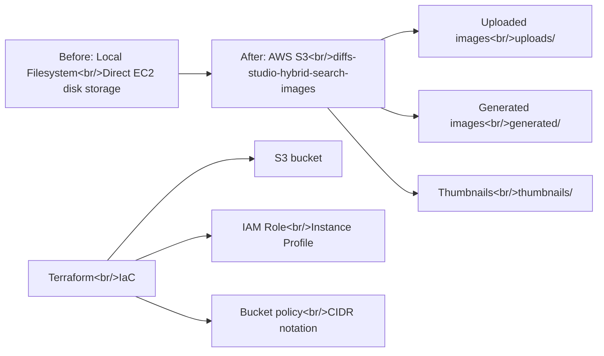

## Overview

[Previous: #5 — Inpaint UX Improvements, Dev Server Deployment, Stability Work](/posts/2026-03-25-hybrid-search-dev5/)

In #6, three core tasks were completed across 31 commits. First, image storage was fully migrated from the local EC2 filesystem to AWS S3. Second, "Diffs Image Agent" branding was applied and the favicon replaced. Third, a number of UI stability and usability fixes were shipped.

<!--more-->

---

## S3 Image Storage Migration

### Background

Images were previously stored directly on the EC2 instance's local disk. This created problems: storage capacity limits, risk of data loss when the instance is replaced, and environment mismatch between local development and the server. Migrating to S3 eliminates storage concerns and gives both local and production environments the same storage layer.

### Implementation

The migration was approached systematically, starting with design documentation. The S3 migration design spec and implementation plan were documented first, then work proceeded layer by layer from infrastructure to application.

**Infrastructure layer (Terraform):**
- Created the `diffs-studio-hybrid-search-images` S3 bucket
- Configured IAM Role and Instance Profile for EC2 bucket access
- Applied EIP CIDR notation to the bucket policy

**Backend layer:**
- Added S3 config and boto3 dependency
- Implemented S3 storage wrapper module — initialized in app lifespan
- Replaced all local file URL/path helpers with S3-based versions
- Redirected `/images/` path to S3; uploads now go to S3
- Generated images and thumbnails written directly to S3
- Reference images, inpaint/edit source images all loaded from S3
- Rewrote thumbnail backfill script to use S3

**Presigned URL handling:**
- Added automatic presigned URL refresh on tab visibility change — a clean solution to S3 presigned URL expiration

### Problem Solved

There was an EIP CIDR notation issue in the Terraform bucket policy. A single IP needs to be specified as `/32`, but the suffix was missing, causing the policy to fail silently. Caught during code review and fixed together with CIDR notation, ref key cache, ContentType, and Gemini API issues.

---

## Diffs Branding

### Login Page and Header

The Diffs logo was applied to the login page and header, giving the previously bare-default UI a brand identity.

### Browser Tab Title and Favicon

The browser tab title was changed to "Diffs Image Agent" and the generic favicon was replaced with a "D." icon. The favicon was converted from PNG to ICO using favicon.io.

---

## UI Stability and Usability Improvements

A variety of UI issues were fixed across multiple sessions:

- **Card action buttons**: Buttons not visible over bright images — darkened button backgrounds
- **Infinite scroll**: Infinite scroll triggering page bounce on empty state — fixed
- **Reference image ordering**: User-uploaded references now appear before system-injected images
- **Uploaded image display**: Uploaded images shown as cards in search popup and vertical browse grid
- **Type label**: Renamed to "Base Regeneration" to prevent confusion with the button
- **Base image indicator**: Color changed from purple to neutral gray
- **IMAGE_SAFETY error**: Specific reason now shown on frontend instead of a generic 500 error
- **Card/detail UI**: Unified to a neutral, minimal style

---

## DB Migration and User Data

Alembic migration sync work was done on the EC2 server. Migration versions were verified before server pooling and synchronized between local and server environments. Images that had been generated without a `user_id` were also reassigned to a specific user.

---

## Gemini Labeling Pipeline

Labeling work was done on image references. The status of the Gemini API-based labeling pipeline was checked and progress monitored at 30-minute intervals. New image labels were also added.

---

## Commit Log

| Message | Scope |
|---------|-------|
| fix: terraform bucket policy CIDR notation for EIPs | infra |
| add new image label | data |
| chore: add APP_ENVIRONMENT to ecosystem config and .env | config |
| fix: address code review issues — CIDR, ref key cache, ContentType, Gemini | multi |
| feat: refresh presigned image URLs on tab visibility change | frontend |
| feat: rewrite thumbnail backfill script to use S3 | backend |
| feat: add S3 image source support to labeling pipeline | backend |
| feat: load source images from S3 for inpaint/edit | backend |
| feat: load reference images from S3 for generation | backend |
| feat: write generated images and thumbnails to S3 | backend |
| feat: redirect /images/ to S3, upload to S3 | backend |
| feat: replace local file URL/path helpers with S3-based versions | backend |
| feat: initialize S3 storage in app lifespan, remove local dir constants | backend |
| feat: add S3 storage wrapper module | backend |
| feat: add S3 config and boto3 dependency | backend |
| infra: add S3 bucket, IAM role, and instance profile for image storage | infra |
| docs: add S3 image migration implementation plan | docs |
| docs: add S3 image migration design spec | docs |
| feat: replace generic favicon with branded Diffs "D." icon | frontend |
| feat: update browser tab title to "Diffs Image Agent" | frontend |
| fix: darken card action button backgrounds for visibility | frontend |
| fix: prevent infinite scroll loading on empty state | frontend |
| refactor: reorder reference images so user refs come before system-injected | backend |
| feat: rebrand login page and header with Diffs logo | frontend |
| fix: hide info button and scroll arrows on uploaded image cards | frontend |
| feat: show uploaded images as cards in search popup + vertical browse grid | frontend |
| fix: rename type label to 'Base Regeneration' | frontend |
| refactor: neutralize base image indicator colors from purple to gray | frontend |
| fix: surface IMAGE_SAFETY reason to frontend instead of generic 500 | full-stack |
| refactor: unify card and detail UI to neutral, minimal style | frontend |

---

## Insight

The centerpiece of this cycle was the S3 migration. The systematic layer-by-layer transition — design doc → Terraform infra → backend wrapper → API endpoints → frontend URL refresh — went smoothly. Solving the presigned URL expiration issue via the tab visibility event was a clean UX-first approach. Branding work may look simple, but swapping out a favicon and tab title has a surprisingly large impact on how finished the app feels. The fact that more than half of the 31 commits were S3-related is a reminder of just how many touchpoints a storage layer replacement actually involves.
